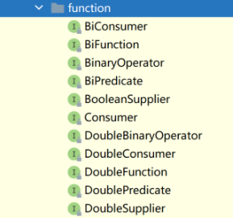

# 参考文档：

​	《Java 函数式编程》

​	《Java8 实战》

# 一、零散特性

## try-with-resources & AutoClosable

# 二、Optional

 Optional 类既可以含有对象也可以为空 

在线JDK说明： https://www.matools.com/file/manual/jdk_api_1.8_google/java/util/Optional.html#orElseThrow-java.util.function.Supplier-

## 1. API定义

### 1.1 构造函数

```java
private Optional() // 构建一个空的 Optional 实例。实例中的 value == null
private Optional(T var1) // 构建一个Optional 实例。实例中的 value == var1。var1为NULL会抛NPE.
```

### 1.2 获取 Optional 实例方法

```java
public static  Optional empty() // 获取一个 Optional 空实例。
public static  Optional of(T var0) // 获取一个 Optional 实例。var0为NULL会抛NPE。
public static  Optional ofNullable(T var0) // 获取一个 Optional 实例。var0为 NULL 会返回一个 Optional 空实例。
```

### 1.3 获取 Optional 实例中的 value

```java
public T get()  // value 为空抛NoSuchElementException。
public T orElse(T var1) // value 不为 NULL 则返回 value ；为 NULL 返回 var1。
public T orElseGet(Supplier<? extends T> var1) // value 不为 NULL 则返回 value ；为 NULL 执行 Supplier。
public <X extends Throwable> T orElseThrow(Supplier<? extends X> var1) throws X 
// value 不为 NULL 则返回 value ；为 NULL 执行 var1。
```

### 1.4 判断 Optional 是否存在

```java
public boolean isPresent()  // 即返回 Optional 实例中的 value 是否为 NULL。
public void ifPresent(Consumer<? super T> var1) // value 不为 NULL 则执行 var1。
```

### 1.5 其他 Lambda 表达式的操作

​	 如果当前对象为NULL，则返回自己或者一个 Optional 空实例。不 NULL 则执行后面的 Lambda，得到返回结果的Optional 实例 

```java
public Optional<T> filter(Predicate<? super T> var1)：
public <U> Optional<U> map(Function<? super T, ? extends U> var1)：
public <U> Optional<U> flatMap(Function<? super T, Optional<U>> var1)
```

## 2. 代码样例

```java
Optional<User> emptyOpt = Optional.empty();
Optional<User> opt = Optional.of(user);  // 不可为NULL，否则NPE
Optional<User> opt = Optional.ofNullable(user);

Optional<String> opt = Optional.ofNullable(name);
assertEquals("John", opt.get());  // value 为空抛NoSuchElementException

User user = null;
User user2 = new User("anna@gmail.com", "1234");
User result = Optional.ofNullable(user).orElse(user2);
User result = Optional.ofNullable(user).orElseGet( () -> user2); // user为空执行Supplier

User result = Optional.ofNullable(user)
      .orElseThrow( () -> new IllegalArgumentException());

User user = new User("anna@gmail.com", "1234");
String email = Optional.ofNullable(user)
      .map(u -> u.getEmail()).orElse("default@gmail.com");
// map() 对值应用(调用)作为参数的函数，

User user = new User("anna@gmail.com", "1234");
user.setPosition("Developer");
String position = Optional.ofNullable(user)
      .flatMap(u -> u.getPosition()).orElse("default");

// filter() 接受一个 Predicate 参数，返回测试结果为 true 的值。如果测试结果为 false，会返回一个空的 Optional。
User user = new User("anna@gmail.com", "1234");
    Optional<User> result = Optional.ofNullable(user)
      .filter(u -> u.getEmail() != null && u.getEmail().contains("@"));
```

具体场景

```java
if (user != null) {
    Address address = user.getAddress();
    if (address != null) {
        Country country = address.getCountry();
        if (country != null) {
            String isocode = country.getIsocode();
            if (isocode != null) {
                isocode = isocode.toUpperCase();
            }
        }
    }
}
```

==优化后==

1. 重构类，使其 getter 方法返回 *Optional* 引用：

```java
public class User {
    private Address address;

    public Optional<Address> getAddress() {
        return Optional.ofNullable(address);
    }

    // ...
}
public class Address {
    private Country country;

    public Optional<Country> getCountry() {
        return Optional.ofNullable(country);
    }

    // ...
}
```

2. 具体业务代码

```java
String result = Optional.ofNullable(user)
  .flatMap(User::getAddress)
  .flatMap(Address::getCountry)
  .map(Country::getIsocode)
  .orElse("default");
```

# 三、Lambda表达式

​	Lambda表达式，JDK8允许把函数作为一个方法的参数（函数作为参数传递进方法中）。使用 Lambda 表达式可以使代码变的更加简洁紧凑。

```
(parameters) -> expression
(parameters) ->{ statements; }
```

样例：

```java
//入参为空
TestDemo no_param = () -> "hi, no param";
TestDemo no_param2 = () -> { return "hi, no param"; };
System.out.println(no_param.hi());

//单个参数
TestDemo2 param = name -> name;
TestDemo2 param2 = name -> { return name;};
System.out.println(param.hei("hei, grils"));

//多个参数
TestDemo3 multiple = (String hello, String name) -> hello + " " + name;
//一条返回语句，可以省略大括号和return
TestDemo3 multiple2 = (hello, name) -> hello + name;
//多条处理语句，需要大括号和return
TestDemo3 multiple3 = (hello, name) -> {
    System.out.println("进入内部");
    return hello + name;
};
System.out.println(multiple.greet("hello", "lambda"));
```

1）对象::实例方法，将 lambda 的参数当做方法的参数使用

```java
Consumer<String> sc = System.out::println;
//等效
Consumer<String> sc2 = (x) -> System.out.println(x);
sc.accept("618, 狂欢happy");
```

2）类::静态方法，将lambda的参数当做方法的参数使用

```java
//ClassName::staticMethod  类的静态方法：把表达式的参数值作为staticMethod方法的参数
Function<Integer, String> sf = String::valueOf;
//等效
Function<Integer, String> sf2 = (x) -> String.valueOf(x);
String apply1 = sf.apply(61888);
```

3）类::实例方法，将lambda的第一个参数当做方法的调用者，其他的参数作为方法的参数。开发中尽量少些此类写法，减少后续维护成本。

```java
//ClassName::instanceMethod  类的实例方法：把表达式的第一个参数当成instanceMethod的调用者，其他参数作为该方法的参数
BiPredicate<String, String> sbp = String::equals;
//等效
BiPredicate<String, String> sbp2 = (x, y) -> x.equals(y);
boolean test = sbp.test("a", "A");
```

4）构造函数

```java
Supplier<User> us = User::new;
//等效
Supplier<User> us2 = () -> new User();
//获取对象
User user = us.get();

//一个参数,参数类型不同则会编译出错
Function<Integer, User> uf = id -> new User(id);
//或加括号
Function<Integer, User> uf2 = (id) -> new User(id);
//等效
Function<Integer, User> uf3 = (Integer id) -> new User(id);
User apply = uf.apply(61888);

//两个参数
BiFunction<Integer, String, User> ubf = (id, name) -> new User(id, name);
User 狂欢happy = ubf.apply(618, "狂欢happy");
```


## 样例


```java
List<Apple> result = 
 		filterApples(inventory, (Apple apple) -> "red".equals(apple.getColor()));

public interface Predicate<T>{ 
 boolean test(T t); 
} 

public static <T> List<T> filter(List<T> list, Predicate<T> p){
 		List<T> result = new ArrayList<>(); 
		for(T e: list){ 
 		if(p.test(e)){ 
 			result.add(e); 
 		} 
 	} 
 	return result; 
}
List<Apple> redApples = 
 	filter(inventory, (Apple apple) -> "red".equals(apple.getColor())); 
List<Integer> evenNumbers = 
 	filter(numbers, (Integer i) -> i % 2 == 0);
```

排序

```java
// java.util.Comparator 
public interface Comparator<T> { 
	public int compare(T o1, T o2); 
}

inventory.sort((Apple a1, Apple a2) -> a1.getWeight().compareTo(a2.getWeight()));
```

线程

```java
Thread t = new Thread(() -> System.out.println("Hello world"));
```


# 四、函数式接口

使用@FunctionalInterface注解定义的接口，且里面只有一个抽象方法

## 1. 原有函数式接口

Runnable、Callable、PrivilegedAction、Comparator、FileFilter、PathMatcher、InvocationHandler

PropertyChangeListener、java.awt.event.ActionListener、javax.swing.event.ChangeListener

## 2. 新增函数式接口

JDK8新增函数式接口，代码位置java.util.function



### 2.1 消费型Consumer<T>

```java
@FunctionalInterface
public interface Consumer<T> {
    void accept(T t);
    default Consumer<T> andThen(Consumer<? super T> after) {
        Objects.requireNonNull(after);
        return (T t) -> { accept(t); after.accept(t); };
    }
}
```

#### 样例：

### 2.2 供给型Supplier<T>

T get()

#### 样例：	

### 2.3 函数型Function<T，R>

 R apply(T t);

#### 	样例

### 2.4 断言型Predicate<T>

​    boolean test(T t)

#### 	样例


# 五、Stream编程

## 1. 理论

### 1.1 Stream与collection区别


- No storage. A stream is not a data structure that stores elements; instead, it conveys elements from a source such as a data structure, an array, a generator function, or an I/O channel, through a pipeline of computational operations.

- Functional in nature. An operation on a stream produces a result, but does not modify its source. For example, filtering a `Stream` obtained from a collection produces a new `Stream` without the filtered elements, rather than removing elements from the source collection.
- Laziness-seeking. Many stream operations, such as filtering, mapping, or duplicate removal, can be implemented lazily, exposing opportunities for optimization. For example, "find the first `String` with three consecutive vowels" need not examine all the input strings. Stream operations are divided into intermediate (`Stream`-producing) operations and terminal (value- or side-effect-producing) operations. Intermediate operations are always lazy.

- Possibly unbounded. While collections have a finite size, streams need not. Short-circuiting operations such as `limit(n)` or `findFirst()` can allow computations on infinite streams to complete in finite time.
- Consumable. The elements of a stream are only visited once during the life of a stream. Like an [`Iterator`](../Iterator.html), a new stream must be generated to revisit the same elements of the source.

### 1.2 流的操作与pipeline

Stream operations are divided into ==intermediate== and ==terminal== operations, and are combined to form *stream pipelines*.

A stream pipeline consists of

- a source (such as a `Collection`, an array, a generator function, or an I/O channel); 
- followed by zero or more intermediate operations such as `Stream.filter` or `Stream.map`; 
- a terminal operation such as `Stream.forEach` or `Stream.reduce`.

Intermediate operations return a new stream. They are always *lazy*; executing an intermediate operation such as `filter()` does not actually perform any filtering, but instead creates a new stream that, when traversed, contains the elements of the initial stream that match the given predicate. Traversal of the pipeline source does not begin until the terminal operation of the pipeline is executed.

Terminal operations, such as `Stream.forEach` or `IntStream.sum`, may traverse the stream to produce a result or a side-effect. After the terminal operation is performed, the stream pipeline is considered consumed, and can no longer be used; if you need to traverse the same data source again, you must return to the data source to get a new stream. In almost all cases, terminal operations are *eager*, completing their traversal of the data source and processing of the pipeline before returning. Only the terminal operations `iterator()` and `spliterator()` are not; these are provided as an "escape hatch" to enable arbitrary client-controlled pipeline traversals in the event that the existing operations are not sufficient to the task.

### 1.3 Parallelism

All streams operations can execute either in serial or in parallel.

`Collection` has methods [`Collection.stream()`](../Collection.html#stream()) and [`Collection.parallelStream()`](../Collection.html#parallelStream()),


### 1.4 怎么得到Stream

- From a [`Collection`](../Collection.html) via the `stream()` and `parallelStream()` methods;
- From an array via [`Arrays.stream(Object[\])`](../Arrays.html#stream(T[]));
- From static factory methods on the stream classes, such as [`Stream.of(Object[\])`](Stream.html#of(T...)), [`IntStream.range(int, int)`](IntStream.html#range(int,int)) or [`Stream.iterate(Object, UnaryOperator)`](Stream.html#iterate(T,java.util.function.UnaryOperator));
- The lines of a file can be obtained from [`BufferedReader.lines()`](../../io/BufferedReader.html#lines());
- Streams of file paths can be obtained from methods in [`Files`](../../nio/file/Files.html);
- Streams of random numbers can be obtained from [`Random.ints()`](../Random.html#ints());
- Numerous other stream-bearing methods in the JDK, including [`BitSet.stream()`](../BitSet.html#stream()), [`Pattern.splitAsStream(java.lang.CharSequence)`](../regex/Pattern.html#splitAsStream(java.lang.CharSequence)), and [`JarFile.stream()`](../jar/JarFile.html#stream()).


## 2. API定义

### 2.1 中间处理


### 2.2 规约型


## 3. 样例

```java
int sum = widgets.parallelStream()
                      .filter(b -> b.getColor() == RED)
                      .mapToInt(b -> b.getWeight())
                      .sum();
// reduce操作
int sum = numbers.stream().reduce(0, Integer::sum);
int sum = numbers.parallelStream().reduce(0, Integer::sum);

// 
OptionalInt heaviest = widgets.parallelStream()
                               .mapToInt(Widget::getWeight)
                               .max();
```

*In its more general form, a reduce operation on elements of type <T> yielding a result of type <U> requires three parameters:*

```java
<U> U reduce(U identity,
              BiFunction<U, ? super T, U> accumulator,
              BinaryOperator<U> combiner);
// identity: both an initial seed value for the reduction and a default result if there are no input elements.
// The accumulator function takes a partial result and the next element, and produces a new partial result.
// The combiner function combines two partial results to produce a new partial result.

int sumOfWeights = widgets.stream()
                           .reduce(0,
                                   (sum, b) -> sum + b.getWeight(),
                                   Integer::sum);

Mutable reduction
<R> R collect(Supplier<R> supplier,
           BiConsumer<R, ? super T> accumulator,
           BiConsumer<R, R> combiner);
// a supplier function to construct new instances of the result container, 
// an accumulator function to incorporate an input element into a result container,
// a combining function to merge the contents of one result container into another. 

List<String> strings = stream.map(Object::toString)
                                  .collect(Collectors.toList());
Collector<Employee, ?, Integer> summingSalaries
         = Collectors.summingInt(Employee::getSalary);

Map<Department, Integer> salariesByDept
 = employees.stream().collect(Collectors.groupingBy(Employee::getDepartment,
                                                    summingSalaries));
// 声明无序：BaseStream.unordered()
Map<Buyer, List<Transaction>> salesByBuyer
         = txns.parallelStream()
               .unordered()
               .collect(groupingByConcurrent(Transaction::getBuyer));

```


# CompletableFuture

## 美团外卖商家API的异步化

https://mp.weixin.qq.com/s/GQGidprakfticYnbVYVYGQ

## 原理

可以将多个依赖操作通过不同的方式进行编排，例如CompletableFuture提供thenCompose、thenCombine等各种then开头的方法，这些方法就是对“可组合”特性的支持。

CompletableFuture实现了两个接口：

- Future: Future表示异步计算的结果

- CompletionStage: CompletionStage用于表示异步执行过程中的一个步骤（Stage），这个步骤可能是由另外一个CompletionStage触发的，随着当前步骤的完成，也可能会触发其他一系列CompletionStage的执行。从而我们可以根据实际业务对这些步骤进行多样化的编排组合，CompletionStage接口正是定义了这样的能力，我们可以通过其提供的thenAppy、thenCompose等函数式编程方法来组合编排这些步骤。


CompletableFuture中包含两个字段：**result**和**stack**。result用于存储当前CF的结果，stack（Completion）表示当前CF完成后需要触发的依赖动作（Dependency Actions），去触发依赖它的CF的计算，依赖动作可以有多个（表示有多个依赖它的CF），以栈（[Treiber stack](https://en.wikipedia.org/wiki/Treiber_stack)）的形式存储，stack表示栈顶元素。

> 更深入原理，参考上面美团技术文档


## 实际样例

#### 样例1

``` java
ExecutorService executor = Executors.newFixedThreadPool(5);
CompletableFuture<String> cf1 = CompletableFuture.supplyAsync(() -> {
    System.out.println("执行step 1");
    return "step1 result";
}, executor);

CompletableFuture<String> cf2 = CompletableFuture.supplyAsync(() -> {
    System.out.println("执行step 2");
    return "step2 result";
});

cf1.thenCombine(cf2, (result1, result2) -> {
    System.out.println(result1 + " , " + result2);
    System.out.println("执行step 3");
    return "step3 result";
}).thenAccept(result3 -> System.out.println(result3));
```

#### 样例2


在使用CompletableFuture进行异步化编程时，图中的每个步骤都会产生一个CompletableFuture对象

```java
ExecutorService executor = Executors.newFixedThreadPool(5);
//1、使用runAsync或supplyAsync发起异步调用
CompletableFuture<String> cf1 = CompletableFuture.supplyAsync(() -> {
  return "result1";
}, executor);
//2、CompletableFuture.completedFuture()直接创建一个已完成状态的CompletableFuture
CompletableFuture<String> cf2 = CompletableFuture.completedFuture("result2");

// 一元依赖
CompletableFuture<String> cf3 = cf1.thenApply(result1 -> {
  //result1为CF1的结果
  //......
  return "result3";
});

// 二元依赖
CompletableFuture<String> cf4 = cf1.thenCombine(cf2, (result1, result2) -> {
  //result1和result2分别为cf1和cf2的结果
  return "result4";
});

// 多元依赖
CompletableFuture<Void> cf6 = CompletableFuture.allOf(cf3, cf4, cf5);
CompletableFuture<String> result = cf6.thenApply(v -> {
  //这里的join并不会阻塞，因为传给thenApply的函数是在CF3、CF4、CF5全部完成时，才会执行 。
  result3 = cf3.join();
  result4 = cf4.join();
  result5 = cf5.join();
  //根据result3、result4、result5组装最终result;
  return "result";
});


```


# 时间日期


