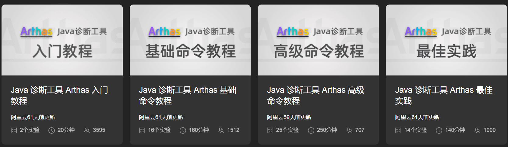
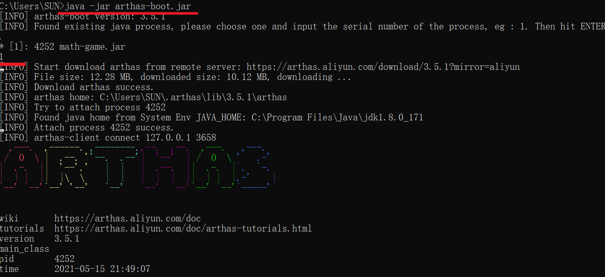
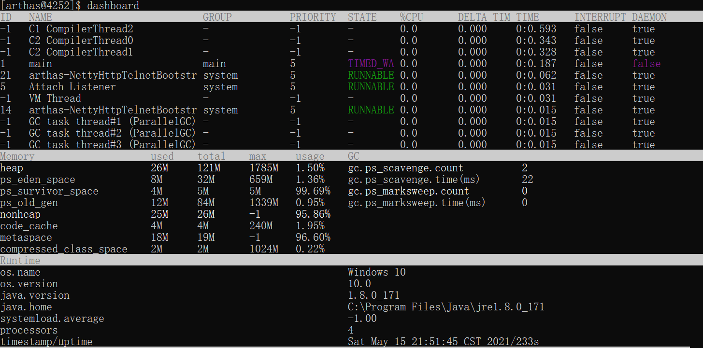
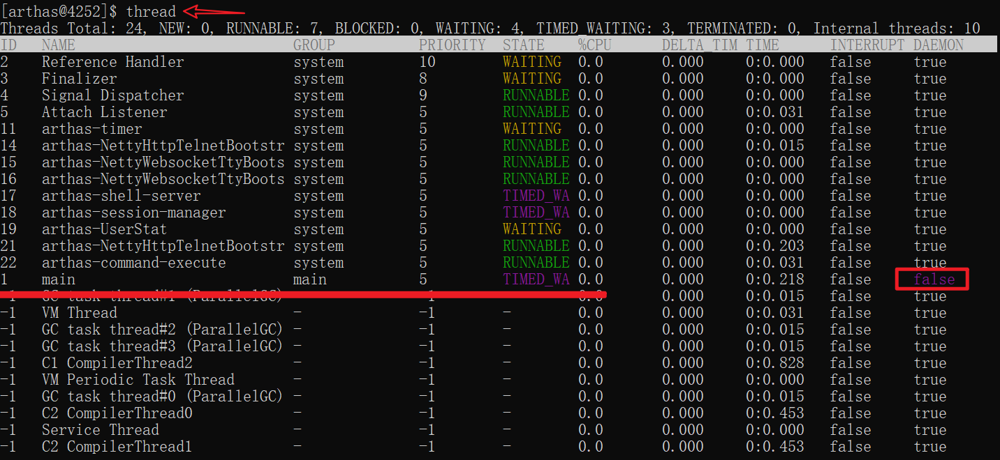
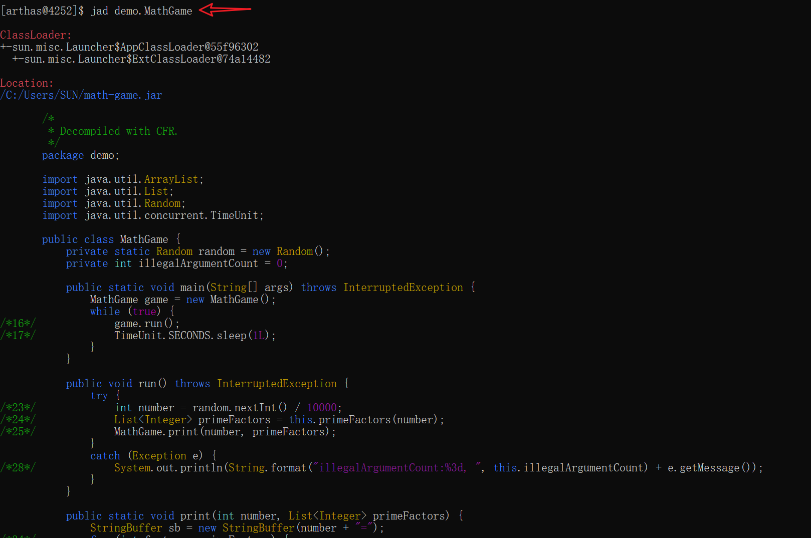
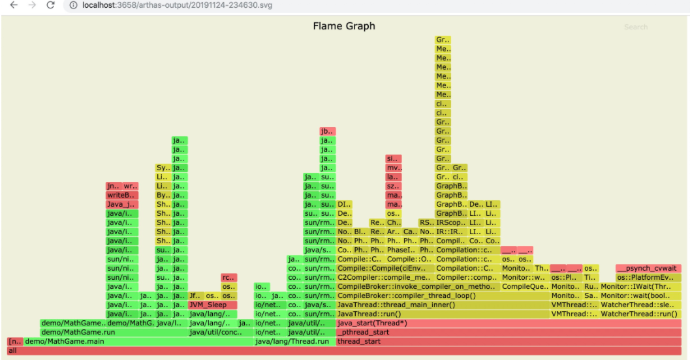
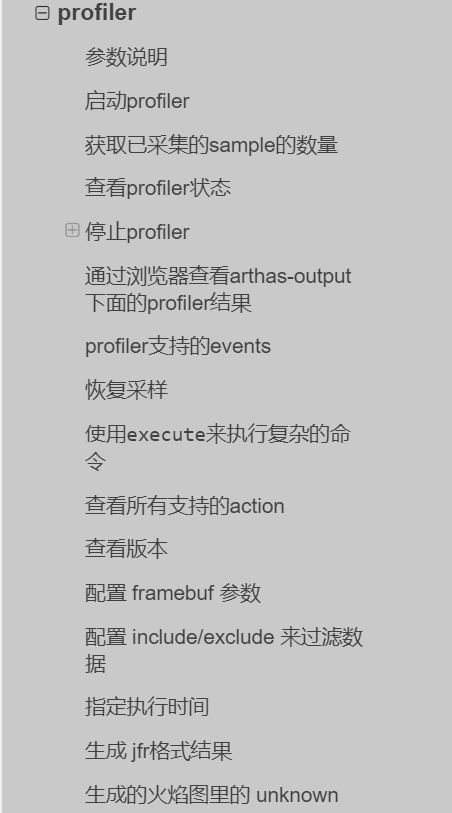

官网：https://arthas.aliyun.com/zh-cn/

动手实验室  https://start.aliyun.com/handson-lab?category=arthas




可以参考官网提供的样例进行命令学习

# 一、安装&启动Arthas

1. 启动

```
curl -O https://arthas.aliyun.com/arthas-boot.jar
java -jar arthas-boot.jar
```

> - 执行该程序的用户需要和目标进程具有相同的权限。比如以`admin`用户来执行：`sudo su admin && java -jar arthas-boot.jar` 或 `sudo -u admin -EH java -jar arthas-boot.jar`。
> - 如果attach不上目标进程，可以查看`~/logs/arthas/` 目录下的日志。
> - 如果下载速度比较慢，可以使用aliyun的镜像：`java -jar arthas-boot.jar --repo-mirror aliyun --use-http`
> - `java -jar arthas-boot.jar -h` 打印更多参数信息。

2. 选择待监控应用java进程序号

   

# 二、基本命令

## dashboard

​	展示当前进程的信息，定时刷新，按`ctrl+c`可以中断



## thread

查看当前的线程列表



### thread 线程ID

查看指定线程ID

```bash
[arthas@4252]$ thread 1
"main" Id=1 TIMED_WAITING
    at java.lang.Thread.sleep(Native Method)
    at java.lang.Thread.sleep(Unknown Source)
    at java.util.concurrent.TimeUnit.sleep(Unknown Source)
    at demo.MathGame.main(MathGame.java:17)

$ thread 1 | grep 'main('
    at demo.MathGame.main(MathGame.java:17)
    
查看CPU使用率top n线程的栈
thread -n 3

查看5秒内的CPU使用率top n线程栈
thread -n 3 -i 5000

查找线程是否有阻塞
thread -b
```


## jad 反编译




## watch 查看方法返回值


# 二、JVM相关

- [dashboard](https://arthas.aliyun.com/doc/dashboard.html)——当前系统的实时数据面板
- [thread](https://arthas.aliyun.com/doc/thread.html)——查看当前 JVM 的线程堆栈信息
- [jvm](https://arthas.aliyun.com/doc/jvm.html)——查看当前 JVM 的信息
- [sysprop](https://arthas.aliyun.com/doc/sysprop.html)——查看和修改JVM的系统属性
- [sysenv](https://arthas.aliyun.com/doc/sysenv.html)——查看JVM的环境变量
- [vmoption](https://arthas.aliyun.com/doc/vmoption.html)——查看和修改JVM里诊断相关的option
- [perfcounter](https://arthas.aliyun.com/doc/perfcounter.html)——查看当前 JVM 的Perf Counter信息
- [logger](https://arthas.aliyun.com/doc/logger.html)——查看和修改logger
- [getstatic](https://arthas.aliyun.com/doc/getstatic.html)——查看类的静态属性
- [ognl](https://arthas.aliyun.com/doc/ognl.html)——执行ognl表达式
- [mbean](https://arthas.aliyun.com/doc/mbean.html)——查看 Mbean 的信息
- [heapdump](https://arthas.aliyun.com/doc/heapdump.html)——dump java heap, 类似jmap命令的heap dump功能
- [vmtool](https://arthas.aliyun.com/doc/vmtool.html)——从jvm里查询对象，执行forceGc


## 2.1 垃圾回收


## 2.2 线程死锁


# 三、class/classloader相关

- [sc](https://arthas.aliyun.com/doc/sc.html)——查看JVM已加载的类信息：方法、变量定义等
- [sm](https://arthas.aliyun.com/doc/sm.html)——查看已加载类的方法信息
- [jad](https://arthas.aliyun.com/doc/jad.html)——反编译指定已加载类的源码
- [mc](https://arthas.aliyun.com/doc/mc.html)——内存编译器，内存编译`.java`文件为`.class`文件
- [retransform](https://arthas.aliyun.com/doc/retransform.html)——加载外部的`.class`文件，retransform到JVM里
- [redefine](https://arthas.aliyun.com/doc/redefine.html)——加载外部的`.class`文件，redefine到JVM里
- [dump](https://arthas.aliyun.com/doc/dump.html)——dump 已加载类的 byte code 到特定目录
- [classloader](https://arthas.aliyun.com/doc/classloader.html)——查看classloader的继承树，urls，类加载信息，使用classloader去getResource

# 四、profiler/火焰图

应用场景：CPU高问题

- [profiler](https://arthas.aliyun.com/doc/profiler.html)–使用[async-profiler](https://github.com/jvm-profiling-tools/async-profiler)对应用采样，生成火焰图

操作

```bash
# 启动（默认生成的是cpu的火焰图，即event为`cpu`。可以用`--event`参数来指定。）
$ profiler start
Started [cpu] profiling

# 获取已采集的sample的数量
$ profiler getSamples
23

# 查看profiler状态
$ profiler status
[cpu] profiling is running for 4 seconds

# 停止profiler,生成svg格式图片
$profiler stop
profiler output file: /tmp/demo/arthas-output/20191125-135546.svg
OK
# 指定导出文件位置
$ profiler stop --file /tmp/output.svg
profiler output file: /tmp/output.svg
OK
# 生成HTML格式
$ profiler stop --format html
profiler output file: /tmp/test/arthas-output/20191125-143329.html
OK

# 通过浏览器查看arthas-output下面的profiler结果
http://localhost:3658/arthas-output/  查看到arthas-output目录下面的profiler结果：
```




``` bash
# profiler支持的events
$ profiler list
Basic events:
  cpu
  alloc
  lock
  wall
  itimer
Perf events:
  page-faults
  context-switches
  cycles
  instructions
  cache-references
  cache-misses
  branches
  branch-misses
  bus-cycles
  L1-dcache-load-misses
  LLC-load-misses
  dTLB-load-misses
  mem:breakpoint
  trace:tracepoint

# 指定要采样的事件
$ profiler start --event alloc

# 恢复采样 start是新开始采样，resume会保留上次stop时的数据。
$ profiler resume
Started [cpu] profiling

# 查看所有支持的action
$ profiler actions
Supported Actions: [resume, dumpCollapsed, getSamples, start, list, execute, version, stop, load, dumpFlat, actions, dumpTraces, status]
```

