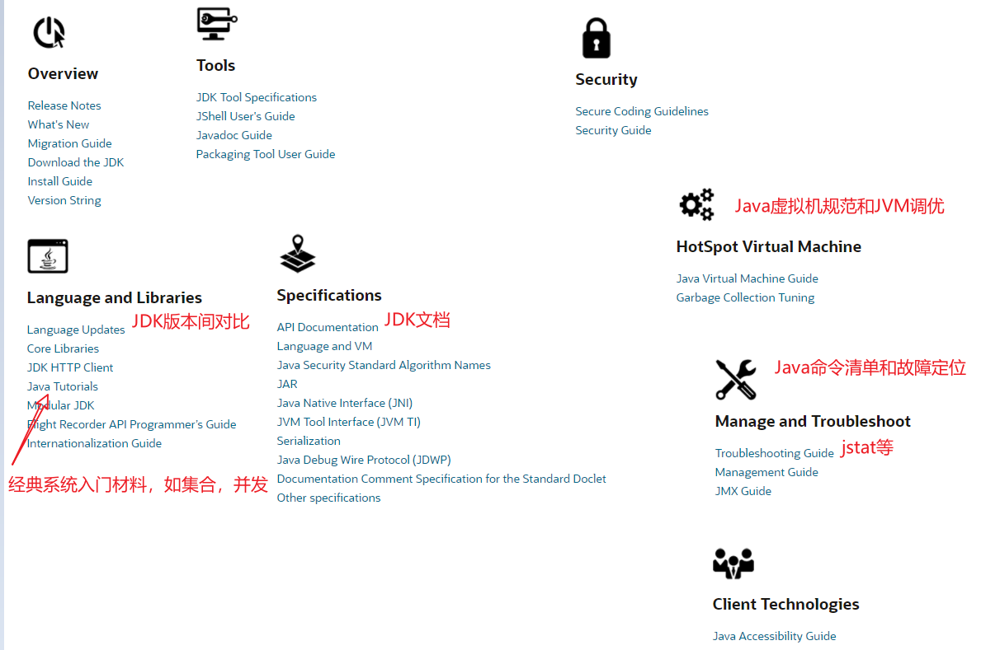
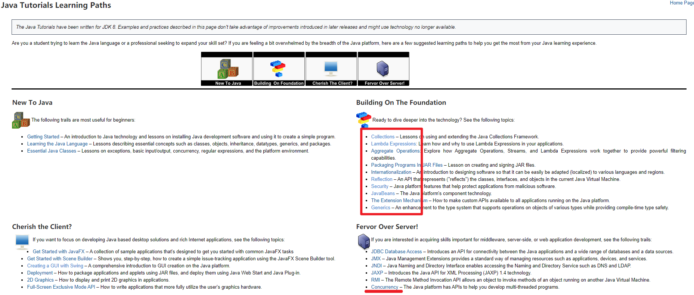
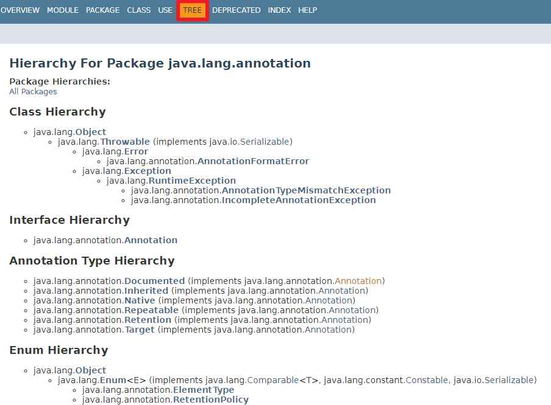
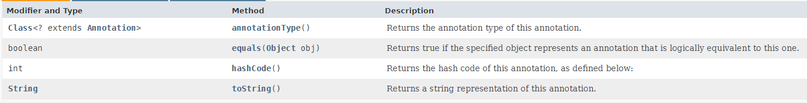
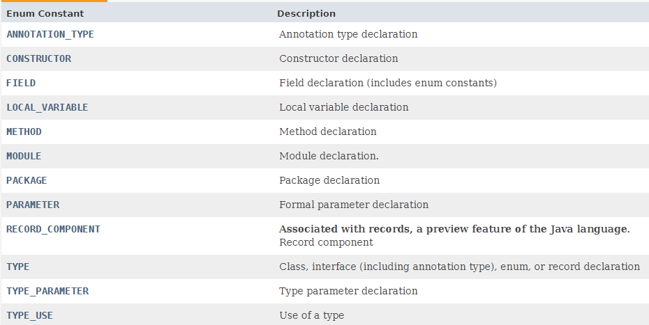
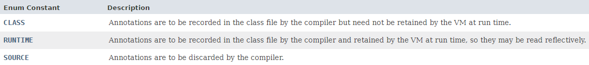
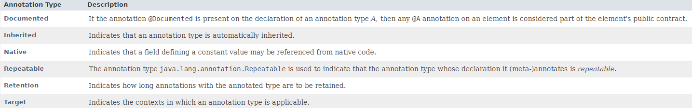
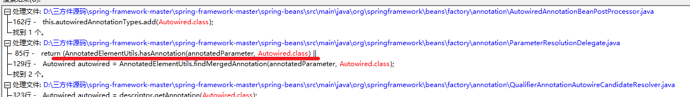

# 一、参考文档

## 1. Oracle官网

以官网JDK15相关链接说明。https://docs.oracle.com/en/java/javase/15/



## 2. Java Tutorials(入门学习路线)

https://docs.oracle.com/javase/tutorial/tutorialLearningPaths.html

> 提供了最系统、清晰简洁的java知识




# 二、核心API


# 反射


# 三、注解

Package：  java.lang.annotation

参考自JDK帮助文安定



## 3.1 注解框架

未列举异常相关

### 1 Interface汇总

**Annotation**接口： The common interface extended by all annotation types.

常见实现类Override、Target、Retention、



### 2 Enum汇总

- **ElementType**

​      The constants of this enumerated type provide a simple classification of the syntactic（语法） locations where annotations may appear in a Java program.



   

- **RetentionPolicy**



### 3 Annotation Types汇总

 

#### 3.1 Retention

​	与RetentionPolicy配合使用

#### 3.2 Target

​	与ElementType配合使用

## 3.2 测试样例


## 3.3 作用机理

1、自定义注解

```java
@Target(ElementType.METHOD)
@Retention(RetentionPolicy.RUNTIME)
public @interface MyAnnotation {
    public String name()  default "zhangsan";
    public String value() default "123";
}
```

2、使用注解类

```java
public class MyAnnotationDemo {

    @MyAnnotation(value = "456", name = "wangwu")
    public void print()
    {
        System.out.println("call print()");
    }
}
```

3、验证类

> method.isAnnotationPresent(MyAnnotation.class) 判断注解是否存在，然后做相关处理

```java
public class MyAnnotationDemoTest {
    public static void main(String[] args) throws Exception {
        Class<?> clazz = Class.forName("com.demo.annotation.MyAnnotationDemo");
        // printClassInfo(clazz);
        Method[] methods = clazz.getMethods();
        printMethodInfo(clazz, methods);
    }

    private static void printMethodInfo(Class<?> clazz, Method[] methods) throws Exception {
        System.out.println("\n************* call printMethodInfo begin ************* ");
        for (Method method : methods) {
            // 判断方法是否有指定的注解信息
            boolean annotationPresent = method.isAnnotationPresent(MyAnnotation.class);
            if (annotationPresent) {
                System.out.println(method.getName());

                // call print()
                method.invoke(clazz.getConstructor().newInstance(null), null);
                method.invoke(clazz.newInstance(), null);

                // print注解信息
                for (Annotation annotation : method.getAnnotations()) {
                    System.out.println("method annotation: " + annotation.toString());
                }
            }
        }
        System.out.println("************* call printMethodInfo end ************* \n");
    }
}
```

4、控制台打印

```bash
************* call printMethodInfo begin ************* 
print
call print()
call print()
method annotation: @com.demo.annotation.MyAnnotation(name=wangwu, value=456)
************* call printMethodInfo end ************* 
```

5、参考：Spring 注解原理

​	Autowired注解实现



```java
	public static boolean isAutowirable(Parameter parameter, int parameterIndex) {
		Assert.notNull(parameter, "Parameter must not be null");
		AnnotatedElement annotatedParameter = getEffectiveAnnotatedParameter(parameter, parameterIndex);
		return (AnnotatedElementUtils.hasAnnotation(annotatedParameter, Autowired.class) ||
				AnnotatedElementUtils.hasAnnotation(annotatedParameter, Qualifier.class) ||
				AnnotatedElementUtils.hasAnnotation(annotatedParameter, Value.class));
	}
```


# 四、集合

## 4.1 集合分类


## 4.2 Collections工具类


## 4.3 样例

​	Collections.singletonList("localhost:9092")

​	Collections.emptyList()

# 五、零碎知识

## 5.1  强、软、弱、虚引用

> 涉及GC时应用的回收处理方式

**java.lang.ref**

- Reference：抽象类

- SoftReference: 软引用，如果内存足够，GC不回收；如果内存不足，GC会回收。==可用于实现内存敏感的高速缓存== 。 软引用可以和一个引用队列（ReferenceQueue）联合使用，如果软引用所引用的对象被垃圾回收，Java虚拟机就会把这个软引用加入到与之关联的引用队列中。 

- WeakReference<T>：弱引用，GC回收时一旦发现直接回收（不管内存是否足够）。 弱引用可以和一个引用队列（ReferenceQueue）联合使用，如果弱引用所引用的对象被垃圾回 收，Java虚拟机就会把这个弱引用加入到与之关联的引用队列中。 

- PhantomReference：虚引用。主要用来跟踪对象被垃圾回收器回收的活动。虚引用与软引用和弱引用的一个区别在于：虚引用必须和引用队列 （ReferenceQueue）联合使用。当垃圾回收器准备回收一个对象时，如果**发现它还有虚引用，就会在回收对象的内存之前，把这个虚引用加入到与之关联的引用队列**中。 

- FinalReference

- Finalizer

- **ReferenceQueue**

**强引用：** 强引用不会被GC回收，并且在java.lang.ref里也没有实际的对应类型； Object obj = new Object(); 内存不足时，程序宁愿OutOfMemoryError异常终止，也不进行回收

WeakHashMap：弱引用

## 5.2  类初始化顺序

 **参考：https://zhuanlan.zhihu.com/p/62212361** 

 ### **1. 单类的初始化顺序**   

静态变量 > 静态初始块 > 成员变量 > 非静态初始块 > 构造器 

```java
public class ClassInitOrderTest {

    public static String staticField = "static field";

    static {
        System.out.println(staticField);
        System.out.println("static block");
    }

    private String field = "member field";

    {
        System.out.println(field);
        System.out.println("non-static block");
    }

    public ClassInitOrderTest() {
        System.out.println("constructor");
    }

    public static void main(String[] args) {
        new ClassInitOrderTest();
    }

}
```

结果

```bash
static field
static block
member field
non-static block
constructor
```

 **继承场景初始化顺序**： 父类静态变量 > 父类静态初始块 > 子类静态变量 > 子类静态初始块 > 父类成员变量 > 父类非静态初始块 > 父类构造器 > 子类成员变量 > 子类非静态初始块 > 子类构造器 

```bash
parent static field
parent static block
child static field
child static block
parent member field
parent non-static block
parent constructor
child member field
child non-static block
child constructor
```

### 2. 静态成员变量、初始块的初始化顺序

依赖类中定义的顺序

```java
public class TestOrder {

    private static A a = new A();

    static {
        System.out.println("static block");
    }

    private static B b = new B();

    public static void main(String[] args) {
        new TestOrder();
    }

}

class A {
    public A() {
        System.out.println("static field A");
    }
}

class B {
    public B() {
        System.out.println("static field B");
    }
}
```

结果

```bash
static field A
static block
static field B
```

此处：初始化顺序：静态变量A > 静态初始块 > 静态变量B

==它们的在类中的顺序就决定了它们的初始化顺序，而不是变量一定会优先于初始块。==


## 5.3 字符串操作

### 1 字符串拼接

**1、StringJoiner 拼接（需要JDK1.8）**

```java
Set<String> set = new HashSet<String>();
set.add("123");
set.add("456");
String str = set.stream().parallel().collect(Collectors.joining(","));
System.out.println(str);
```

 **2、集合通过流式拼接；List类似（需要JDK1.8）**  

```java
StringJoiner sj = new StringJoiner(",", "[", "]");
sj.add("George").add("Sally").add("Fred").add("Lily");
System.out.println(sj.toString());
```


