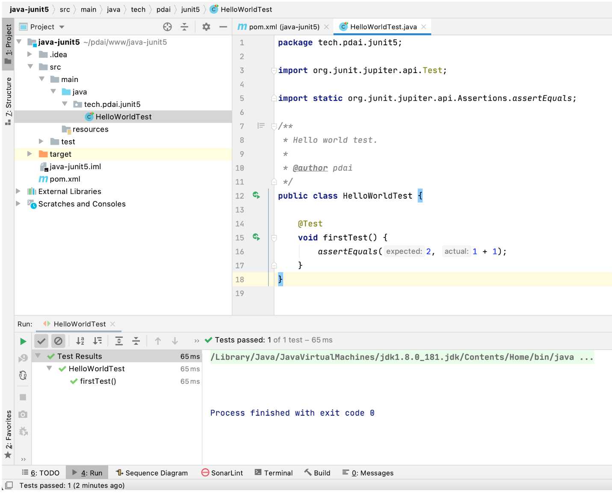
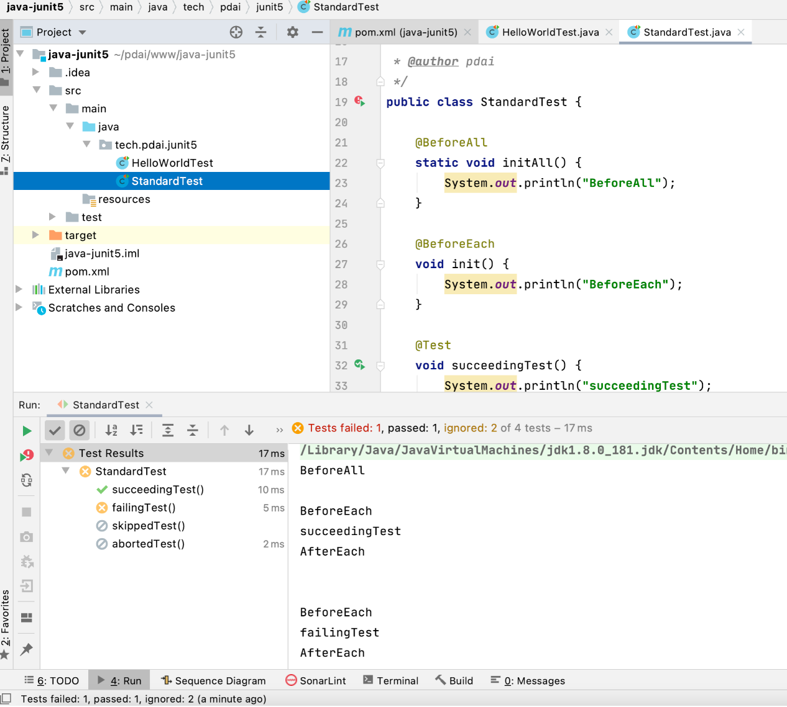
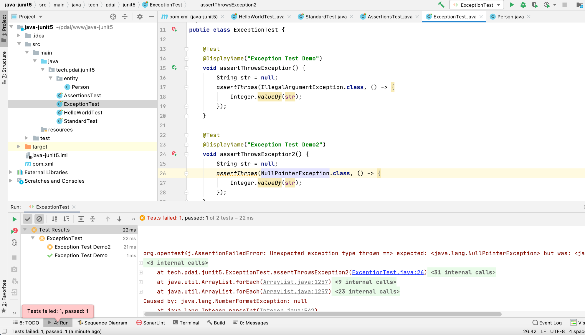
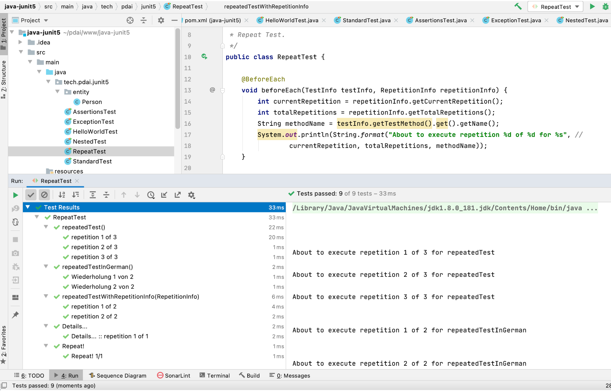
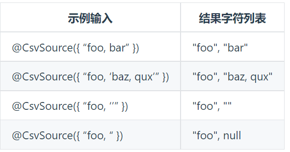

著作权归https://pdai.tech所有。 链接：https://pdai.tech/md/develop/ut/dev-ut-x-junit5.html

> JUnit 5是JUnit的下一代。目标是为JVM上的开发人员端测试创建一个最新的基础。这包括专注于Java 8及更高版本，以及启用许多不同风格的测试。@pdai


## 官方资料

> 最好的资料依然在Junit官方网站，以下我帮你总结下Junit相关的官方网址。@pdai

- 官网地址

  https://junit.org/junit5/

- 官方入门文档

  https://junit.org/junit5/docs/current/user-guide/#overview

- 官方例子

  https://github.com/junit-team/junit5-samples

- 官方github

  https://github.com/junit-team

## Junit5的架构

与以前版本的JUnit不同，JUnit 5由三个不同子项目中的几个不同模块组成。

> JUnit 5 = JUnit Platform + JUnit Jupiter + JUnit Vintage

- **JUnit Platform**是基于JVM的运行测试的基础框架在，它定义了开发运行在这个测试框架上的TestEngine API。此外该平台提供了一个控制台启动器，可以从命令行启动平台，可以为Gradle和 Maven构建插件，同时提供基于JUnit 4的Runner。
- **JUnit Jupiter**是在JUnit 5中编写测试和扩展的新编程模型和扩展模型的组合.Jupiter子项目提供了一个TestEngine在平台上运行基于Jupiter的测试。
- **JUnit Vintage**提供了一个TestEngine在平台上运行基于JUnit 3和JUnit 4的测试。

架构图如下:


著作权归https://pdai.tech所有。 链接：https://pdai.tech/md/develop/ut/dev-ut-x-junit5.html

## JUnit Jupiter API 的使用

> JUnit Jupiter是在JUnit 5中编写测试和扩展的新编程模型和扩展模型的组合; 所以我们使用Jupiter来学习Junit5。

### 常用注解

​	**@Test** 表示方法是一种测试方法。 与JUnit 4的@Test注解不同，此注释不会声明任何属性。

​	**@ParameterizedTest** 表示方法是参数化测试

​	**@RepeatedTest** 表示方法是重复测试模板

​	**@TestFactory** 表示方法是动态测试的测试工程

​	**@DisplayName** 为测试类或者测试方法自定义一个名称

​	**@BeforeEach** 表示方法在每个测试方法运行前都会运行 ，**@AfterEach** 表示方法在每个测试方法运行之后都会运行

​	**@BeforeAll** 表示方法在所有测试方法之前运行 ，**@AfterAll** 表示方法在所有测试方法之后运行

​	**@Nested** 表示带注解的类是嵌套的非静态测试类，**@BeforeAll**和 **@AfterAll**方法不能直接在@Nested测试类中使用，除非修改测试实例生命周 期。

​	**@Tag** 用于在类或方法级别声明用于过滤测试的标记

​	**@Disabled** 用于禁用测试类或测试方法

​	**@ExtendWith** 用于注册自定义扩展，该注解可以继承

​	**@FixMethodOrder(MethodSorters.NAME_ASCENDING)**，控制测试类中方法执行的顺序，这种测试方式将按方法名称的进行排序，由于是按字符的字典顺序，所以以这种方式指定执行顺序会始终保持一致；不过这种方式需要对测试方法有一定的命名规则，如 测试方法均以testNNN开头（NNN表示测试方法序列号 001-999）

## 编写单元测试

> 接下来，我们开始学习JUnit5单元测试实例:

### Maven包引入

最新的包引入，请参考这里:https://junit.org/junit5/docs/current/user-guide/#running-tests

```xml
<?xml version="1.0" encoding="UTF-8"?>
<project xmlns="http://maven.apache.org/POM/4.0.0"
         xmlns:xsi="http://www.w3.org/2001/XMLSchema-instance"
         xsi:schemaLocation="http://maven.apache.org/POM/4.0.0 http://maven.apache.org/xsd/maven-4.0.0.xsd">
    <modelVersion>4.0.0</modelVersion>

    <groupId>pdai.tech</groupId>
    <artifactId>java-junit5</artifactId>
    <version>1.0-SNAPSHOT</version>

    <dependencies>
        <!-- Only needed to run tests in a version of IntelliJ IDEA that bundles older versions -->
        <dependency>
            <groupId>org.junit.platform</groupId>
            <artifactId>junit-platform-launcher</artifactId>
            <version>1.7.0</version>
            <scope>test</scope>
        </dependency>
        <dependency>
            <groupId>org.junit.jupiter</groupId>
            <artifactId>junit-jupiter-engine</artifactId>
            <version>5.7.0</version>
            <scope>test</scope>
        </dependency>
        <dependency>
            <groupId>org.junit.vintage</groupId>
            <artifactId>junit-vintage-engine</artifactId>
            <version>5.7.0</version>
            <scope>test</scope>
        </dependency>
        <dependency>
            <groupId>org.junit.jupiter</groupId>
            <artifactId>junit-jupiter-api</artifactId>
            <version>5.7.0</version>
        </dependency>

        <!-- lombok -->
        <dependency>
            <groupId>org.projectlombok</groupId>
            <artifactId>lombok</artifactId>
            <version>1.18.16</version>
        </dependency>
    </dependencies>

</project>

```

### 测试:Hello World

第一个测试:

```java
package tech.pdai.junit5;

import org.junit.jupiter.api.Test;

import static org.junit.jupiter.api.Assertions.assertEquals;

/**
 * Hello world test.
 *
 * @author pdai
 */
public class HelloWorldTest {

    @Test
    void firstTest() {
        assertEquals(2, 1 + 1);
    }
}

```

执行结果



@Test注解在方法上标记方法为测试方法，以便构建工具和 IDE 能够识别并执行它们。JUnit 5不再需要手动将测试类与测试方法为public，包可见的访问级别就足够了。

### 测试:生命周期

首先，需要对比下Junit5和Junit4注解:

|  **Junit4**  |   **Junit5**    | **注释**                                                     |
| :----------: | :-------------: | ------------------------------------------------------------ |
|    @Test     |      @Test      | 表示该方法是一个测试方法                                     |
| @BeforeClass | **@BeforeAll**  | 表示使用了该注解的方法应该在当前类中所有测试方法之前执行（只执行一次），并且它必须是 static方法（除非@TestInstance指定生命周期为Lifecycle.PER_CLASS） |
| @AfterClass  |  **@AfterAll**  | 表示使用了该注解的方法应该在当前类中所有测试方法之后执行（只执行一次），并且它必须是 static方法（除非@TestInstance指定生命周期为Lifecycle.PER_CLASS） |
|   @Before    | **@BeforeEach** | 表示使用了该注解的方法应该在当前类中每一个测试方法之前执行   |
|    @After    | **@AfterEach**  | 表示使用了该注解的方法应该在当前类中每一个测试方法之后执行   |
|   @Ignore    |    @Disabled    | 用于禁用（或者说忽略）一个测试类或测试方法                   |
|  @Category   |      @Tag       | 用于声明过滤测试的tag标签，该注解可以用在方法或类上          |

测试用例:

```java
package tech.pdai.junit5;

import static org.junit.jupiter.api.Assertions.fail;
import static org.junit.jupiter.api.Assumptions.assumeTrue;

import lombok.extern.slf4j.Slf4j;
import org.junit.jupiter.api.AfterAll;
import org.junit.jupiter.api.AfterEach;
import org.junit.jupiter.api.BeforeAll;
import org.junit.jupiter.api.BeforeEach;
import org.junit.jupiter.api.Disabled;
import org.junit.jupiter.api.Test;

/**
 * Standard Test.
 *
 * @author pdai
 */
public class StandardTest {

    @BeforeAll
    static void initAll() {
        System.out.println("BeforeAll");
    }

    @BeforeEach
    void init() {
        System.out.println("BeforeEach");
    }

    @Test
    void succeedingTest() {
        System.out.println("succeedingTest");
    }

    @Test
    void failingTest() {
        System.out.println("failingTest");
        fail("a failing test");
    }

    @Test
    @Disabled("for demonstration purposes")
    void skippedTest() {
        // not executed
    }

    @Test
    void abortedTest() {
        System.out.println("abortedTest");
        assumeTrue("abc".contains("Z"));
        fail("test should have been aborted");
    }

    @AfterEach
    void tearDown() {
        System.out.println("AfterEach");
    }

    @AfterAll
    static void tearDownAll() {
        System.out.println("AfterEach");
    }

}
```

执行结果



观察正确和错误的结果:

```text
BeforeAll

BeforeEach
succeedingTest
AfterEach


BeforeEach
failingTest
AfterEach


org.opentest4j.AssertionFailedError: a failing test
  at org.junit.jupiter.api.AssertionUtils.fail(AssertionUtils.java:39)
  // ...


BeforeEach
abortedTest
AfterEach


org.opentest4j.TestAbortedException: Assumption failed: assumption is not true
	at org.junit.jupiter.api.Assumptions.throwTestAbortedException(Assumptions.java:256)
  // ...

AfterEach

Process finished with exit code 255

```

###  测试:禁用测试

这是一个禁用的测试案例：

```java
import org.junit.jupiter.api.Disabled;
import org.junit.jupiter.api.Test;

@Disabled
class DisabledClassTest {
    @Test
    void testWillBeSkipped() {
    }
}

```

这是一个带有禁用测试方法的测试案例：

```java
import org.junit.jupiter.api.Disabled;
import org.junit.jupiter.api.Test;

class DisabledTest {

    @Disabled
    @Test
    void testWillBeSkipped() {
    }

    @Test
    void testWillBeExecuted() {
    }
}

```

### 测试:断言测试

> 准备好测试实例、执行了被测类的方法以后，断言能确保你得到了想要的结果。一般的断言，无非是检查一个实例的属性（比如，判空与判非空等），或者对两个实例进行比较（比如，检查两个实例对象是否相等）等。无论哪种检查，断言方法都可以接受一个字符串作为最后一个可选参数，它会在断言失败时提供必要的描述信息。如果提供出错信息的过程比较复杂，它也可以被包装在一个 lambda 表达式中，这样，只有到真正失败的时候，消息才会真正被构造出来。

- 常用断言 Assertions
  - `assertEquals` 断言预期值和实际值相等
  - `assertAll` 分组断言,执行其中包含的所有断言
  - `assertArrayEquals` 断言预期数组和实际数组相等
  - `assertFalse` 断言条件为假
  - `assertNotNull` 断言不为空
  - `assertSame` 断言两个对象相等
  - `assertTimeout` 断言超时
  - `fail` 使单元测试失败

定义一个Person实体类

```java
package tech.pdai.junit5.entity;

import lombok.AllArgsConstructor;
import lombok.Data;

/**
 * Person.
 *
 * @author pdai
 */
@Data
@AllArgsConstructor
public class Person {

    private String firstName;

    private String lastName;
}

```

测试代码:

```java
package tech.pdai.junit5;

import org.junit.jupiter.api.Test;
import tech.pdai.junit5.entity.Person;

import static java.time.Duration.ofMillis;
import static java.time.Duration.ofMinutes;
import static org.junit.jupiter.api.Assertions.*;

/**
 * Assertions Test.
 *
 */
public class AssertionsTest {

    Person person = new Person("John", "Doe");

    @Test
    void standardAssertions() {
        assertEquals(2, 2);
        assertEquals(4, 4, "The optional assertion message is now the last parameter.");
        assertTrue(2 == 2, () -> "Assertion messages can be lazily evaluated -- "
                + "to avoid constructing complex messages unnecessarily.");
    }

    @Test
    void groupedAssertions() {
        // In a grouped assertion all assertions are executed, and any
        // failures will be reported together.
        assertAll("person",
                () -> assertEquals("John", person.getFirstName()),
                () -> assertEquals("Doe", person.getLastName())
        );
    }

    @Test
    void dependentAssertions() {
        // Within a code block, if an assertion fails the
        // subsequent code in the same block will be skipped.
        assertAll("properties",
                () -> {
                    String firstName = person.getFirstName();
                    assertNotNull(firstName);

                    // Executed only if the previous assertion is valid.
                    assertAll("first name",
                            () -> assertTrue(firstName.startsWith("J")),
                            () -> assertTrue(firstName.endsWith("n"))
                    );
                },
                () -> {
                    // Grouped assertion, so processed independently
                    // of results of first name assertions.
                    String lastName = person.getLastName();
                    assertNotNull(lastName);

                    // Executed only if the previous assertion is valid.
                    assertAll("last name",
                            () -> assertTrue(lastName.startsWith("D")),
                            () -> assertTrue(lastName.endsWith("e"))
                    );
                }
        );
    }

    @Test
    void exceptionTesting() {
        Throwable exception = assertThrows(IllegalArgumentException.class, () -> {
            throw new IllegalArgumentException("a message");
        });
        assertEquals("a message", exception.getMessage());
    }

    @Test
    void timeoutNotExceeded() {
        // The following assertion succeeds.
        assertTimeout(ofMinutes(2), () -> {
            // Perform task that takes less than 2 minutes.
        });
    }

    @Test
    void timeoutNotExceededWithResult() {
        // The following assertion succeeds, and returns the supplied object.
        String actualResult = assertTimeout(ofMinutes(2), () -> {
            return "a result";
        });
        assertEquals("a result", actualResult);
    }

    @Test
    void timeoutNotExceededWithMethod() {
        // The following assertion invokes a method reference and returns an object.
        String actualGreeting = assertTimeout(ofMinutes(2), AssertionsTest::greeting);
        assertEquals("hello world!", actualGreeting);
    }

    @Test
    void timeoutExceeded() {
        // The following assertion fails with an error message similar to:
        // execution exceeded timeout of 10 ms by 91 ms
        assertTimeout(ofMillis(10), () -> {
            // Simulate task that takes more than 10 ms.
            Thread.sleep(100);
        });
    }

    @Test
    void timeoutExceededWithPreemptiveTermination() {
        // The following assertion fails with an error message similar to:
        // execution timed out after 10 ms
        assertTimeoutPreemptively(ofMillis(10), () -> {
            // Simulate task that takes more than 10 ms.
            Thread.sleep(100);
        });
    }

    private static String greeting() {
        return "hello world!";
    }
}

```

这里注意下:`assertTimeoutPreemptively()` 和 `assertTimeout()` 的区别为: 两者都是断言超时，前者在指定时间没有完成任务就会立即返回断言失败；后者会在任务执行完毕之后才返回。

执行结果:


观察错误的结果:

```python
org.opentest4j.AssertionFailedError: execution timed out after 10 ms
	at org.junit.jupiter.api.AssertTimeout.assertTimeoutPreemptively(AssertTimeout.java:158)
	at org.junit.jupiter.api.AssertTimeout.assertTimeoutPreemptively(AssertTimeout.java:119)
	at org.junit.jupiter.api.AssertTimeout.assertTimeoutPreemptively(AssertTimeout.java:101)
	at org.junit.jupiter.api.AssertTimeout.assertTimeoutPreemptively(AssertTimeout.java:97)
	at org.junit.jupiter.api.Assertions.assertTimeoutPreemptively(Assertions.java:3323)
	at tech.pdai.junit5.AssertionsTest.timeoutExceededWithPreemptiveTermination(AssertionsTest.java:108)
  // ...

org.opentest4j.AssertionFailedError: execution exceeded timeout of 10 ms by 92 ms
	at org.junit.jupiter.api.AssertionUtils.fail(AssertionUtils.java:39)
	at org.junit.jupiter.api.Assertions.fail(Assertions.java:117)
	at org.junit.jupiter.api.AssertTimeout.assertTimeout(AssertTimeout.java:90)
	at org.junit.jupiter.api.AssertTimeout.assertTimeout(AssertTimeout.java:70)
	at org.junit.jupiter.api.AssertTimeout.assertTimeout(AssertTimeout.java:52)
	at org.junit.jupiter.api.AssertTimeout.assertTimeout(AssertTimeout.java:48)
	at org.junit.jupiter.api.Assertions.assertTimeout(Assertions.java:3186)
	at tech.pdai.junit5.AssertionsTest.timeoutExceeded(AssertionsTest.java:98)
  // ...


Process finished with exit code 255

```

### 测试:异常测试

我们代码中对于带有异常的方法通常都是使用 try-catch 方式捕获处理，针对测试这样带有异常抛出的代码，而 JUnit 5 提供方法 `Assertions#assertThrows(Class<T>, Executable)` 来进行测试，第一个参数为异常类型，第二个为函数式接口参数，跟 Runnable 接口相似，不需要参数，也没有返回，并且支持 Lambda表达式方式使用，具体使用方式可参考下方代码:

```java
package tech.pdai.junit5;

import org.junit.jupiter.api.DisplayName;
import org.junit.jupiter.api.Test;

import static org.junit.jupiter.api.Assertions.assertThrows;

/**
 * Exception Test.
 */
public class ExceptionTest {

    // 标准的测试例子
    @Test
    @DisplayName("Exception Test Demo")
    void assertThrowsException() {
        String str = null;
        assertThrows(IllegalArgumentException.class, () -> {
            Integer.valueOf(str);
        });
    }

    // 注:异常失败例子，当Lambda表达式中代码出现的异常会跟首个参数的异常类型进行比较，如果不属于同一类异常，则失败
    @Test
    @DisplayName("Exception Test Demo2")
    void assertThrowsException2() {
        String str = null;
        assertThrows(NullPointerException.class, () -> {
            Integer.valueOf(str);
        });
    }
}

```

执行结果:



观察错误的结果:

```java
org.opentest4j.AssertionFailedError: Unexpected exception type thrown ==> expected: <java.lang.NullPointerException> but was: <java.lang.NumberFormatException>

	at org.junit.jupiter.api.AssertThrows.assertThrows(AssertThrows.java:65)
	at org.junit.jupiter.api.AssertThrows.assertThrows(AssertThrows.java:37)
	at org.junit.jupiter.api.Assertions.assertThrows(Assertions.java:3007)
	at tech.pdai.junit5.ExceptionTest.assertThrowsException2(ExceptionTest.java:26)
  // ...
Caused by: java.lang.NumberFormatException: null
	at java.lang.Integer.parseInt(Integer.java:542)
	at java.lang.Integer.valueOf(Integer.java:766)
	at tech.pdai.junit5.ExceptionTest.lambda$assertThrowsException2$1(ExceptionTest.java:27)
	at org.junit.jupiter.api.AssertThrows.assertThrows(AssertThrows.java:55)
	... 68 more

```

### 测试:嵌套测试

嵌套测试给测试编写者更多的能力，来表达几组测试之间的关系。这里有一个详细的例子。

用于测试stack的嵌套测试套件:

```java
package tech.pdai.junit5;

import org.junit.jupiter.api.BeforeEach;
import org.junit.jupiter.api.DisplayName;
import org.junit.jupiter.api.Nested;
import org.junit.jupiter.api.Test;

import java.util.EmptyStackException;
import java.util.Stack;

import static org.junit.jupiter.api.Assertions.*;

/**
 * Stack test for Nest Demo.
 */
@DisplayName("A stack")
public class NestedTest {

    Stack stack;

    @Test
    @DisplayName("is instantiated with new Stack()")
    void isInstantiatedWithNew() {
        new Stack<>();
    }

    @Nested
    @DisplayName("when new")
    class WhenNew {
        @BeforeEach
        void createNewStack() {
            stack = new Stack<>();
        }

        @Test
        @DisplayName("is empty")
        void isEmpty() {
            assertTrue(stack.isEmpty());
        }

        @Test
        @DisplayName("throws EmptyStackException when popped")
        void throwsExceptionWhenPopped() {
            assertThrows(EmptyStackException.class, () -> stack.pop());
        }

        @Test
        @DisplayName("throws EmptyStackException when peeked")
        void throwsExceptionWhenPeeked() {
            assertThrows(EmptyStackException.class, () -> stack.peek());
        }

        @Nested
        @DisplayName("after pushing an element")
        class AfterPushing {
            String anElement = "an element";

            @BeforeEach
            void pushAnElement() {
                stack.push(anElement);
            }

            @Test
            @DisplayName("it is no longer empty")
            void isNotEmpty() {
                assertFalse(stack.isEmpty());
            }

            @Test
            @DisplayName("returns the element when popped and is empty")
            void returnElementWhenPopped() {
                assertEquals(anElement, stack.pop());
                assertTrue(stack.isEmpty());
            }

            @Test
            @DisplayName("returns the element when peeked but remains not empty")
            void returnElementWhenPeeked() {
                assertEquals(anElement, stack.peek());
                assertFalse(stack.isEmpty());
            }
        }
    }
}

```

执行结果:


### 测试:重复测试

JUnit Jupiter通过使用@RepeatedTest注解方法并指定所需的重复次数，提供了重复测试指定次数的功能。每次重复测试的调用都像执行常规的@Test方法一样，完全支持相同的生命周期回调和扩展。

以下示例演示了如何声明名为repeatedTest()的测试，该测试将自动重复10次。

```java
@RepeatedTest(10)
void repeatedTest() {
    // ...
}

```

除了指定重复次数外，还可以通过@RepeatedTest注解的name属性为每次重复配置自定义显示名称。此外，显示名称可以是模式，由静态文本和动态占位符的组合而成。目前支持以下占位符:

- {displayName}: @RepeatedTest方法的显示名称
- {currentRepetition}: 当前重复次数
- {totalRepetitions}: 重复的总次数

测试例子

```java
package tech.pdai.junit5;

import org.junit.jupiter.api.*;

import static org.junit.jupiter.api.Assertions.assertEquals;

/**
 * Repeat Test.
 */
public class RepeatTest {

    @BeforeEach
    void beforeEach(TestInfo testInfo, RepetitionInfo repetitionInfo) {
        int currentRepetition = repetitionInfo.getCurrentRepetition();
        int totalRepetitions = repetitionInfo.getTotalRepetitions();
        String methodName = testInfo.getTestMethod().get().getName();
        System.out.println(String.format("About to execute repetition %d of %d for %s", //
                currentRepetition, totalRepetitions, methodName));
    }

    @RepeatedTest(3)
    void repeatedTest() {
        // ...
    }

    @RepeatedTest(2)
    void repeatedTestWithRepetitionInfo(RepetitionInfo repetitionInfo) {
        assertEquals(2, repetitionInfo.getTotalRepetitions());
    }

    @RepeatedTest(value = 1, name = "{displayName} {currentRepetition}/{totalRepetitions}")
    @DisplayName("Repeat!")
    void customDisplayName(TestInfo testInfo) {
        assertEquals(testInfo.getDisplayName(), "Repeat! 1/1");
    }

    @RepeatedTest(value = 1, name = RepeatedTest.LONG_DISPLAY_NAME)
    @DisplayName("Details...")
    void customDisplayNameWithLongPattern(TestInfo testInfo) {
        assertEquals(testInfo.getDisplayName(), "Details... :: repetition 1 of 1");
    }

    @RepeatedTest(value = 2, name = "Wiederholung {currentRepetition} von {totalRepetitions}")
    void repeatedTestInGerman() {
        // ...
    }
}

```

执行结果:



### 测试:参数化测试

JUnit Jupiter开箱即用，提供了不少source注解。下面的每个小节都为他们提供了简要的概述和示例。请参阅org.junit.jupiter.params.provider包中的JavaDoc以获取更多信息。

- **@ValueSource**

@ValueSource是最简单的source之一。它可以让你指定一个原生类型（String，int，long或double）的数组，并且只能为每次调用提供一个参数。

```java
@ParameterizedTest
@ValueSource(ints = { 1, 2, 3 })
void testWithValueSource(int argument) {
    assertNotNull(argument);
}

```

- **@EnumSource**

@EnumSource提供了一个使用Enum常量的简便方法。该注释提供了一个可选的name参数，可以指定使用哪些常量。如果省略，所有的常量将被用在下面的例子中。

```java
@ParameterizedTest
@EnumSource(TimeUnit.class)
void testWithEnumSource(TimeUnit timeUnit) {
    assertNotNull(timeUnit);
}
@ParameterizedTest
@EnumSource(value = TimeUnit.class, names = { "DAYS", "HOURS" })
void testWithEnumSourceInclude(TimeUnit timeUnit) {
    assertTrue(EnumSet.of(TimeUnit.DAYS, TimeUnit.HOURS).contains(timeUnit));
}

```

@EnumSource注解还提供了一个可选的mode参数，可以对将哪些常量传递给测试方法进行细化控制。例如，您可以从枚举常量池中排除名称或指定正则表达式，如下例所示。

```java
@ParameterizedTest
@EnumSource(value = TimeUnit.class, mode = EXCLUDE, names = { "DAYS", "HOURS" })
void testWithEnumSourceExclude(TimeUnit timeUnit) {
    assertFalse(EnumSet.of(TimeUnit.DAYS, TimeUnit.HOURS).contains(timeUnit));
    assertTrue(timeUnit.name().length() > 5);
}
@ParameterizedTest
@EnumSource(value = TimeUnit.class, mode = MATCH_ALL, names = "^(M|N).+SECONDS$")
void testWithEnumSourceRegex(TimeUnit timeUnit) {
    String name = timeUnit.name();
    assertTrue(name.startsWith("M") || name.startsWith("N"));
    assertTrue(name.endsWith("SECONDS"));
}

```

著作权归https://pdai.tech所有。 链接：https://pdai.tech/md/develop/ut/dev-ut-x-junit5.html

- **@MethodSource**

@MethodSource允许你引用一个或多个测试类的工厂方法。这样的方法必须返回一个Stream，Iterable，Iterator或者参数数组。另外，这种方法不能接受任何参数。默认情况下，除非测试类用@TestInstance(Lifecycle.PER_CLASS)注解，否则这些方法必须是静态的。

如果只需要一个参数，则可以返回参数类型的实例Stream，如以下示例所示。

```java
@ParameterizedTest
@MethodSource("stringProvider")
void testWithSimpleMethodSource(String argument) {
    assertNotNull(argument);
}
static Stream<String> stringProvider() {
    return Stream.of("foo", "bar");
}

```

支持原始类型（DoubleStream，IntStream和LongStream）的流，示例如下：

```java
@ParameterizedTest
@MethodSource("range")
void testWithRangeMethodSource(int argument) {
    assertNotEquals(9, argument);
}
static IntStream range() {
    return IntStream.range(0, 20).skip(10);
}

```

如果测试方法声明多个参数，则需要返回一个集合或Arguments实例流，如下所示。请注意，Arguments.of(Object…)是Arguments接口中定义的静态工厂方法。

```java
@ParameterizedTest
@MethodSource("stringIntAndListProvider")
void testWithMultiArgMethodSource(String str, int num, List<String> list) {
    assertEquals(3, str.length());
    assertTrue(num >=1 && num <=2);
    assertEquals(2, list.size());
}
static Stream<Arguments> stringIntAndListProvider() {
    return Stream.of(
        Arguments.of("foo", 1, Arrays.asList("a", "b")),
        Arguments.of("bar", 2, Arrays.asList("x", "y"))
    );
}

```

- **@CsvSource**

@CsvSource允许您将参数列表表示为以逗号分隔的值（例如，字符串文字）。

```java
@ParameterizedTest
@CsvSource({ "foo, 1", "bar, 2", "'baz, qux', 3" })
void testWithCsvSource(String first, int second) {
    assertNotNull(first);
    assertNotEquals(0, second);
}

```

@CsvSource使用'作为转义字符。 请参阅上述示例和下表中的’baz, qux’值。 一个空的引用值''会导致一个空的String; 而一个完全空的值被解释为一个null引用。如果null引用的目标类型是基本类型，则引发ArgumentConversionException。



- **@CsvFileSource**

  @CsvFileSource让你使用classpath中的CSV文件。CSV文件中的每一行都会导致参数化测试的一次调用。

  ```java
  @ParameterizedTest
  @CsvFileSource(resources = "/two-column.csv")
  void testWithCsvFileSource(String first, int second) {
      assertNotNull(first);
      assertNotEquals(0, second);
  }
  
  ```

  two-column.csv

  ```
  foo, 1
  bar, 2
  "baz, qux", 3
  ```

  

  与@CsvSource中使用的语法相反，@CsvFileSource使用双引号"作为转义字符，请参阅上面例子中的"baz, qux"值，一个空的转义值""会产生一个空字符串， 一个完全为空的值被解释为null引用，如果null引用的目标类型是基本类型，则引发ArgumentConversionException。

- **@ArgumentsSource**

  可以使用@ArgumentsSource指定一个自定义的，可重用的ArgumentsProvider。

  ```java
  @ParameterizedTest
  @ArgumentsSource(MyArgumentsProvider.class)
  void testWithArgumentsSource(String argument) {
      assertNotNull(argument);
  }
  static class MyArgumentsProvider implements ArgumentsProvider {
      @Override
      public Stream< ? extends Arguments > provideArguments(ExtensionContext context) {
          return Stream.of("foo", "bar").map(Arguments::of);
      }
  }
  
  ```

  执行结果:

  

  著作权归https://pdai.tech所有。 链接：https://pdai.tech/md/develop/ut/dev-ut-x-junit5.html

### 测试:动态测试

除了这些标准测试外，JUnit Jupiter还引入了一种全新的测试编程模型。这种新的测试是动态测试，它是由 **@TestFactory** 注解的工厂方法在运行时生成的。

与@Test方法相比，@TestFactory方法本身不是测试用例，而是测试用例的工厂。因此，动态测试是工厂的产物。从技术上讲，@TestFactory方法必须返回DynamicNode实例的Stream，Collection，Iterable或Iterator。 DynamicNode的可实例化的子类是DynamicContainer和DynamicTest。 DynamicContainer实例由一个显示名称和一个动态子节点列表组成，可以创建任意嵌套的动态节点层次结构。然后，DynamicTest实例将被延迟执行，从而实现测试用例的动态甚至非确定性生成。

任何由@TestFactory返回的Stream都要通过调用stream.close()来正确关闭，使得使用诸如Files.lines()之类的资源变得安全。

与@Test方法一样，@TestFactory方法不能是private或static，并且可以选择声明参数，以便通过ParameterResolvers解析。

DynamicTest是运行时生成的测试用例。它由显示名称和Executable组成。 Executable是@FunctionalInterface，这意味着动态测试的实现可以作为lambda表达式或方法引用来提供。

```java
package tech.pdai.junit5;

import org.junit.jupiter.api.DynamicNode;
import org.junit.jupiter.api.DynamicTest;
import org.junit.jupiter.api.TestFactory;
import org.junit.jupiter.api.function.ThrowingConsumer;

import java.util.*;
import java.util.function.Function;
import java.util.stream.IntStream;
import java.util.stream.Stream;

import static org.junit.jupiter.api.Assertions.*;
import static org.junit.jupiter.api.DynamicContainer.dynamicContainer;
import static org.junit.jupiter.api.DynamicTest.dynamicTest;

/**
 * Dynamic Test.
 */
public class DynamicsTest {

    // This will result in a JUnitException!
    @TestFactory
    List<String> dynamicTestsWithInvalidReturnType() {
        return Arrays.asList("Hello");
    }

    @TestFactory
    Collection<DynamicTest> dynamicTestsFromCollection() {
        return Arrays.asList(
                dynamicTest("1st dynamic test", () -> assertTrue(true)),
                dynamicTest("2nd dynamic test", () -> assertEquals(4, 2 * 2))
        );
    }

    @TestFactory
    Iterable<DynamicTest> dynamicTestsFromIterable() {
        return Arrays.asList(
                dynamicTest("3rd dynamic test", () -> assertTrue(true)),
                dynamicTest("4th dynamic test", () -> assertEquals(4, 2 * 2))
        );
    }

    @TestFactory
    Iterator<DynamicTest> dynamicTestsFromIterator() {
        return Arrays.asList(
                dynamicTest("5th dynamic test", () -> assertTrue(true)),
                dynamicTest("6th dynamic test", () -> assertEquals(4, 2 * 2))
        ).iterator();
    }

    @TestFactory
    Stream<DynamicTest> dynamicTestsFromStream() {
        return Stream.of("A", "B", "C")
                .map(str -> dynamicTest("test" + str, () -> { /* ... */ }));
    }

    @TestFactory
    Stream<DynamicTest> dynamicTestsFromIntStream() {
        // Generates tests for the first 10 even integers.
        return IntStream.iterate(0, n -> n + 2).limit(10)
                .mapToObj(n -> dynamicTest("test" + n, () -> assertTrue(n % 2 == 0)));
    }

    @TestFactory
    Stream<DynamicTest> generateRandomNumberOfTests() {
        // Generates random positive integers between 0 and 100 until
        // a number evenly divisible by 7 is encountered.
        Iterator<Integer> inputGenerator = new Iterator<Integer>() {
            Random random = new Random();
            int current;

            @Override
            public boolean hasNext() {
                current = random.nextInt(100);
                return current % 7 != 0;
            }

            @Override
            public Integer next() {
                return current;
            }
        };
        // Generates display names like: input:5, input:37, input:85, etc.
        Function<Integer, String> displayNameGenerator = (input) -> "input:" + input;
        // Executes tests based on the current input value.
        ThrowingConsumer<Integer> testExecutor = (input) -> assertTrue(input % 7 != 0);
        // Returns a stream of dynamic tests.
        return DynamicTest.stream(inputGenerator, displayNameGenerator, testExecutor);
    }

    @TestFactory
    Stream<DynamicNode> dynamicTestsWithContainers() {
        return Stream.of("A", "B", "C")
                .map(input -> dynamicContainer("Container " + input, Stream.of(
                        dynamicTest("not null", () -> assertNotNull(input)),
                        dynamicContainer("properties", Stream.of(
                                dynamicTest("length > 0", () -> assertTrue(input.length() > 0)),
                                dynamicTest("not empty", () -> assertFalse(input.isEmpty()))
                        ))
                )));
    }
}

```

执行结果:


##  参考文章

- https://junit.org/junit5/
- https://github.com/junit-team
- https://junit.org/junit5/docs/current/user-guide
- https://www.bookstack.cn/read/junit5
- https://blog.csdn.net/swordcenter/article/details/79279094
- https://www.cnblogs.com/one12138/archive/2019/09/17/11536492.html