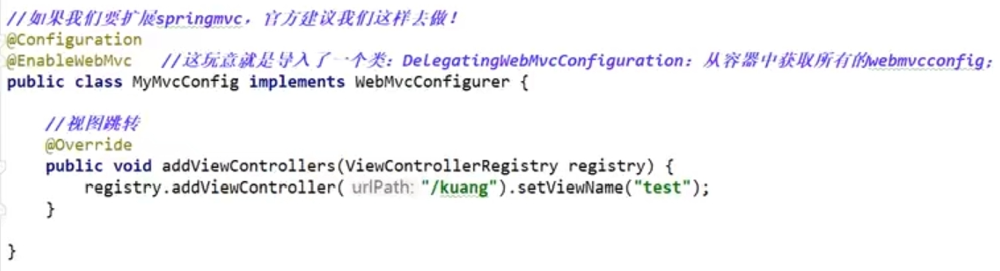
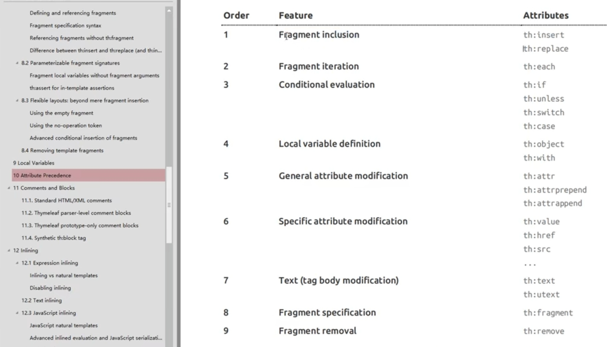

# 接口扩展

## WebMvcConfigurer

样例

# 模板引擎

## Themleaf

标签

# Rest client

## 1. RestTemplate

​	RestTemplate is a **synchronous** client to perform HTTP requests；

​	**As of 5.0 the RestTemplate is in maintenance mode,** with only minor requests for changes and bugs to be accepted going forward. Please, consider using the **WebClient** which offers a more modern API and supports sync, async, and streaming scenarios.

## 2. WebClient

​	WebClient is a non-blocking, reactive client to perform HTTP requests. It was introduced in 5.0 and offers a modern alternative to the RestTemplate, with efficient support for **both synchronous and asynchronous**, as well as **streaming** scenarios.

  In contrast to RestTemplate, WebClient supports the following:

- Non-blocking I/O.

- Reactive Streams back pressure.

- High concurrency with fewer hardware resources.

- Functional-style, fluent API that takes advantage of Java 8 lambdas.

- Synchronous and asynchronous interactions.

- Streaming up to or streaming down from a server

