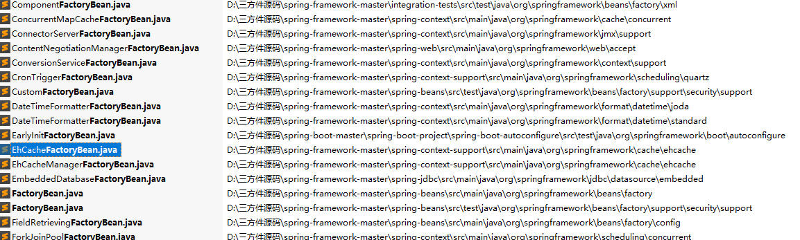
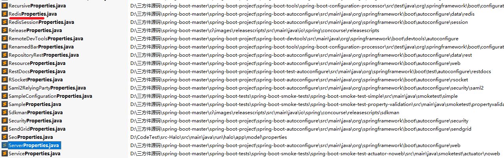

# 一、Spring

## 1. xxFactoryBean.java

功能：

### 1.1 查找结果

仅列举部分



代码样例，实现FactoryBean接口

```java
public class EarlyInitFactoryBean implements FactoryBean<String> {

public class EhCacheFactoryBean extends CacheConfiguration implements FactoryBean<Ehcache>, BeanNameAware, InitializingBean
```


## 2. xxBeanPostProcessor

### 2.1 查找结果

​	仅列举部分


## 3. Aware接口

Aware系列接口，主要用于辅助Spring bean访问Spring容器

### 3.1 查找结果

- ApplicationContextAware


每个Aware子接口都实现了一个setXX方法，而方法中的形参是接口Aware前面的内容，也就是当前Bean需要感知的内容。所以我们需要在Bean中声明相关的成员变量来接收。

- 2.1 ApplicationContextAware

  ```javascript
  void setApplicationContext(ApplicationContext applicationContext)
  ```

  2.2 BeanClassLoaderAware

  ```javascript
  void setBeanClassLoader(ClassLoader classLoader);
  ```

  2.3 BeanFactoryAware

  ```javascript
  void setBeanFactory(BeanFactory beanFactory)
  ```

  2.4 BeanNameAware

  ```javascript
  void setBeanName(String name);
  ```

### 3.2 测试

```java
public class User implements ApplicationContextAware,BeanClassLoaderAware,BeanFactoryAware,BeanNameAware{

	private int id;
	
	private String name;
	// 保存感知的信息
	private String beanName;
	// 保存感知的信息
	private BeanFactory beanFactory;
	// 保存感知的信息
	private ApplicationContext ac;
	// 保存感知的信息
	private ClassLoader classLoader;
	
	public BeanFactory getBeanFactory() {
		return beanFactory;
	}

	public ApplicationContext getAc() {
		return ac;
	}

	public ClassLoader getClassLoader() {
		return classLoader;
	}

	public User(){
		System.out.println("User 被实例化");
	}

	public int getId() {
		return id;
	}

	public void setId(int id) {
		this.id = id;
	}

	public String getName() {
		return name;
	}

	public void setName(String name) {
		this.name = name;
	}

	public String getBeanName() {
		return beanName;
	}
	
	/**
	 * 自定义的初始化方法
	 */
	public void start(){
		System.out.println("User 中自定义的初始化方法");
	}
	
	@Override
	public String toString() {
		return "User [id=" + id + ", name=" + name + ", beanName=" + beanName + "]";
	}

	@Override
	public void setBeanClassLoader(ClassLoader classLoader) {
		System.out.println(">>> setBeanClassLoader");
		this.classLoader = classLoader;
	}

	@Override
	public void setApplicationContext(ApplicationContext applicationContext) throws BeansException {
		System.out.println(">>> setApplicationContext");
		this.ac = applicationContext;
	}

	@Override
	public void setBeanName(String name) {
		System.out.println(">>> setBeanName");
		this.beanName = name;
	}

	@Override
	public void setBeanFactory(BeanFactory beanFactory) throws BeansException {
		System.out.println(">>> setBeanFactory");
		this.beanFactory = beanFactory;
	}
}
```

测试结果

```java
@Test
public void test1() {
	ApplicationContext ac = new ClassPathXmlApplicationContext("applicationContext.xml");
	User user = ac.getBean(User.class);
	System.out.println("beanFactory:"+user.getBeanFactory());
	System.out.println("beanName:"+user.getBeanName());
	System.out.println("applicationContext:"+user.getAc());
	System.out.println("classLoader:"+user.getClassLoader());
	System.out.println(user);
}

测试结果：
User 被实例化
>>> setBeanName
>>> setBeanClassLoader
>>> setBeanFactory
>>> setApplicationContext
User 中自定义的初始化方法
beanFactory:org.springframework.beans.factory.support.DefaultListableBeanFactory@4520ebad: defining beans [user]; root of factory hierarchy
beanName:user
applicationContext:org.springframework.context.support.ClassPathXmlApplicationContext@311d617d: startup date [Sun Mar 03 22:43:08 CST 2019]; root of context hierarchy
classLoader:sun.misc.Launcher$AppClassLoader@4aa298b7
User [id=0, name=波波烤鸭, beanName=user]
```


## 4. xxAnnotationparser.java


## 5. EnableXXX

### 查找结果


### 实现原理


## 6. xxxBeanFactory


# 二、SpringBoot

## 1. xxProperties.java

定义在application.properties参数的定义和默认值

### 1.1 查找结果



如RedisProperties内容

