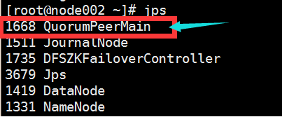

### 启动


启动zk后，启动类： QuorumPeerMain 



QuorumPeerMain：zookeeper集群的启动入口类，是用来加载配置启动QuorumPeer线程的。

QuorumPeer，谷歌翻译quorum是法定人数，定额的意思，peer是对等的意思，quorum代表的意思就是每个zookeeper集群启动的时候集群中zookeeper服务数量就已经确定。

zookeeper是基于paxos算法实现的，在每个zookeeper的配置文件中配置集群中的所有机器

```bash
# server.X记录代表集群中的一个服务;X代表zookpeer的sid;
server.1=127.0.0.1:2888:3888
server.2=127.0.0.1:2888:3888
server.3=127.0.0.1:2888:3888
```

QuorumPeerConfig会构建一个QuorumServer对象，每个zookeeper都会编辑自己的sid在dataDir目下的myid文件中，sid标记每个服务，在快速选举中起作用。

