>  参考材料：

https://www.bilibili.com/video/BV1a4411B7V9?from=search&seid=373116801260941011


## 一、Kafka概述

### 1.1 定义

==分布式==基于发布/订阅模式的消息队列，用于==大数据实时处理==领域。

功能：解耦、异步、削峰。

### 1.2 Kafka基础架构

消息队列两种模式：点到点、发布订阅模式（推和拉两种模式）。Kafka基于Pull模式。

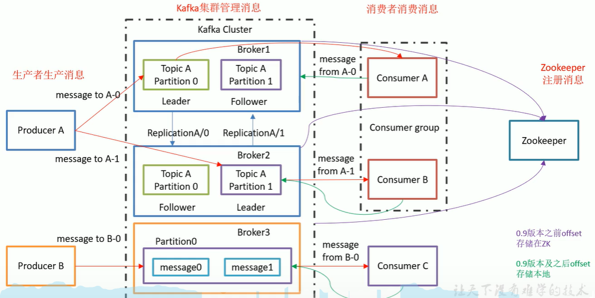

zk作用：1）Kafka集群工作，支撑Leader选举；2）0.9版本前消费者的offset（0.9后存储在Kafka磁盘中），降低对ZK的频繁交互；

Leader和Follower：面向Topic，而不是面向Broker。

broker：一个服务器是一个broker；一个集群由多个broker组成；一个broker可容纳多个topic。

Consumer Group：==消费者组内每个消费者负责消费不同分区的数据。一个分区只能一个组内消费者消费。消费者组间互不影响。==

==Partition==: 为实现扩展性，一个topic可分为多个Partition。==每个partition是一个有序的队列。==

==Replica==: 副本


## 二、安装部署

### 2.1 集群规划

多个节点，每个节点部署zk和kafka

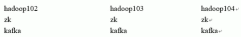

### 2.2 配置文件

Kafka集群中所有broker修改server.properties，==同时修改连接的zk信息==

```bash
broker.id=0  #全局唯一
delete.topic.enable=true
log.dirs=xxx  # topic的消息数据
log.retention.hours=168  #消息数据保存时间，默认7天
log.segment.bytes=1073141824 # 默认1G
# 配置zk集群信息，集群信息，需写所有zk节点2181信息；从而ZK知道哪些kafka是同一个集群
zookeeper.connect=localhost:2181
zookeeper.connect.timeout.ms=6000
```

### 2.3 启停过程

1、启动zk集群

​      每个zk节点，单独的zoo.cfg修改（如果不使用kafka自带的zk）

2、每个broker启停Kafka

```bash
常用命令kafka/bin目录
kafka-server-start.sh
kafka-server-stop.sh
# 如下测试使用
kafka-topics.sh
kafka-console-consumer.sh
kafka-console-producer.sh
```

启动  kafka-server-start.sh -daemon config/server.properties

停止  kafka-server-stop.sh

### 2.4 topic命令操作

> --zookeeper 必须指定，指定集群信息

1. 查看当前服务所有topic

   ```bash
   kafka-topics.sh --zookeeper hadoop102:2181 --list
   ```

2. 创建topic（指定分区和副本数）

   ```bash
   # 指定副本，分区
   kafka-topics.sh --zookeeper hadoop102:2181 --create --replication-facotr 2 --partitions 2 -- topic first
   ```

   ==创建后会在不同机器log.dir目录下生成分区文件==，遍历所有节点在会发现副本数。共计会发现两次first-0,first-1

   **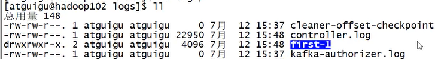**

   如果同时创建多个topic，kafka日志存储形式类似如下：

   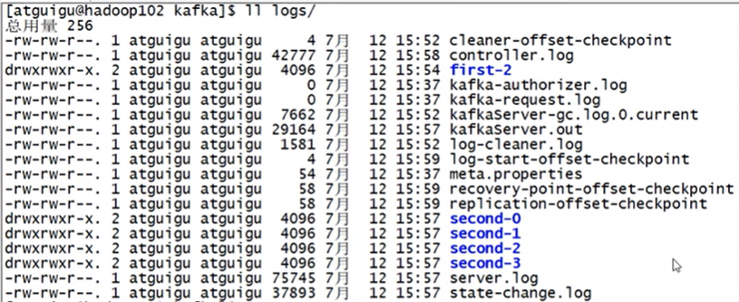

3. 删除topic

   ```bash
   # 需要server.properties中delete.topics.enable=true,否则只是标记删除
   kafka-topics.sh --zookeeper hadoop102:2181 --delete --topic first
   ```

4. 查看某个topic详情

   ```bash
   kafka-topics.sh --zookeeper hadoop102:2181 --describe --topic first
   ```

   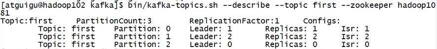

5. 修改分区数

   ```bash
   kafka-topics.sh --zookeeper hadoopo102:2181 --alter -topic first --partition 6
   ```

### 2.5 生产者和消费者(自带shell)

生产者：

```bash
kafka-console-producer.sh --topic first --zookeeper hadoop1:2181
```

消费者：连Kafka信息

```bash
kafka-console-consumer.sh --topic first --bootstrap-server hadoop1:9092
```

如果消费者加入晚，需要从头开始消费，增加参数  ==--from-beginning==，最早7天内数据

### 2.6 offset备份在kafka的topic中


## 三、Kafka架构深入

### 3.1 工作流程和文件存储机制

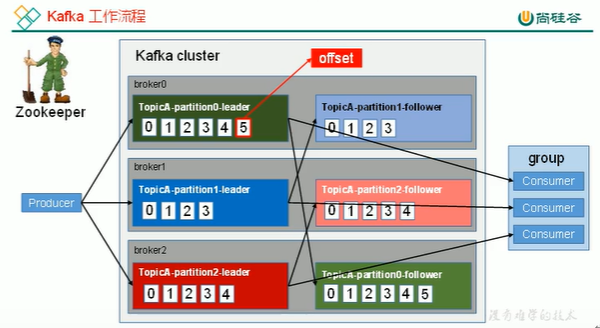

> 上述所有数字只代表offset，不是实际的内容。共计发送了15条消息。

==只保证分区内消息有序，不能保证全局消息有序。==

实际过程中，每个consumer都会实时记录消费到了哪个offset；出错恢复时可以恢复现场。

#### 3.1.1 partition=n*segment（index+log）

由于生产者消息不断追加到log末尾，为防止log过大而导致数据定位效率问题。所以采用==分片+索引==机制：

> 1. 将每个partition分为多个segment。
> 2. 每个segment对应文件：index+log，位于同一目录（topic名称+分区号）


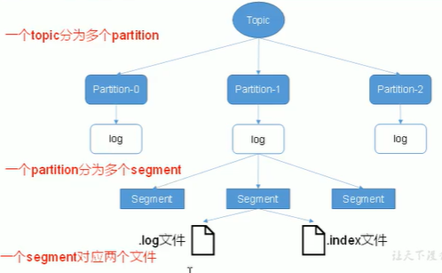

1. **每个片段的大小控制：**默认最大1G

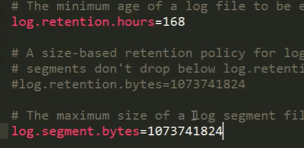

2. ==index和log所处目录名称：topic名称+分区号==

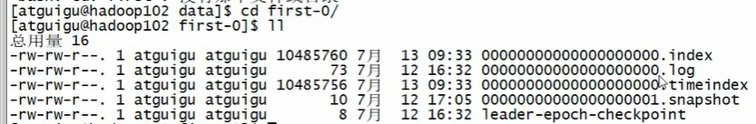

3. ==index和log以当前segment第1条消息offset命名。==

   

   查找过程示意：1）定位segment；2）根据offset查找消息

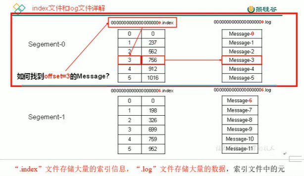


### 3.2 生产者（发送可靠性）

#### 3.2.1 发送partition分区选择

**分区原因：**

1. 方便集群扩展：每个parition可调整适应所在机器；一个topic可以有多个partition，因此集群可以适应任意大小数据
2. 提高并发：以partition为单位读写

**==分区原则：==**

  根据构造ProducerRecord来决定，参考构造函数：

1. 源码直接指定；
2. 根据下发的key对分区数取余；
3. 随机生成一个数，对分区数取余；后续对随机数自增取余。

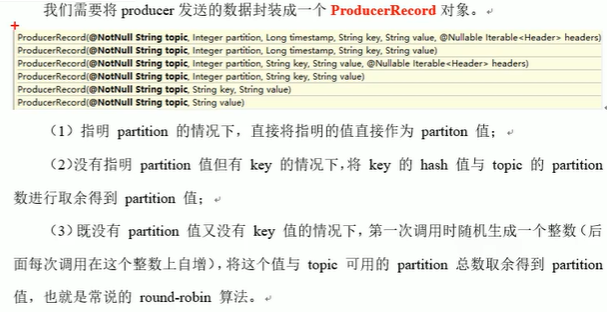

#### 3.2.2 发送数据可靠性保证ack

  producer成功发送消息的ack机制：


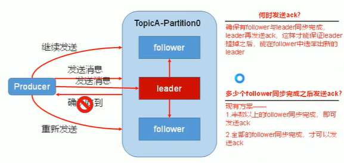

当前方案：半数以上同步完成，就发ack。

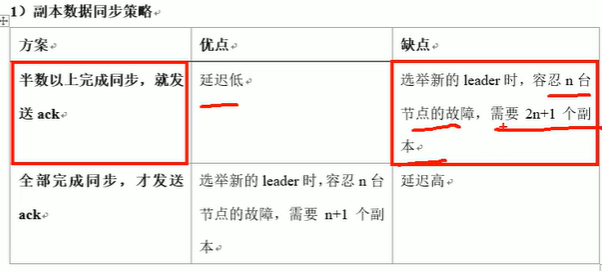

#### 3.2.3 生产者ISR（In sync replica set）

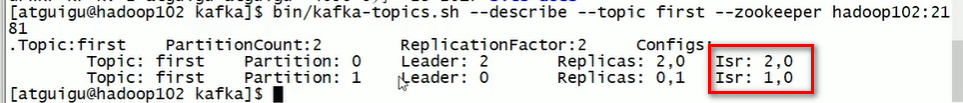

==ISR：记录哪些follower与leader数据一致；后续leader挂掉后，从isr中选取leader；==

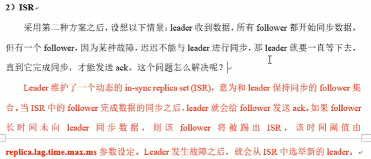


P14 15min

https://www.bilibili.com/video/BV1a4411B7V9?p=14

## Kafka日志说明

