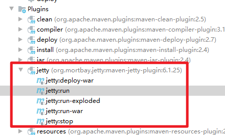

# 一、 代码目录


# 二、服务器配置

## 1. maven-jetty-plugin插件（POM）

运行jetty服务器

```xml
<build>
 	<plugins>
		 <plugin>
            <groupId>org.mortbay.jetty</groupId>
            <artifactId>maven-jetty-plugin</artifactId>
            <version>6.1.25</version>
            <configuration>
                <connectors>
                    <connector implementation="org.mortbay.jetty.nio.SelectChannelConnector">
                        <port>80</port>
                        <maxIdleTime>60000</maxIdleTime>
                    </connector>
                </connectors>
                <contextPath>/forum</contextPath>
                <scanIntervalSeconds>0</scanIntervalSeconds>
            </configuration>
        </plugin>
    </plugins>
</build>
```

效果



双击jetty:run启动当前服务

