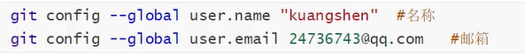
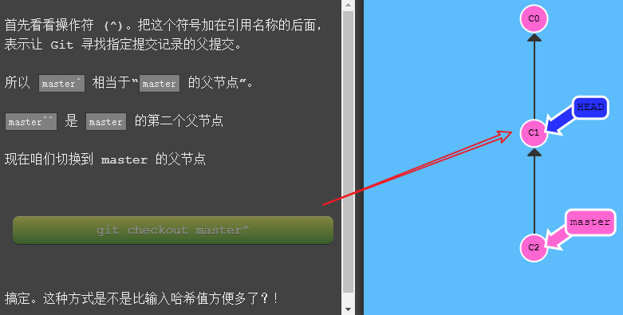

### 1. 参考资料

码云官网底部： 


> Git 大全

​		// 从工具安装下载，插件、服务搭建，命令行

​		==工具下载经验==：国外工具在国内镜像的下载

​				http://npm.taobao.org/mirrors/git-for-windows/

​		搜索：taobao 镜像 git   //  直接访问http://npm.taobao.org/mirrors会提示404

> Git 命令学习

​		==动画演示，循序渐进学习命令，所见即所得==


> 狂神说 B站视频


### 2. Git环境配置

> **git config -l**   查看全局和系统配置

```bash
git config -l
```


> **git config --system -l**   

​    查看系统配置，系统默认配置

> **git config --global -l**   

​    查看用户配置


1. 默认保存在.gitconfig文件中，c盘 用户目录下文件保存


2. 设置用户配置




### 3. Git理论

Git工作区域：工作目录-》暂存区Stage-》本地仓库（Local Repository)->远端git仓库（Remote Directory）


### 4. Git命令操作


#### 1. 本地仓库搭建

1. git init： 目录下新建仓库

2. git clone 路径

   

#### 2. 文件状态

> 文件有4种状态


>  ==命令==

```bash
# 查看所有文件状态
git status  
# 上传文件到暂存区
git add .   
# 提交暂存区文件到个人本地仓库，m代表message
git commit  -m      
```

#### 3. 文件.gitignore

  配置忽略不提交暂存区文件


1. 

   


#### 4. Git 分支操作

```bash
# 列出所有本地分支
git branch
# 列出所有远程分支
git branch -r
# 新建一个分支，但仍停留在当前分支
git branch [branch-name]
# 新建一个分支，并切换该分支
git checkout -b [branch]
# 合并指定分支到当前分支
git merge [branch]
# 删除分支
git branch -d [branch-name]

# 删除远程分支
git push origin --delete [branch-name]
git branch -dr [remote/brach]
```

#### 5. Git 远程remote仓库操作

查看所有远程仓库

```bash
# 查看所有远程仓库信息
git remote -v
# 添加远端仓库
git remote add [shortname] [url]
# 删除远程仓库
git remote rm name  

# 取回远程仓库的变化，并与本地分支合并
$ git pull [remote] [branch]
```

样例：

```bash
$ git remote -v
origin  https://github.com/tianqixin/runoob-git-test (fetch)
origin  https://github.com/tianqixin/runoob-git-test (push)

添加远端仓库
$ git remote add origin git@github.com:tianqixin/runoob-git-test.git
```


#### 6. Git Head操作

> HEAD 是一个对当前检出记录的符号引用 —— 也就是指向你正在其基础上进行工作的提交记录。
>
> HEAD 总是指向当前分支上最近一次提交记录。大多数修改提交树的 Git 命令都是从改变 HEAD 的指向开始的。
>
> HEAD 通常情况下是指向分支名的（如 bugFix）。在你提交时，改变了 bugFix 的状态，这一变化通过 HEAD 变得可见。

当前


执行命令 ==git checkout c4==，生成HEAD


执行命令 == git checkout c2==，切换HEADER位置


#### 7. Git 相对引用

> 通过指定提交记录哈希值的方式在 Git 中移动不太方便。在实际应用时，不得不用 `git log` 来查查看提交记录的哈希值。
>
> 哈希值在真实的 Git 世界中也会更长（译者注：基于 SHA-1，共 40 位）。哈希值可能是 `fed2da64c0efc5293610bdd892f82a58e8cbc5d8`。
>
> 比较令人欣慰的是，Git 对哈希的处理很智能。你只需要提供能够唯一标识提交记录的前几个字符即可。因此我可以仅输入`fed2` 而不是上面的一长串字符。

- 使用 `^` 向上移动 1 个提交记录
- 使用 `~<num>` 向上移动多个提交记录，如 `~3`

##### 1. 设置Header到指定位置

样例1：通过分支名+^方式移动



  样例2：==将 `HEAD` 作为相对引用的参照==


样例3：使用~数字进行多次回退


##### 2. 使用"!" 进行分支强制移动指定位置

  初始状态： master位于C4节点，通过相对引用，移动到C1节点


#### 8. Git撤销变更

>  撤销变更由底层部分（暂存区的独立文件或者片段）和上层部分（变更到底是通过哪种方式被撤销的）组成
>
> 主要有两种方法用来撤销变更 —— 一是 `git reset`，还有就是 `git revert`

##### 1. git reset


##### 2. git revert

> 虽然在你的本地分支中使用 `git reset` 很方便，但是这种“改写历史”的方法对大家一起使用的远程分支是无效的哦！

初始状态：master位于C2节点


#### 9. Git整理提交记录


### 5. 使用码云

1. 设置本机绑定SSH公钥，实现免密登录

   ```bash
   #  进入  c:\users\登录名\.ssh目录
   ssh-keygen
   ```

   

2. 将公钥信息添加码云账号，SSH配置，将pub文件所有内容放入

3. 使用码云界面创建个人仓库：仓库名称，开源许可证信息

4. git clone克隆到本地