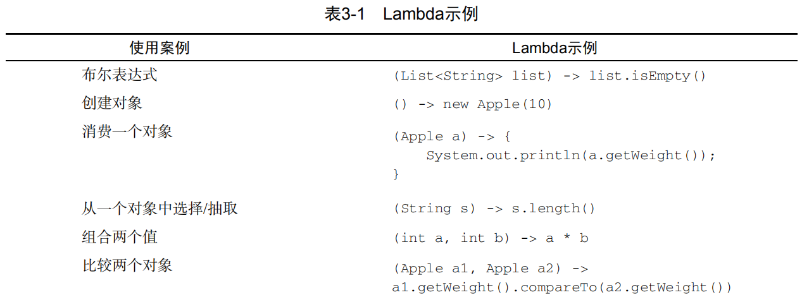
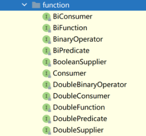

# 参考文档：

​	《Java 函数式编程》

​	《Java8 实战》

# 一、零散特性

## try-with-resources & AutoClosable

# 二、Optional

 Optional 类既可以含有对象也可以为空 

在线JDK说明： https://www.matools.com/file/manual/jdk_api_1.8_google/java/util/Optional.html#orElseThrow-java.util.function.Supplier-

## 1. API定义

### 1.1 构造函数

```java
private Optional() // 构建一个空的 Optional 实例。实例中的 value == null
private Optional(T var1) // 构建一个Optional 实例。实例中的 value == var1。var1为NULL会抛NPE.
```

### 1.2 获取 Optional 实例方法

```java
public static  Optional empty() // 获取一个 Optional 空实例。
public static  Optional of(T var0) // 获取一个 Optional 实例。var0为NULL会抛NPE。
public static  Optional ofNullable(T var0) // 获取一个 Optional 实例。var0为 NULL 会返回一个 Optional 空实例。
```

### 1.3 获取 Optional 实例中的 value

```java
public T get()  // value 为空抛NoSuchElementException。
public T orElse(T var1) // value 不为 NULL 则返回 value ；为 NULL 返回 var1。
public T orElseGet(Supplier<? extends T> var1) // value 不为 NULL 则返回 value ；为 NULL 执行 Supplier。
public <X extends Throwable> T orElseThrow(Supplier<? extends X> var1) throws X 
// value 不为 NULL 则返回 value ；为 NULL 执行 var1。
```

### 1.4 判断 Optional 是否存在

```java
public boolean isPresent()  // 即返回 Optional 实例中的 value 是否为 NULL。
public void ifPresent(Consumer<? super T> var1) // value 不为 NULL 则执行 var1。
```

### 1.5 其他 Lambda 表达式的操作

​	 如果当前对象为NULL，则返回自己或者一个 Optional 空实例。不 NULL 则执行后面的 Lambda，得到返回结果的Optional 实例 

```java
public Optional<T> filter(Predicate<? super T> var1)：
public <U> Optional<U> map(Function<? super T, ? extends U> var1)：
public <U> Optional<U> flatMap(Function<? super T, Optional<U>> var1)
```

## 2. 代码样例

```java
Optional<User> emptyOpt = Optional.empty();
Optional<User> opt = Optional.of(user);  // 不可为NULL，否则NPE
Optional<User> opt = Optional.ofNullable(user);

Optional<String> opt = Optional.ofNullable(name);
assertEquals("John", opt.get());  // value 为空抛NoSuchElementException

User user = null;
User user2 = new User("anna@gmail.com", "1234");
User result = Optional.ofNullable(user).orElse(user2);
User result = Optional.ofNullable(user).orElseGet( () -> user2); // user为空执行Supplier

User result = Optional.ofNullable(user)
      .orElseThrow( () -> new IllegalArgumentException());

User user = new User("anna@gmail.com", "1234");
String email = Optional.ofNullable(user)
      .map(u -> u.getEmail()).orElse("default@gmail.com");
// map() 对值应用(调用)作为参数的函数，

User user = new User("anna@gmail.com", "1234");
user.setPosition("Developer");
String position = Optional.ofNullable(user)
      .flatMap(u -> u.getPosition()).orElse("default");

// filter() 接受一个 Predicate 参数，返回测试结果为 true 的值。如果测试结果为 false，会返回一个空的 Optional。
User user = new User("anna@gmail.com", "1234");
    Optional<User> result = Optional.ofNullable(user)
      .filter(u -> u.getEmail() != null && u.getEmail().contains("@"));
```

具体场景

```java
if (user != null) {
    Address address = user.getAddress();
    if (address != null) {
        Country country = address.getCountry();
        if (country != null) {
            String isocode = country.getIsocode();
            if (isocode != null) {
                isocode = isocode.toUpperCase();
            }
        }
    }
}
```

==优化后==

1. 重构类，使其 getter 方法返回 *Optional* 引用：

```java
public class User {
    private Address address;

    public Optional<Address> getAddress() {
        return Optional.ofNullable(address);
    }

    // ...
}
public class Address {
    private Country country;

    public Optional<Country> getCountry() {
        return Optional.ofNullable(country);
    }

    // ...
}
```

2. 具体业务代码

```java
String result = Optional.ofNullable(user)
  .flatMap(User::getAddress)
  .flatMap(Address::getCountry)
  .map(Country::getIsocode)
  .orElse("default");
```

# 三、Lambda表达式

​	Lambda表达式，JDK8允许把函数作为一个方法的参数（函数作为参数传递进方法中）。使用 Lambda 表达式可以使代码变的更加简洁紧凑。

```
(parameters) -> expression
(parameters) ->{ statements; }
```

样例：

```java
//入参为空
TestDemo no_param = () -> "hi, no param";
TestDemo no_param2 = () -> { return "hi, no param"; };
System.out.println(no_param.hi());

//单个参数
TestDemo2 param = name -> name;
TestDemo2 param2 = name -> { return name;};
System.out.println(param.hei("hei, grils"));

//多个参数
TestDemo3 multiple = (String hello, String name) -> hello + " " + name;
//一条返回语句，可以省略大括号和return
TestDemo3 multiple2 = (hello, name) -> hello + name;
//多条处理语句，需要大括号和return
TestDemo3 multiple3 = (hello, name) -> {
    System.out.println("进入内部");
    return hello + name;
};
System.out.println(multiple.greet("hello", "lambda"));
```

1）对象::实例方法，将 lambda 的参数当做方法的参数使用

```java
Consumer<String> sc = System.out::println;
//等效
Consumer<String> sc2 = (x) -> System.out.println(x);
sc.accept("618, 狂欢happy");
```

2）类::静态方法，将lambda的参数当做方法的参数使用

```java
//ClassName::staticMethod  类的静态方法：把表达式的参数值作为staticMethod方法的参数
Function<Integer, String> sf = String::valueOf;
//等效
Function<Integer, String> sf2 = (x) -> String.valueOf(x);
String apply1 = sf.apply(61888);
```

3）类::实例方法，将lambda的第一个参数当做方法的调用者，其他的参数作为方法的参数。开发中尽量少些此类写法，减少后续维护成本。

```java
//ClassName::instanceMethod  类的实例方法：把表达式的第一个参数当成instanceMethod的调用者，其他参数作为该方法的参数
BiPredicate<String, String> sbp = String::equals;
//等效
BiPredicate<String, String> sbp2 = (x, y) -> x.equals(y);
boolean test = sbp.test("a", "A");
```

4）构造函数

```java
Supplier<User> us = User::new;
//等效
Supplier<User> us2 = () -> new User();
//获取对象
User user = us.get();

//一个参数,参数类型不同则会编译出错
Function<Integer, User> uf = id -> new User(id);
//或加括号
Function<Integer, User> uf2 = (id) -> new User(id);
//等效
Function<Integer, User> uf3 = (Integer id) -> new User(id);
User apply = uf.apply(61888);

//两个参数
BiFunction<Integer, String, User> ubf = (id, name) -> new User(id, name);
User 狂欢happy = ubf.apply(618, "狂欢happy");
```


## 样例



```java
List<Apple> result = 
 		filterApples(inventory, (Apple apple) -> "red".equals(apple.getColor()));

public interface Predicate<T>{ 
 boolean test(T t); 
} 

public static <T> List<T> filter(List<T> list, Predicate<T> p){
 		List<T> result = new ArrayList<>(); 
		for(T e: list){ 
 		if(p.test(e)){ 
 			result.add(e); 
 		} 
 	} 
 	return result; 
}
List<Apple> redApples = 
 	filter(inventory, (Apple apple) -> "red".equals(apple.getColor())); 
List<Integer> evenNumbers = 
 	filter(numbers, (Integer i) -> i % 2 == 0);
```

排序

```java
// java.util.Comparator 
public interface Comparator<T> { 
	public int compare(T o1, T o2); 
}

inventory.sort((Apple a1, Apple a2) -> a1.getWeight().compareTo(a2.getWeight()));
```

线程

```java
Thread t = new Thread(() -> System.out.println("Hello world"));
```


# 四、函数式接口

使用@FunctionalInterface注解定义的接口，且里面只有一个抽象方法

## 1. 原有函数式接口

Runnable、Callable、PrivilegedAction、Comparator、FileFilter、PathMatcher、InvocationHandler

PropertyChangeListener、java.awt.event.ActionListener、javax.swing.event.ChangeListener

## 2. 新增函数式接口

JDK8新增函数式接口，代码位置java.util.function



### 2.1 消费型Consumer<T>

```java
@FunctionalInterface
public interface Consumer<T> {
    void accept(T t);
    default Consumer<T> andThen(Consumer<? super T> after) {
        Objects.requireNonNull(after);
        return (T t) -> { accept(t); after.accept(t); };
    }
}
```

#### 样例：

### 2.2 供给型Supplier<T>

T get()

#### 样例：	

### 2.3 函数型Function<T，R>

 R apply(T t);

#### 	样例

### 2.4 断言型Predicate<T>

​    boolean test(T t)

#### 	样例


# 五、Stream编程

## 1. API定义


## 2. 怎么得到Stream


# 时间日期