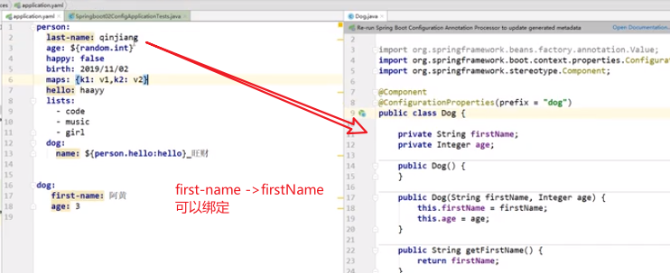
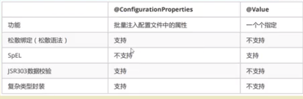
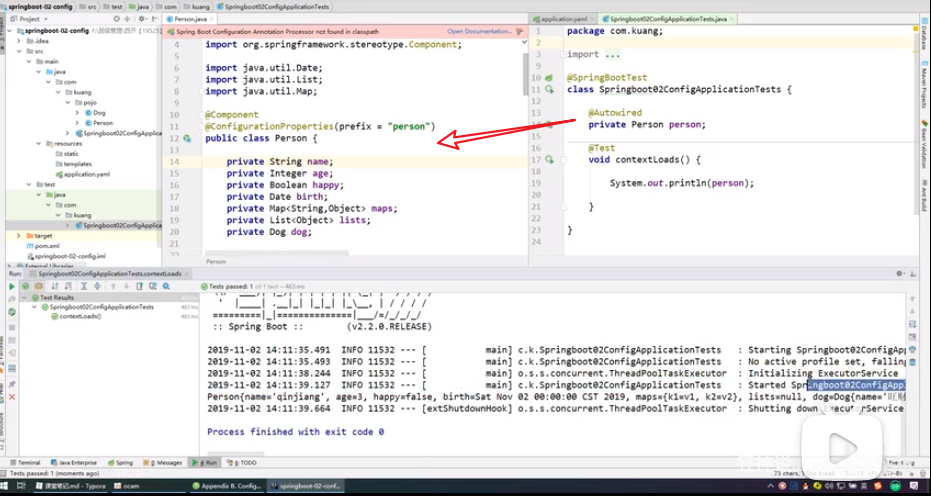
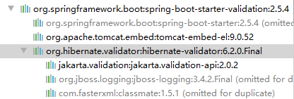
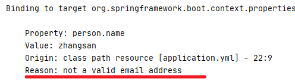
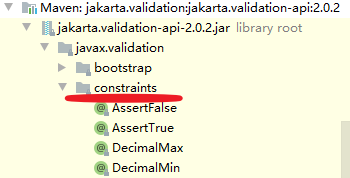

## 

Spring实战第5版

SpringBoot官网  https://docs.spring.io/spring-boot/docs/current/reference/html/index.html

https://www.baeldung.com/spring-boot

【狂神说Java】SpringBoot + 【狂神说Java】SpringBoot开发简单的网站

# 原理篇

## 1、自动装配原理

​	https://www.bilibili.com/video/BV1PE411i7CV?p=6

### pom.xml

```java
spring-boot-starter-parent 核心依赖在父工程中，定义了源码、资源、打包等相关配置
	- spring-boot-dependencies  定义了各种三方件如activiti、redis等各种三方件jar的dependencyManagement和版本号
```


### 启动器

```xml
<groupId>org.springframework.boot</groupId>
<artifactId>spring-boot-starter</artifactId>
<version>2.5.4</version>
```

定义了springboot的启动场景

- spring-boot-start-web：帮我们自动导入web场景所有依赖，如tomcat-embed

  


### 注解SpringBootApplication

```java
SpringBootApplication
	- EnableAutoConfiguration
    	- @Import({AutoConfigurationImportSelector.class})
        - AutoConfigurationPackage
    		- @Import({Registrar.class})
    - SpringBootConfiguration
    	- Configuration

    - ComponentScan
```


### SpringApplication

参考： https://www.bilibili.com/video/BV1PE411i7CV?p=7

主要功能

- 推断应用是普通项目还是WEB项目
- 查找并加载所有可用初始化器，设置到initializer中
- 找出所有应用监听器，设置到listener中
- 推断并设置main方法的定义类，找到运行的主类

# 应用篇

## 1、指定属性

### @Value直接指定

### 使用springboot-@configurationProperties
  1、默认绑定applicatons.yml定义的属性
  2、使用注解，自动与之绑定

  ```java
  // 此处默认将applications.yml内容与之绑定
  @Componenet
  @Data
  @AllArgsConstructor
  @NoArgsConstructor
  @ConfigurationProperties(prefix = "person")
  public Class Person {
      private String name;
      private Integer age;
      private Map<String, Object> maps;
      private List<Object> lists;
      private Dog dog
  }
  ```

applicatoins.yml

```yaml
person:
	name: zhangsan
	age: 23
	maps {k1：v1; k2：v2}
	lists:
		- aaa
		- bbb
	Dog
		name: "wangcai"
		age: 3
```

### 使用Spring-@PropertySource

1、定义属性 resource/db.properties

``` properties
db.username=tester
db.password=123456
```

2、导入并引用

```java
@Component
@Data
@NoArgsConstructor
@AllArgsConstructor
@PropertySource(value="classpath:db.properties")
public class DB {
    @Value("${db.username}")
    private String username;
    @Value("${db.password}")
    private String password;
}
```


### 对比

ConfigurationProperties支持松散绑定，未严格要求字段拼写一致，见下图



> 推荐使用configurationProperties+ yml方式，不需要针对每个字段都使用@Value绑定




### 功能测试




## 2、JSR-303校验

> 校验字段合法性

pom依赖

``` xml
<groupId>org.springframework.boot</groupId>
<artifactId>spring-boot-starter-validation</artifactId>
```

SpringBoot 中的 `bean validation` 是继承`hibernate-validator`和`tomcat-embed-el`



字段校验注解，在具体字段上

```java
@Component
@Data
@NoArgsConstructor
@AllArgsConstructor
@ConfigurationProperties(prefix = "person")
@Validated
public class Person {
    @Email(message = "not a valid email address")  // 自定义报错信息
    private String name;
    private String age;
}
```

测试结果：



字段校验注解（JSR303规范+hibernate扩展）

```java
@Valid	被注释的元素是一个对象，需要检查此对象的所有字段值
@Null	被注释的元素必须为 null
@NotNull	被注释的元素必须不为 null
@AssertTrue	被注释的元素必须为 true
@AssertFalse	被注释的元素必须为 false
@Min(value)	被注释的元素必须是一个数字，其值必须大于等于指定的最小值
@Max(value)	被注释的元素必须是一个数字，其值必须小于等于指定的最大值
@DecimalMin(value)	被注释的元素必须是一个数字，其值必须大于等于指定的最小值
@DecimalMax(value)	被注释的元素必须是一个数字，其值必须小于等于指定的最大值
@Size(max, min)	被注释的元素的大小必须在指定的范围内
@Digits (integer, fraction)	被注释的元素必须是一个数字，其值必须在可接受的范围内
@Past	被注释的元素必须是一个过去的日期
@Future	被注释的元素必须是一个将来的日期
@Pattern(value)	被注释的元素必须符合指定的正则表达式

@Email	被注释的元素必须是电子邮箱地址
@Length(min=, max=)	被注释的字符串的大小必须在指定的范围内
@NotEmpty	被注释的字符串的必须非空
@Range(min=, max=)	被注释的元素必须在合适的范围内
@NotBlank	被注释的字符串的必须非空
@URL(protocol=,host=, port=,regexp=, flags=)	被注释的字符串必须是一个有效的url
```

参考



## 3、多环境配置


