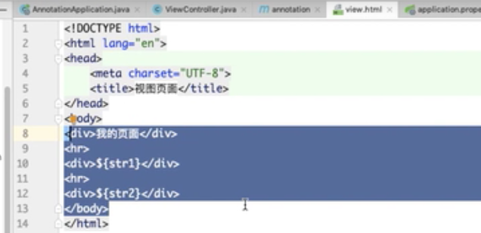
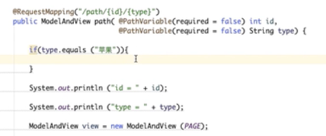

## 参考文档：

Spring实战第5版

Spring官网

---

## 常用注解

https://www.bilibili.com/video/BV1y7411j78K?from=search&seid=17566126572410637701

``` properties
@SpringBootApplication
@Controller/RestController/RequestMapping/RequestParam/PathVariable
@GetMapping/PutMapping/DeleteMapping/RequestBody/ResponseBody
@CrossOrigin
@Configuration/Bean/Service/Component
@Autowired/Resource/Autowired+Qualifier/Values
```

FreeMarker模板依赖

``` xml
<dependency>
    <groupdId>org.springframework.boot</groupdId>
    <artifactId>spring-boot-starter-freemarker</artifactId>
</dependency>
```

applications.properties配置

``` pro
server.port=8080
#spring.mvc.view.prefix=/
#spring.mvc.view.suffix=.html
#freeMarker
#spring.freemarker.suffix=.html
#spring.freemarker.template-load-path=classpath:/static/
```








@Controller 返回并查找页面 ModelAndView

@RestController 不返回页面，POSTMAN调用

