### 参考 

狂神说Java：Spring 5教程

https://www.bilibili.com/video/BV1WE411d7Dv?from=search&seid=9005465323303069344 

Spring官网PDF

Spring实战第4版


# 一、简介

maven依赖配置：依赖context/core/aop等多个模块，自己开发时可只指定该模块

```xml
<!-- https://mvnrepository.com/artifact/org.springframework/spring-webmvc -->
<dependency>
    <groupId>org.springframework</groupId>
    <artifactId>spring-webmvc</artifactId>
    <version>5.3.3</version>
</dependency>
```

# 二、 IOC

官方：https://docs.spring.io/spring-framework/docs/current/reference/html/core.html#spring-core

## 1 容器概览

### 1.1 元数据配置方式

1. beans.xml：传统方式

2. 注解: Since Spring 2.5
3. Java base Configuration：基于Spring JavaConfig工程（spring core框架中组件）提供，since spring 3.0。 @Configuration, @Bean, @Import, and @DependsOn annotations.

```xml
<!- 传统方式 ->
<?xml version="1.0" encoding="UTF-8"?>
<beans xmlns="http://www.springframework.org/schema/beans"
  xmlns:xsi="http://www.w3.org/2001/XMLSchema-instance"
  xsi:schemaLocation="http://www.springframework.org/schema/beans
  https://www.springframework.org/schema/beans/spring-beans.xsd">
  <bean id="..." class="..."> ① ②
  <!-- collaborators and configuration for this bean go here -->
  </bean>
  <bean id="..." class="...">
  <!-- collaborators and configuration for this bean go here -->
  </bean>
  <!-- more bean definitions go here -->
</beans>
```

### 1.2 实例化容器

The location path or paths supplied to an ApplicationContext constructor are resource strings that let the container load configuration metadata from a variety of external resources, such as the local file system, the Java CLASSPATH, and so on.

```java
// create and configure beans, 构造函数可传入多个xml配置
ApplicationContext context = new ClassPathXmlApplicationContext("services.xml",
"daos.xml");
// retrieve configured instance
PetStoreService service = context.getBean("petStore", PetStoreService.class);
// use configured instance
List<String> userList = service.getUsernameList();
```

样例：嵌套包含

```xml
<beans>
  <import resource="services.xml"/>
  <import resource="resources/messageSource.xml"/>
  <import resource="/resources/themeSource.xml"/>
  <bean id="bean1" class="..."/>
  <bean id="bean2" class="..."/>
</beans>

```

## 2 Bean 概览

### 2.1 命名Bean

​	基于XML配置的meta中，可以使用id或name指定一个bean。

​	**Bean Naming Conventions**：start with a lowercase letter and are camel-cased from there.

### 2.2 实例化Bean

#### 1. 使用构造器实例化

#### 2. static-factory实例化

#### 3.  **Instance Factory**初始化


### 2.3 依赖注入

https://docs.spring.io/spring-framework/docs/current/reference/html/core.html#beans-factory-collaborators

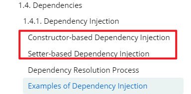


#### 1. 构造器注入

==要求必须有明确的构造函数==

```java
public class ExampleBean {

    // Number of years to calculate the Ultimate Answer
    private int years;

    // The Answer to Life, the Universe, and Everything
    private String ultimateAnswer;

    public ExampleBean(int years, String ultimateAnswer) {
        this.years = years;
        this.ultimateAnswer = ultimateAnswer;
    }
}
```

==支持三种构造器方式注入==

- 类型匹配方式

```xml
<bean id="exampleBean" class="examples.ExampleBean">
    <constructor-arg type="int" value="7500000"/>
    <constructor-arg type="java.lang.String" value="42"/>
</bean>
```

- 下标方式

  ```xml
  <bean id="exampleBean" class="examples.ExampleBean">
  <constructor-arg index="0" value="7500000"/>
  <constructor-arg index="1" value="42"/>
  </bean>
  ```

- 构造函数入参名字

```xml
<bean id="exampleBean" class="examples.ExampleBean">
    <constructor-arg name="years" value="7500000"/>
    <constructor-arg name="ultimateAnswer" value="42"/>
</bean>
```

#### 2. Setter注入


#### 3. 各种数据类型属性在xml中配置

基础类型、引用、对象、数组、map等

没有构造器，但是有各参数的setter和getter方法。 

```java
class Student {
    private String name;
    private Address address;
    private String[] books;
    private List<String> hobbys;
    private Map<String, String> card;
    private Set<String> games;
    private Properties info;    
    // 省略 Getter和Setter方法，必须有，否则实例化失败
}
```

bean.xml的配置

```xml
<bean id="address" class="com.xx.xx.Address"

<bean id="student" class="com.xxx.Student">
    <!-- 普通类型注入 -->
    <proprety name="name" value="xxx" />
    <!-- Bean注入 -->
    <property name="address" ref="address" />
    <!-- 数组注入 -->
    <property name="books">
        <array>
            <values>红楼梦</values>
            <values>三国</values>
        </array>
    </property>
    <!-- list类型注入 -->
    <property name="hobbys" >
        <list>
            <value>音乐</value>
            <value>足球</value>
        </list>
    </property>
    <!-- map类型注入 -->
    <property mame="card" >
        <map>
            <entry key="id card" value="123456" />
            <entry key="学号" value="123456" />
        </map>
    </property>
    <!-- set类型注入 -->
    <property mame="games" >
        <set>
            <value>音乐</value>
            <value>足球</value>
        </set>
    </property>
    <!-- Properties类型注入 -->
    <property name="info" >
        <props>
            <prop key="学号">0303103</prop>
            <prop key="性别">男</prop>
        </props>
    </property>    
</bean>
```

#### 4. C和P命名空间注入

实现配置文件的简写，仅需增加一行xml的名字空间的导入。

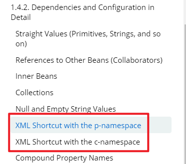


1. ==The p-namespace== lets you use the `bean` element’s attributes (instead of nested `` elements) to describe your property values collaborating beans, or both. 

```xml
<!- 增加p命名空间xmlns:p引入 ->
<beans xmlns="http://www.springframework.org/schema/beans"
    xmlns:xsi="http://www.w3.org/2001/XMLSchema-instance"
    xmlns:p="http://www.springframework.org/schema/p"
    xsi:schemaLocation="http://www.springframework.org/schema/beans
        https://www.springframework.org/schema/beans/spring-beans.xsd">

    <bean name="john-classic" class="com.example.Person">
        <property name="name" value="John Doe"/>
        <property name="spouse" ref="jane"/>
    </bean>

    <!-- 对比上个bean配置，p:参数名=xxx -->
    <bean name="john-modern"
        class="com.example.Person"
        p:name="John Doe"
        p:spouse-ref="jane"/>
</beans>
```

2.  ==the c-namespace==, introduced in Spring 3.1, allows inlined attributes for configuring the constructor arguments rather then nested `constructor-arg` elements. 

​      **仅面向构造注入**，C的命名空间效果同P的命名空间效果

  ```xml
<!- 增加p命名空间xmlns:c引入 ->
<beans xmlns="http://www.springframework.org/schema/beans"
    xmlns:xsi="http://www.w3.org/2001/XMLSchema-instance"
    xmlns:c="http://www.springframework.org/schema/c"
    xsi:schemaLocation="http://www.springframework.org/schema/beans
        https://www.springframework.org/schema/beans/spring-beans.xsd">

    <bean id="beanTwo" class="x.y.ThingTwo"/>
    <bean id="beanThree" class="x.y.ThingThree"/>

    <!-- 传统：declaration with optional argument names -->
    <bean id="beanOne" class="x.y.ThingOne">
        <constructor-arg name="thingTwo" ref="beanTwo"/>
        <constructor-arg name="thingThree" ref="beanThree"/>
        <constructor-arg name="email" value="something@somewhere.com"/>
    </bean>

    <!-- 对比：c-namespace declaration with argument names -->
    <bean id="beanOne" class="x.y.ThingOne" 
          c:thingTwo-ref="beanTwo"
          c:thingThree-ref="beanThree" 
          c:email="something@somewhere.com"/>
</beans>
  ```

### 2.4  使用Depends-on

```xml
<bean id="beanOne" class="ExampleBean" depends-on="manager"/>
<bean id="manager" class="ManagerBean" />
```

### 2.5 延迟初始化lazy-init

1. 指定具体Bean延迟初始化

```xml
<bean id="lazy" class="com.something.ExpensiveToCreateBean" lazy-init="true"/>
<bean name="not.lazy" class="com.something.AnotherBean"/>
```

2. 指定容器级别延迟初始化

```xml
<beans default-lazy-init="true">
  <!-- no beans will be pre-instantiated... -->
</beans>
```

2.7 **Autowiring(自动装配) Collaborators**

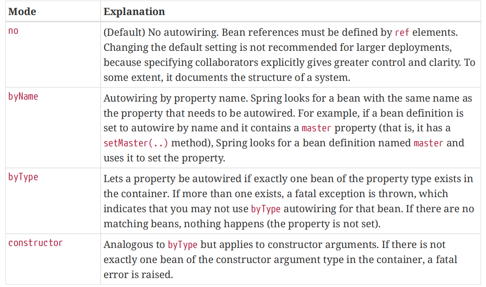

​	With byType or constructor autowiring mode, you can wire arrays and typed collections. 

https://www.cnblogs.com/loong-hon/p/10917755.html

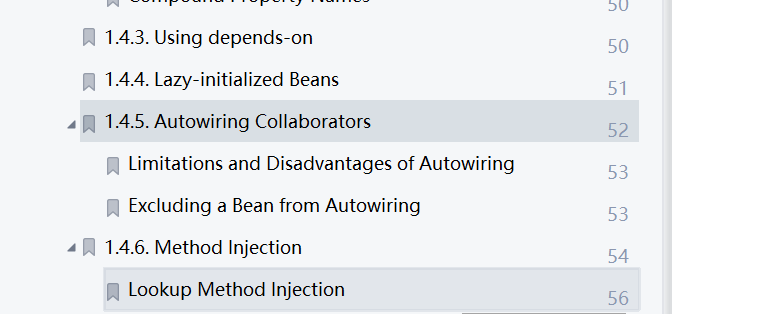


### 2.6 自动装配autowire（byName和byType）

依旧通过beans.xml实现，减少ref类型的配置。

**初始版本：**

​		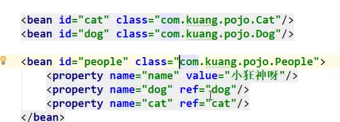

**借助autowire自动装配版本后，省略部分property的配置**

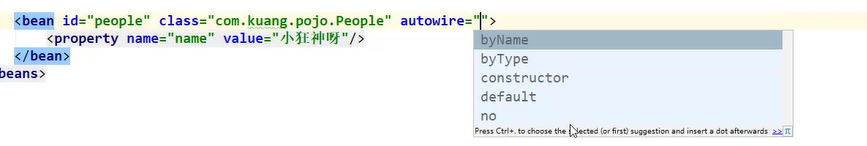

- byName：

  ```java
  @Service
  @Getter
  @Setter
  public class AddressService implements ApplicationContextAware {
    private String address;
    private ApplicationContext ctx;
  
    public void print()
    {
        System.out.println("call AddressService::print");
    }
  
    public void setApplicationContext(ApplicationContext applicationContext) throws BeansException {
        ctx = applicationContext;
    }
  }
  ```


    @Service
    @Getter
    @Setter
    public class UserService{
    	private AddressService addressService;
    
    	public void print(){
        	addressService.print();
    	    System.out.println("call UserService::print()");
    	}
    }
beans.xml配置
  ```
<?xml version="1.0" encoding="UTF-8"?>
<beans xmlns="http://www.springframework.org/schema/beans"
        xmlns:xsi="http://www.w3.org/2001/XMLSchema-instance"
        xmlns:context="http://www.springframework.org/schema/context"
        xsi:schemaLocation="http://www.springframework.org/schema/beans
        https://www.springframework.org/schema/beans/spring-beans.xsd
        http://www.springframework.org/schema/context
        https://www.springframework.org/schema/context/spring-context.xsd"  >

    <bean id="userService" class="com.test.service.UserService" autowire="byName">
    </bean>

    <bean id="addressService" class="com.test.service.AddressService" >
    </bean>
</beans>
  ```

测试

```java
public class UserServiceTest extends TestCase {

    public void testInit() {
        ApplicationContext applicationContext = new ClassPathXmlApplicationContext("beans.xml");
        UserService userService = applicationContext.getBean("userService", UserService.class);
        userService.print();
    }
}
```

call AddressService::print
call UserService::print()


- byType：如果定义两个相同的class的bean，则自动会报错（参考下图）

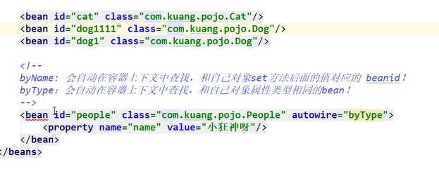

### 2.7 方法注入Method Injection(ApplicationContextAware )

In most application scenarios, most beans in the container are singletons. **When a singleton bean needs to collaborate with another singleton bean or a non-singleton bean needs to collaborate with another non-singleton bean**, you typically handle the dependency by defining one bean as a property of the other. **A problem arises when the bean lifecycles are different.** 

Suppose singleton bean A needs to use non-singleton (prototype) bean B, perhaps on each method invocation on A. The container creates the singleton bean A only once, and thus only gets one opportunity to set the properties. **The container cannot provide bean A with a new instance of bean B every time one is needed.**
A solution is to forego some inversion of control. <font color='red' > You can make bean A aware of the container by implementing the ApplicationContextAware interface </font> ,and by making a getBean("B") call to the container ask for (a typically new) bean B instance every time bean A needs it. The following
example shows this approach:

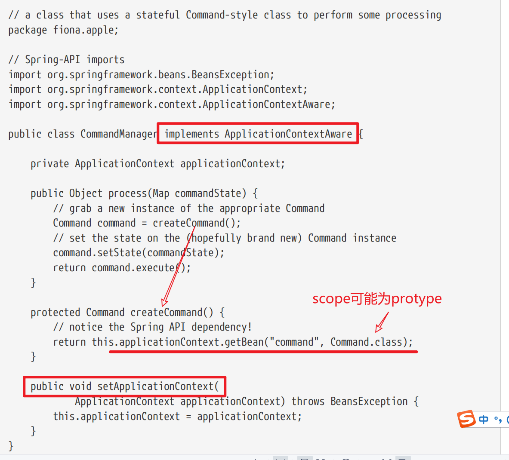


### 2.8 Bean Scope作用域

| Scope                                                        | Description                                                  |
| :----------------------------------------------------------- | :----------------------------------------------------------- |
| [singleton](https://docs.spring.io/spring-framework/docs/current/reference/html/core.html#beans-factory-scopes-singleton) | (==Default==) Scopes a single bean definition to a single object instance for each Spring IoC container. |
| [prototype](https://docs.spring.io/spring-framework/docs/current/reference/html/core.html#beans-factory-scopes-prototype) | Scopes a single bean definition to any number of object instances. |
| [request](https://docs.spring.io/spring-framework/docs/current/reference/html/core.html#beans-factory-scopes-request) | ==从request开始都是针对web开发使用.==Scopes a single bean definition to the lifecycle of a single HTTP request. That is, each HTTP request has its own instance of a bean created off the back of a single bean definition. Only valid in the context of a web-aware Spring `ApplicationContext`. |
| [session](https://docs.spring.io/spring-framework/docs/current/reference/html/core.html#beans-factory-scopes-session) | Scopes a single bean definition to the lifecycle of an HTTP `Session`. Only valid in the context of a web-aware Spring `ApplicationContext`. |
| [application](https://docs.spring.io/spring-framework/docs/current/reference/html/core.html#beans-factory-scopes-application) | Scopes a single bean definition to the lifecycle of a `ServletContext`. Only valid in the context of a web-aware Spring `ApplicationContext`. |
| [websocket](https://docs.spring.io/spring-framework/docs/current/reference/html/web.html#websocket-stomp-websocket-scope) | Scopes a single bean definition to the lifecycle of a `WebSocket`. Only valid in the context of a web-aware Spring `ApplicationContext`. |

### 2.9 定义bean的行为

#### 2.9.1 生命周期callback(PostConstruct和init-method)


##### 1. Initialization Callbacks

> 支持3种方式，推荐注解和init-method方案

```java
void afterPropertiesSet() throws Exception;
```

```java
public class AnotherExampleBean implements InitializingBean {
  @Override
  public void afterPropertiesSet() {
  // do some initialization work
  }
}
```

bean的配置

```xml
<bean id="exampleInitBean" class="examples.AnotherExampleBean"/>
```

> **推荐使用**

- @PostConstruct 注解 

- POJO initialization method（init method属性）  

  ```xml
  <bean id="exampleInitBean" class="examples.ExampleBean" init-method="init"/>
  
  public class ExampleBean {
    public void init() {
    // do some initialization work
    }
  }
  ```

​      **Container级别的配置**：<beans default-init-method="init11" default-destroy-method="destroy11" >


##### 2. @PostConstruct 使用方式

```java
@Service
@Getter
@Setter
public class UserService{

    @Value("AAAA")
    private String name;

    @PostConstruct
    private void init11()
    {
        System.out.println("call init()");
    }

    private void destroy11()
    {
        System.out.println("call destroy");
    }

    public void print() {
        System.out.println("call print(), name = " + name);
    }
}
```

beans.xml配置

```xml
<?xml version="1.0" encoding="UTF-8"?>
<beans xmlns="http://www.springframework.org/schema/beans"
        xmlns:xsi="http://www.w3.org/2001/XMLSchema-instance"
        xmlns:context="http://www.springframework.org/schema/context"
        xsi:schemaLocation="http://www.springframework.org/schema/beans
        https://www.springframework.org/schema/beans/spring-beans.xsd
        http://www.springframework.org/schema/context
        https://www.springframework.org/schema/context/spring-context.xsd"  >

    <bean id="userService" class="com.test.service.UserService" >
    </bean>

    <context:annotation-config />
</beans>
```

测试类：

```java
public class UserServiceTest extends TestCase {

    public void testInit() {
        ApplicationContext applicationContext = new ClassPathXmlApplicationContext("beans.xml");
        UserService userService = applicationContext.getBean("userService", UserService.class);
        userService.print();
    }
}
```

执行结果：

```bash
call init()
call print(), name = AAAA
```


##### 3. Destruction Callbacks

> 支持3种方式，推荐注解和init-method方案

   Implementing the org.springframework.beans.factory.**DisposableBean**（不推荐） interface lets a bean get a callback when the container that contains it is destroyed. 

```java
// The DisposableBean interface specifies a single method:
void destroy() throws Exception;
```

样例

```java
public class AnotherExampleBean implements DisposableBean {
  @Override
  public void destroy() {
  // do some destruction work (like releasing pooled connections)
  }
}
```

>  推荐使用

- @PreDestroy注解

- <bean destroy-method="xxx" <bean/>

  样例：

  ```xml
  <bean id="exampleInitBean" class="examples.ExampleBean" destroy-method="cleanup"/>
  ```

​     Container级别的配置：<beans default-init-method="init11" default-destroy-method="destroy11" >


##### 4.使用多种方案的时候，执行优先级

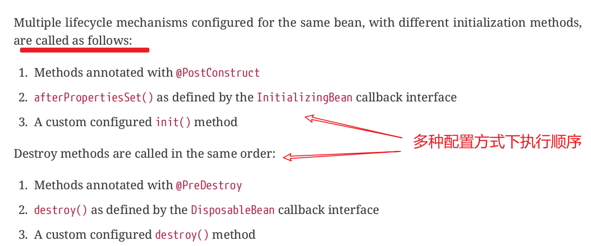


#### 2.9.2 ApplicationContextAware 

接口ApplicationContextAware定义：

```java
public interface ApplicationContextAware {
  void setApplicationContext(ApplicationContext applicationContext) throws BeansException;
}
```

样例：

```java
@Service
@Getter
@Setter
public class UserService implements ApplicationContextAware{

    private ApplicationContext context;

    private String userName;

    @PostConstruct
    public void init(){
        userName = "AAA";
    }

    public void print(){
        System.out.println("call UserService::print(), userName = " + userName);
    }

    public  ApplicationContext getApplicationContext() {
        return context;
    }

    public void setApplicationContext(ApplicationContext applicationContext) throws BeansException {
        context = applicationContext;
    }

    public AddressService getAddressService()
    {
        return context.getBean("addressService", AddressService.class);
    }

}


@Service
@Getter
@Setter
public class AddressService {
    private String address;
    public void print()
    {
        System.out.println("call AddressService::print");
    }
}
```

beans.xml

```xml
<?xml version="1.0" encoding="UTF-8"?>
<beans xmlns="http://www.springframework.org/schema/beans"
        xmlns:xsi="http://www.w3.org/2001/XMLSchema-instance"
        xmlns:context="http://www.springframework.org/schema/context"
        xsi:schemaLocation="http://www.springframework.org/schema/beans
        https://www.springframework.org/schema/beans/spring-beans.xsd
        http://www.springframework.org/schema/context
        https://www.springframework.org/schema/context/spring-context.xsd"  >

    <bean id="userService" class="com.test.service.UserService" autowire="byType">
    </bean>

    <bean id="addressService" class="com.test.service.AddressService" scope="prototype" >
    </bean>

    <context:annotation-config />
</beans>
```

测试类：

```java
public class UserServiceTest extends TestCase {

    public void testInit() {
        ApplicationContext applicationContext = new ClassPathXmlApplicationContext("beans.xml");
        UserService userService = applicationContext.getBean("userService", UserService.class);
        userService.print();

        // 获取原型定义的bean
        System.out.println(userService.getAddressService());
        System.out.println(userService.getAddressService());

        ApplicationContext applicationContext1 = userService.getApplicationContext();
        Object addressService = applicationContext1.getBean("addressService");
        System.out.println(addressService);
    }
}
```

测试结果：

```bash
call UserService::print(), userName = AAA
com.test.service.AddressService@2890c451
com.test.service.AddressService@40e6dfe1
com.test.service.AddressService@1b083826
```


#### 2.9.3 BeanNameAware

```java
public interface BeanNameAware extends Aware {
    void setBeanName(String var1);
}
```

#### 2.9.4 其他Aware **Interfaces**

不同xxxAware + BeanPostProcessor + InitializingBean + DisposableBean + init-method + destroy-method的实现效果对比: https://www.cnblogs.com/-beyond/p/13188675.html


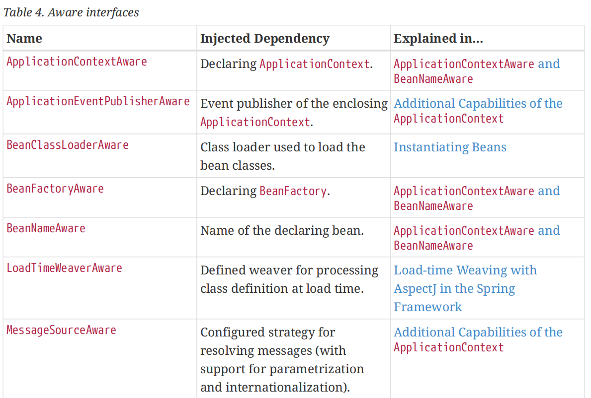

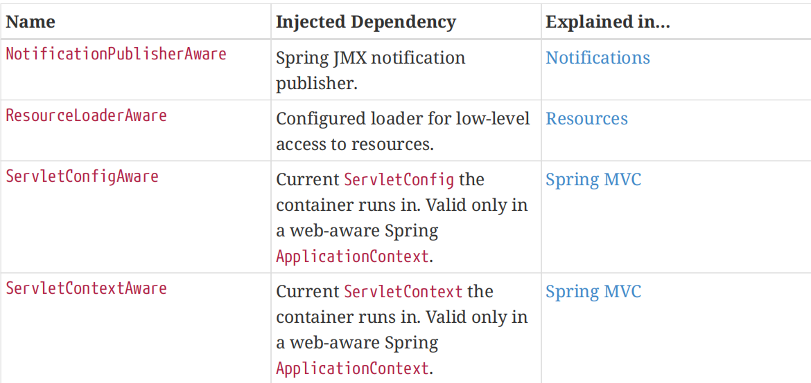

### 2.10 Bean定义继承

!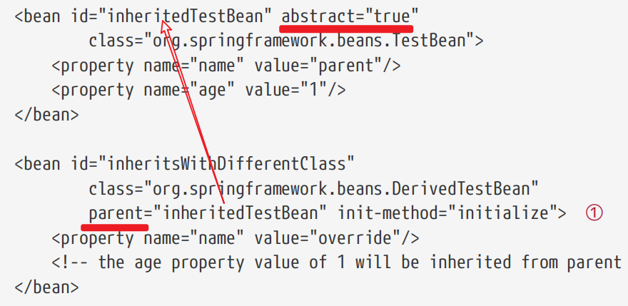

parent bean中class可以不定义，此时parent bean不可被实例化，因为配置信息不完整。


### 2.11 Container级别扩展点

#### 1. BeanPostProcessor接口

**The BeanPostProcessor interface defines callback methods** that you can implement to provide your own (or override the container’s default) instantiation logic, dependency resolution logic, and so forth. If you want to implement some custom logic after the Spring container finishes instantiating, configuring, and initializing a bean, you can plug in one or more custom BeanPostProcessor implementations.

You can configure multiple BeanPostProcessor instances, and you can control the order in which these BeanPostProcessor instances run by setting the order property. You can set this property only if the BeanPostProcessor implements the **Ordered** interface. 

```java
@Retention(RetentionPolicy.RUNTIME)
@Target({ElementType.TYPE, ElementType.METHOD, ElementType.FIELD})
@Documented
public @interface Order {
    int value() default 2147483647;
}
```

样例：

```java
@Component
@Getter
@Setter
public class FamilyService {

    public void print()
    {
        System.out.println("call FamilyService::print()");
    }
}

@Component
@Getter
@Setter
public class UserService {
    private String name;

    public void print()
    {
        System.out.println("call UserService::print");
    }
}

import org.springframework.beans.BeansException;
import org.springframework.beans.factory.config.BeanPostProcessor;
import org.springframework.lang.Nullable;

public class InstantiationTracingBeanPostProcessor implements BeanPostProcessor {
    @Nullable
    public Object postProcessBeforeInitialization(Object bean, String beanName) throws BeansException {
        System.out.println(("Before Bean '" + beanName + "' created : " + bean.toString()));
        return bean;
    }

    @Nullable
    public Object postProcessAfterInitialization(Object bean, String beanName) throws BeansException {
        System.out.println(("After Bean '" + beanName + "' created : " + bean.toString()));
        return bean;
    }
}

```

beans.xml

```xml
<?xml version="1.0" encoding="UTF-8"?>
<beans xmlns="http://www.springframework.org/schema/beans"
        xmlns:xsi="http://www.w3.org/2001/XMLSchema-instance"
        xmlns:context="http://www.springframework.org/schema/context"
        xsi:schemaLocation="http://www.springframework.org/schema/beans
        https://www.springframework.org/schema/beans/spring-beans.xsd
        http://www.springframework.org/schema/context
        https://www.springframework.org/schema/context/spring-context.xsd"  >

    <bean id="userService" class="com.test.service.UserService" autowire="byType">
    </bean>

    <bean id="familyService" class="com.test.service.FamilyService" autowire="byType">
    </bean>

    <bean class="com.test.service.InstantiationTracingBeanPostProcessor"/>

    <context:annotation-config />
</beans>
```

测试代码

```java
public class UserServiceTest extends TestCase {

    @Test
    public void testPrint()
    {
        ApplicationContext context = new ClassPathXmlApplicationContext("beans.xml");
//        UserService userService = context.getBean("userService", UserService.class);
//        userService.print();
    }

}
```

打印结果：

```bash
Before Bean 'userService' created : com.test.service.UserService@646be2c3
After Bean 'userService' created : com.test.service.UserService@646be2c3
Before Bean 'familyService' created : com.test.service.FamilyService@797badd3
After Bean 'familyService' created : com.test.service.FamilyService@797badd3
```

> 如果配置bean为lazy-init=true，则不打印对应的bean


#### 2. BeanFactoryPostProcessor

#### 3. FactoryBean

## 


# 三、高级篇

## 1. 引入外部属性文件（明文）

> 仅介绍配置为明文的引入，如果涉及到加密的属性，参考下一章节

应用场景：DB的相关配置，如用户名和密码。

database.properties

``` properties
jdbc.driverClassName=com.mysql.jdbc.Driver
jdbc.url=jdbc:mysql://localhost:3306/sys
jdbc.username=root
jdbc.password=123456
```

- 方法1：PropertyPlaceholderConfigure引入

  ```xml
  <bean class="org.springframework.beans.factory.config.PropertyPlaceholderConfigurer">
      <property name="location" value="database.properties">
      <property name="fileEncoding" value="utf-8">
  </bean>
  
  <bean id="dataSource" class="org.apache.commons.dbcp.BasicDataSource">
      <property name="driverClassName" value="${jdbc.driverClassName}" />
      <property name="url" value="${jdbc.url}" />
      <property name="username" value="${jdbc.username}" />
      <property name="password" value="${jdbc.password}" />
  </bean>
  ```

  其他属性：

  1. locations：指定多个属性文件，类似配置List方式
  2. fileEncoding: 文件编码方式，Spring使用操作系统默认编码读取属性，如属性采用特殊编码，需显示配置
  3. order：如果定义了多个PropertyPlaceholderConfigurer，通过该参数指定优先顺序

- **方法2：<context:property-plceholder 引入（常用，优雅）**

        ```xml
  <context:property-placeholder order="0" location="database.properties" />
  <context:property-placeholder order="1" location="encoding.properties" />
        ```

## 2. 引入外部属性文件（密文）

> 对于敏感的属性，如数据库密码等敏感信息，应以密文方式保存。此时读取时应支持绑定业务的解密逻辑。

流程：

- 使用业务加密方法对数据加密，放到配置文件
- 使用继承自PropertyPlaceHolderConfigurer类，对读取的参数定制读取逻辑(是否需解密)

**PropertyPlaceHolderConfigurer**用于在属性使用之前对属性转换的方法

- void convertProperties(Properties props)

  属性文件中所有属性值都封装在props中，覆盖此方法，可对所有属性值进行转换处理

- String convertProperty(String propertyName, String propertyValue):

  在加载属性文件并读取文件中每个属性时，都会调用此方法进行转换处理

- String convertPropertyValue(String originalValue):

  和上方法类似，但没有传入属性名

**使用样例：**

1. 加密后的配置文件（假设使用DES加密）

   ``` properties
   driverClassName=com.mysql.jdbc.Driver
   url=jdbc:mysql://localhost:3306/sys
   userName=root
   password=1qahvoiuc!@d
   ```

2. 自定义类继承PropertyPlaceHolderConfigurer

   ```java
   import org.springframework.beans.factory.config.PropertyPlaceHolderConfigurer;
   
   public class EncryptPropertyPlaceHolderConfigurer extends PropertyPlaceHolderConfigurer {
       private String[] encryptPropNames = { "userName", "password" };
       
       // 对特性属性的属性值进行转换
       @Override
       protected String convertProperty(String propertyName, String propertyValue){
           if (isEncryptProp(propertyName)) {
               String decryptValue = DESUtils.getDecryptString(propertyValue);
               return decryptValue;
           } else {
               return decryptValue;
           }
       }
       
       // 判断是否需要解密的属性
       private Boolean isEncryptProp(String propertyName) {
           for (String encryptPropName : encryptPropNames) {
               if (encryptPropName.equals(propertyName)){
                   return true;
               }
           }
       }
   }
   ```

3. 配置bean.xml文件

   ```xml
   <bean class="org.smart.palceholder.EncryptPropertyPlaceHolderConfigurer"
   	p:location="classpath:com/smart/placeholder/jdbc.properties"
   	p:fileEncoding="utf-8">
   
   <bean id="dataSource" class="org.apache.commons.dbcp.BasicDataSource"
       p:driverClassName="${driverClassName}"
       p:url="${url}"
       p:username="${username}"
   	p:password="${password}" />
   ```

## 3. 属性文件自身的引用

​	Spring既允许Bean定义中通过${propName}引用属性值，也允许属性文件中使用${propName}实现属性之间的引用

   属性值太长时，可使用行后添加 \ 划分成多行

```properties
dbName=sampledb
driverClassName=com.mysql.jdbc.Driver
url=jdbc:mysql://localhost:3306/${dbName}
```

