# 一、BeanFactory家族

​	从类名看功能：生成Bean，实现采用工厂方法设计模式。

## 1. BeanFactory接口

​	定义的接口用于指定bean属性、生成特定类型bean和bean相关操作　

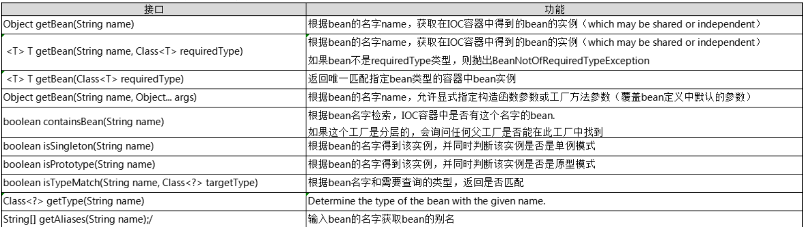

## 2. 类图

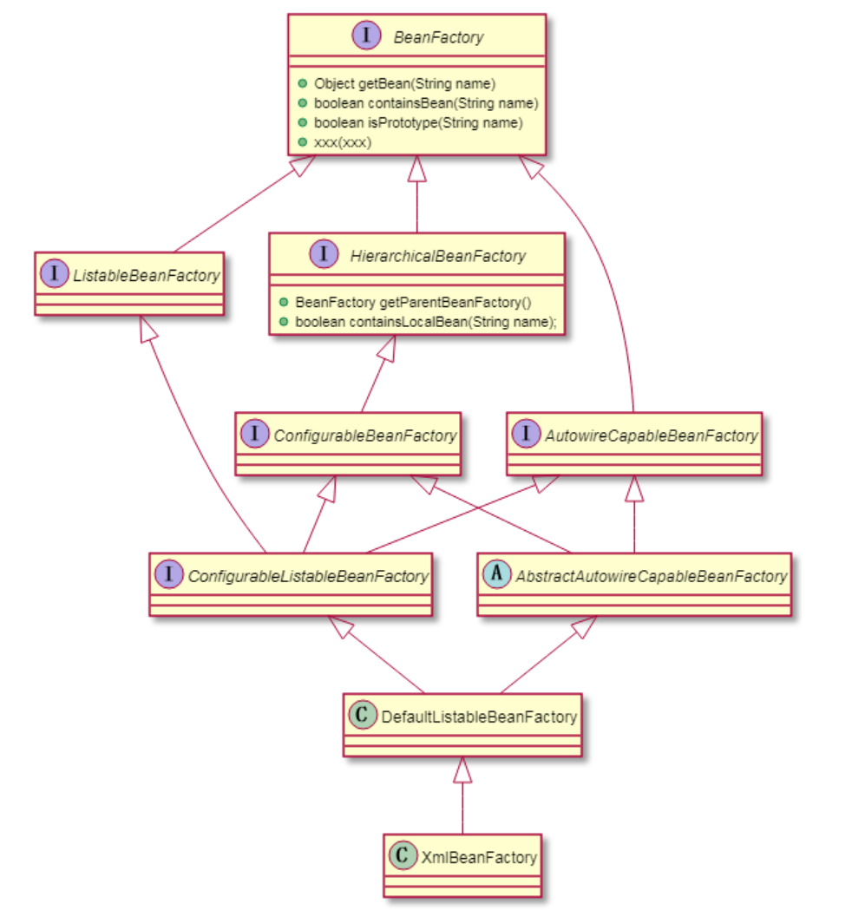

- ListableBeanFactory：表示这些bean是可列表的；
- HierarchicalBeanFactory：表示这些bean是有继承关系的（每个bean可能有父bean）。
- AutowireCapableBeanFactory定义Bean的自动装配规则
- DefaultListableBeanFactory:

## 3. XmlBeanFactory

​	功能如其名：XML格式定义的bean的工厂方法

​    使用方法：XmlBeanFactory factory = new XmlBeanFactory (new ClassPathResource("Beans.xml")); 

​	利用框架提供的 **XmlBeanFactory()** API 去生成工厂 bean 以及利用 **ClassPathResource()** API 去加载在路径 CLASSPATH 下可用的 bean的xml 配置文件。

　源码：@Deprecated就可以看出不推荐使用，通过实例化时会传入一个Resource对象（从上述）

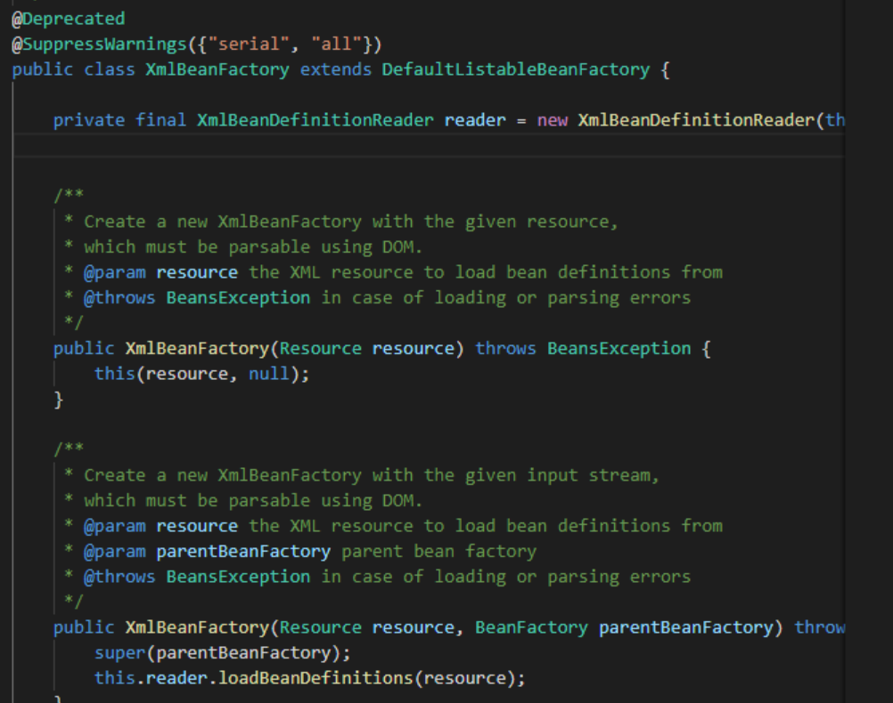

**BeanDefinition**: Bean模型定义

**XmlBeanDefinitionReader:** 读取XML格式的bean定义文件，此处的doLoadBeanDefinitions最终跳转执行如下红框方法

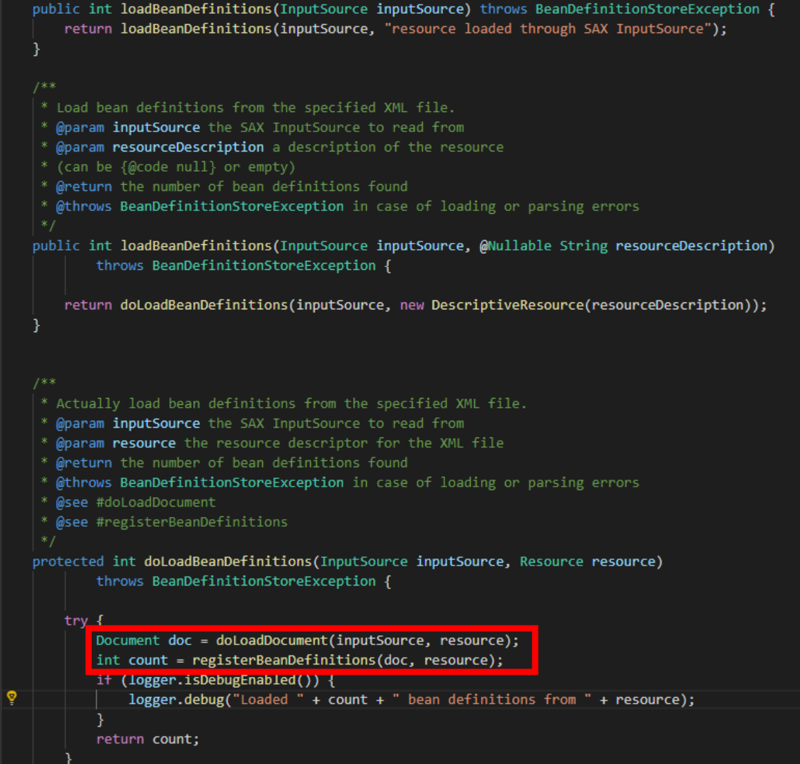

### 步骤1：doLoadDocument完成XML文件到Document

通过 DocumentBuilderFactory方式读取XML文件

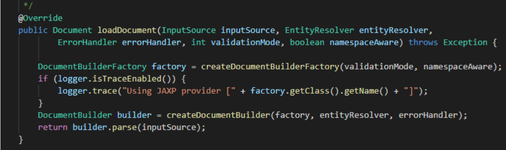

### 步骤2：将xml格式bean定义保存到HashMap

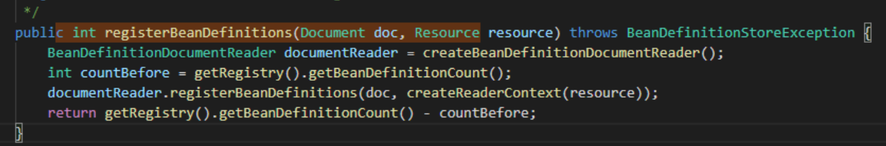

DefaultBeanDefinitionDocumentReader类：

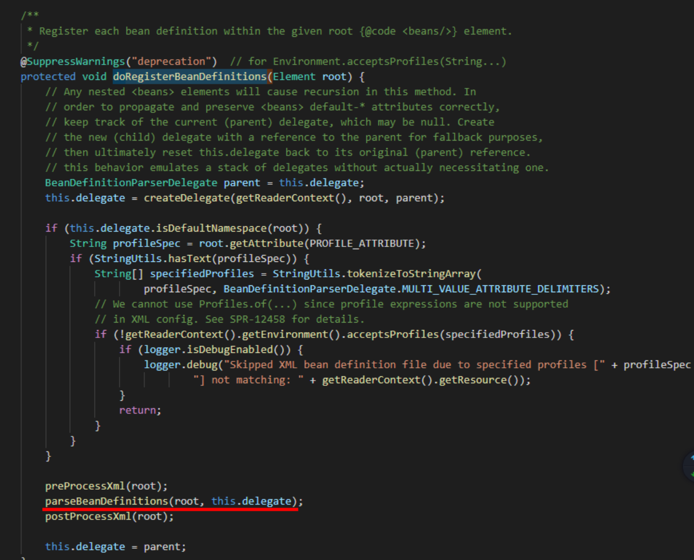

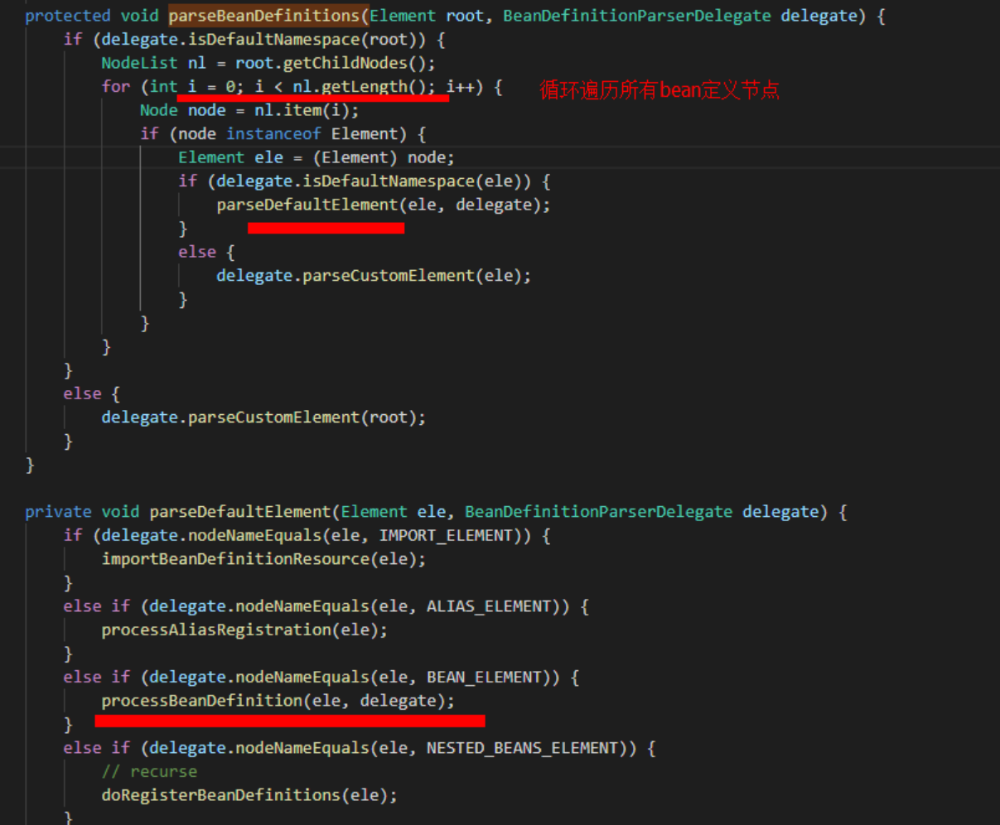

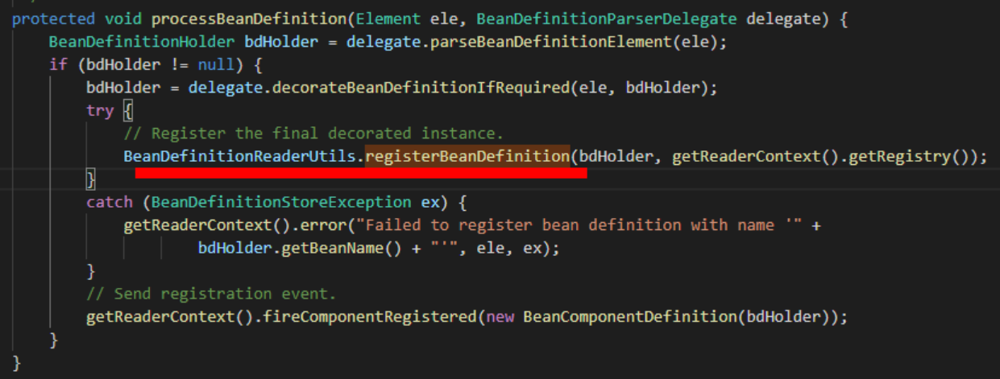

**BeanDefinitionReaderUtils类：实现beanId到bean定义的map保存**

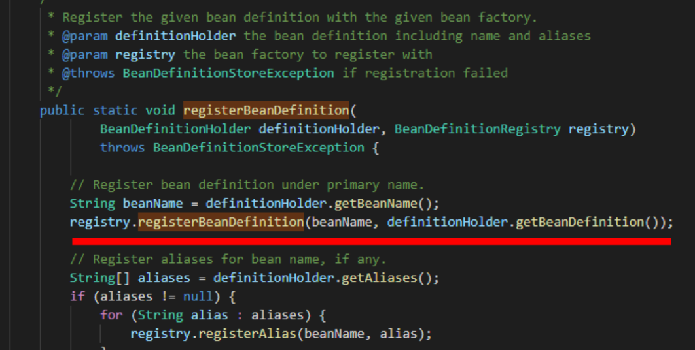

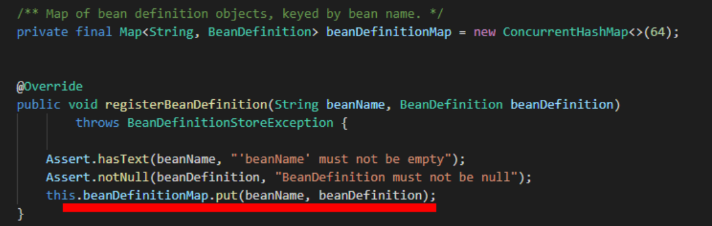