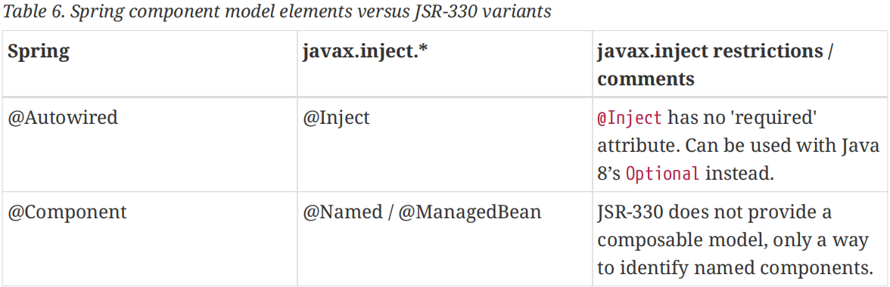
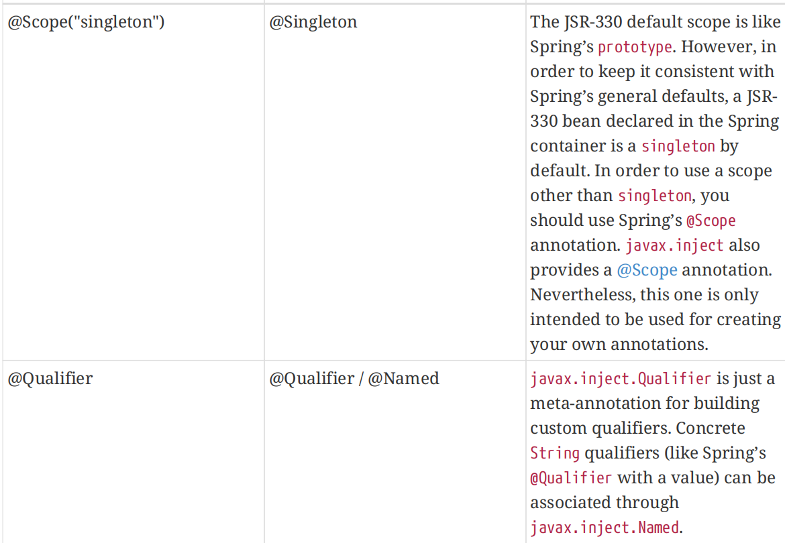
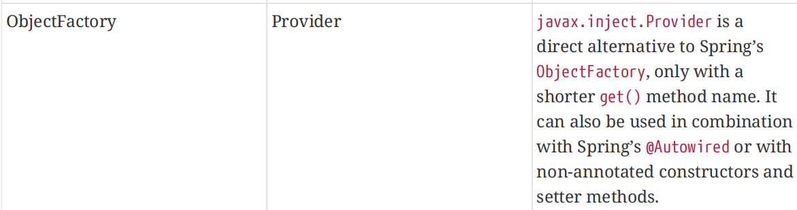
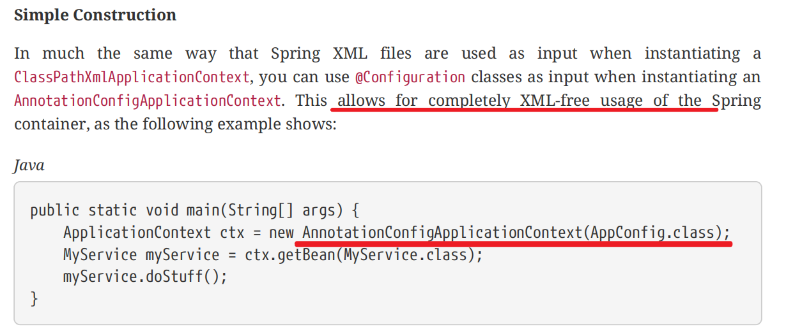

- [1. 准备条件](#1-准备条件)
- [2. 详细注解](#2-详细注解)
  - [2.1 @Required](#21-required)
  - [2.2 @Autowired](#22-autowired)
  - [2.3 @Primary](#23-primary)
  - [2.4 @Qualifier](#24-qualifier)
  - [2.5 JSR250 @Resource](#25-jsr250-resource)
  - [2.6  @Value](#26--value)
- [3.  Classpath Scanning and Managed Components](#3--classpath-scanning-and-managed-components)
  - [3.1 配置自动扫描路径](#31-配置自动扫描路径)
  - [3.2 指定Bean的名称](#32-指定bean的名称)
  - [3.3 指定bean Scope(prototype等)](#33-指定bean-scopeprototype等)
- [3. JSR330 注解](#3-jsr330-注解)
- [4. Java-based Container注解](#4-java-based-container注解)
  - [4.1 Basic Concepts:@Bean **and** @Configuration](#41-basic-conceptsbean-and-configuration)
  - [4.2 完全不使用XML配置bean](#42-完全不使用xml配置bean)
  - [4.3 AnnotationConfigApplicationContext](#43-annotationconfigapplicationcontext)
    - [1. register(Class<?>…)](#1-registerclass)
    - [2. scan(String…)](#2-scanstring)
    - [3. AnnotationConfigWebApplicationContext](#3-annotationconfigwebapplicationcontext)


# 1. 准备条件

beans.xml配置

```xml
<?xml version="1.0" encoding="UTF-8"?>
<beans xmlns="http://www.springframework.org/schema/beans"
  xmlns:xsi="http://www.w3.org/2001/XMLSchema-instance"
  xmlns:context="http://www.springframework.org/schema/context"
  xsi:schemaLocation="http://www.springframework.org/schema/beans
  https://www.springframework.org/schema/beans/spring-beans.xsd
  http://www.springframework.org/schema/context
  https://www.springframework.org/schema/context/spring-context.xsd">
  <context:annotation-config/>
</beans>
```

The implicitly registered post-processors include

- AutowiredAnnotationBeanPostProcessor,

- CommonAnnotationBeanPostProcessor, 

- PersistenceAnnotationBeanPostProcessor

- RequiredAnnotationBeanPostProcessor.


# 2. 详细注解

## 2.1 @Required

Applies to bean property **setter** methods,

```JAVA
public class SimpleMovieLister {
  private MovieFinder movieFinder;
  @Required
  public void setMovieFinder(MovieFinder movieFinder) {
  this.movieFinder = movieFinder;
  }
  // ...
}
```

This annotation indicates that the **affected bean property must be populated at configuration time,** through an explicit property value in a bean definition or through autowiring. **The container throws an exception if the affected bean property has not been populated.** This allows for eager and explicit failure, avoiding NullPointerException instances or the like later on. We still recommend that you put assertions into the bean class itself (for example, into an init method). Doing so enforces those required references and values even when you use the class outside of a container.

**The @Required annotation is formally deprecated as of Spring Framework 5.1,** in favor of using constructor injection for required settings (or a custom implementation of InitializingBean.afterPropertiesSet() along with bean property setter methods).


## 2.2 @Autowired

1.  Apply the @Autowired annotation to **constructors**, as the following example shows:

   ```java
public class MovieRecommender {
  private final CustomerPreferenceDao customerPreferenceDao;
       @Autowired
     public MovieRecommender(CustomerPreferenceDao customerPreferenceDao) {
     this.customerPreferenceDao = customerPreferenceDao;
     }
     // ...
   } 
   ```

2. Apply the @Autowired annotation to *traditional* **setter** methods, 

   ```
public class SimpleMovieLister {
  private MovieFinder movieFinder;
       @Autowired
     public void setMovieFinder(MovieFinder movieFinder) {
     this.movieFinder = movieFinder;
     }
     // ...
   }
    
   ```

3. Apply the annotation to methods with **arbitrary names and multiple arguments**, 

   ```java
public class MovieRecommender {
  private MovieCatalog movieCatalog;
  private CustomerPreferenceDao customerPreferenceDao;
     
       @Autowired
     public void prepare(MovieCatalog movieCatalog,
     CustomerPreferenceDao customerPreferenceDao) {
     this.movieCatalog = movieCatalog;
     this.customerPreferenceDao = customerPreferenceDao;
     }
     // ...
   }
    
   ```

4. Apply @Autowired to fields as well and even mix it with constructors

   ```java
public class MovieRecommender {
  private final CustomerPreferenceDao customerPreferenceDao;
    
  @Autowired
  private MovieCatalog movieCatalog;
    
  @Autowired
  public MovieRecommender(CustomerPreferenceDao customerPreferenceDao) {
  this.customerPreferenceDao = customerPreferenceDao;
  }
  // ...
}
   ```


## 2.3 @Primary

当一个接口有2个不同实现时,使用@Autowired注解时会报org.springframework.beans.factory.NoUniqueBeanDefinitionException异常信息

测试：

```java
public interface Pet {
    public void print();
}

@Component
public class Cat extends Pet {
    public void print(){
        System.out.println("cat");
    }
}

//@Primary
@Component
public class Dog extends Pet {
    public void print(){
        System.out.println("Dog");
    }
}

@Component
@Setter
@Getter
public class User {

    @Autowired
    private Pet pet;

    public void test()
    {
        pet.print();
    }
}
```

beans.xml

```xml
<?xml version="1.0" encoding="UTF-8"?>
<beans xmlns="http://www.springframework.org/schema/beans"
        xmlns:xsi="http://www.w3.org/2001/XMLSchema-instance"
        xmlns:context="http://www.springframework.org/schema/context"
        xsi:schemaLocation="http://www.springframework.org/schema/beans
        https://www.springframework.org/schema/beans/spring-beans.xsd
        http://www.springframework.org/schema/context
        https://www.springframework.org/schema/context/spring-context.xsd"  >

    <context:component-scan base-package="com.test" />
    <context:annotation-config />

</beans>
```

测试类：

```java
public class MainApp {
    public static void main(String[] args) {
        ApplicationContext context = new ClassPathXmlApplicationContext("beans.xml");
        User user = context.getBean("user", User.class);
        user.test();
    }
}
```

Cat和Dog作为Pet的两个实现类，可以选择需要的子类通过@Primary指定优先级，否则会提示

```bash
org.springframework.beans.factory.NoUniqueBeanDefinitionException: No qualifying bean of type 'com.test.pojo.Pet' available: expected single matching bean but found 2: cat,dog
```


## 2.4 @Qualifier

@Qualifier作用同@Primary，主要解决针对多个实现类选择的问题

测试：

```java
public class Pet {
    public void print(){}
}

@Qualifier("Cat")
@Component
public class Cat extends Pet {
    public void print(){
        System.out.println("cat");
    }
}

@Qualifier("Dog")
@Component
public class Dog extends Pet {
    public void print(){
        System.out.println("Dog");
    }
}

@Component
@Setter
@Getter
public class User {

    @Autowired
    @Qualifier("Dog")
    private Pet pet;

    public void test()
    {
        pet.print();
    }
}
```

beans.xml

```xml
<?xml version="1.0" encoding="UTF-8"?>
<beans xmlns="http://www.springframework.org/schema/beans"
        xmlns:xsi="http://www.w3.org/2001/XMLSchema-instance"
        xmlns:context="http://www.springframework.org/schema/context"
        xsi:schemaLocation="http://www.springframework.org/schema/beans
        https://www.springframework.org/schema/beans/spring-beans.xsd
        http://www.springframework.org/schema/context
        https://www.springframework.org/schema/context/spring-context.xsd"  >

    <context:component-scan base-package="com.test" />
    <context:annotation-config />

</beans>
```

测试类：

```java
public class MainApp {
    public static void main(String[] args) {
        ApplicationContext context = new ClassPathXmlApplicationContext("beans.xml");
        User user = context.getBean("user", User.class);
        user.test();
    }
}
```

测试结果：Dog


## 2.5 JSR250 @Resource

[spring](http://lib.csdn.net/base/javaee)不但支持自己定义的@Autowired注解，还支持几个由JSR-250规范定义的注解，它们分别是@Resource、@PostConstruct以及@PreDestroy。
　　@Resource的作用相当于@Autowired，只不过@Autowired按byType自动注入，而@Resource默认按 byName自动注入罢了。@Resource有两个属性是比较重要的，分是name和type，Spring将@Resource注解的name属性解析为bean的名字，而type属性则解析为bean的类型。所以如果使用name属性，则使用byName的自动注入策略，而使用type属性时则使用byType自动注入策略。如果既不指定name也不指定type属性，这时将通过反射机制使用byName自动注入策略。
　　@Resource装配顺序
　　1. 如果同时指定了name和type，则从Spring上下文中找到唯一匹配的bean进行装配，找不到则抛出异常
　　2. 如果指定了name，则从上下文中查找名称（id）匹配的bean进行装配，找不到则抛出异常
　　3. 如果指定了type，则从上下文中找到类型匹配的唯一bean进行装配，找不到或者找到多个，都会抛出异常
　　4. 如果既没有指定name，又没有指定type，则自动按照byName方式进行装配；如果没有匹配，则回退为一个原始类型进行匹配，如果匹配则自动装配；


## 2.6  @Value

@Value is typically used to inject externalized properties:

1. 从配置文件读取参数指定

```java
@Component
@PropertySource("classpath:applications.properties")
public class Pet {
    private String petName;

    public Pet(@Value("${catalog.petName}") String petName) {
        this.petName = petName;
    }

    public void print() {
        System.out.println(petName);
    }
}

```

Resource/applications.properties

```properties
catalog.petName = BBB
```

2. 直接指定

```java
@Component
@Getter
@Setter
public class User {
    private String name;

    public User(@Value("AAA") String name) {
        this.name = name;
    }

    public void print()
    {
        System.out.println(name);
    }
}
```

beans.xml

```xml
<?xml version="1.0" encoding="UTF-8"?>
<beans xmlns="http://www.springframework.org/schema/beans"
        xmlns:xsi="http://www.w3.org/2001/XMLSchema-instance"
        xmlns:context="http://www.springframework.org/schema/context"
        xsi:schemaLocation="http://www.springframework.org/schema/beans
        https://www.springframework.org/schema/beans/spring-beans.xsd
        http://www.springframework.org/schema/context
        https://www.springframework.org/schema/context/spring-context.xsd"  >

    <context:component-scan base-package="com.test" />
    <context:annotation-config />

</beans>
```

测试类

```java
import com.test.pojo.Pet;
import com.test.pojo.User;
import org.springframework.context.ApplicationContext;
import org.springframework.context.support.ClassPathXmlApplicationContext;

public class MainApp {

    public static void main(String[] args) {
        ApplicationContext context = new ClassPathXmlApplicationContext("beans.xml");
        User user = context.getBean("user", User.class);
        user.print();

        Pet pet = context.getBean("pet", Pet.class);
        pet.print();
    }
}
```

打印结果：

```bash
AAA
BBB
```


# 3.  Classpath Scanning and Managed Components

## 3.1 配置自动扫描路径

**方法1：** beans.xml

```xml
<?xml version="1.0" encoding="UTF-8"?>
<beans xmlns="http://www.springframework.org/schema/beans"
  xmlns:xsi="http://www.w3.org/2001/XMLSchema-instance"
  xmlns:context="http://www.springframework.org/schema/context"
  xsi:schemaLocation="http://www.springframework.org/schema/beans
  https://www.springframework.org/schema/beans/spring-beans.xsd
  http://www.springframework.org/schema/context
  https://www.springframework.org/schema/context/spring-context.xsd">
    
  <context:component-scan base-package="org.example"/>
    
</beans>
```

The use of <context:component-scan> implicitly enables the functionality of <context:annotation-config>. There is usually no need to include the <context:annotation-config> element when using <context:component-scan> 

​	然后通过ClassPathApplication(beans.xml) 初始化

**方法2：**@ComponentScan 注解方式

```java
@ComponentScan(basePackages = "com.test")
// 或 @ComponentScan("com.test")
public class BeanConfig {
}


@Component
public class Pet {
    @Value("BBB")
    private String petName;

    public void print() {
        System.out.println("Pet name: " + petName);
    }
}

@Component
@Getter
@Setter
public class User {
   private String userName;

    public User(@Value("AAA") String userName) {
        this.userName = userName;
    }

    public void print()
    {
        System.out.println("User name: " + userName);
    }
}

public class MainApp {

    public static void main(String[] args) {
//        ApplicationContext context = new ClassPathXmlApplicationContext("beans.xml");
        ApplicationContext context = new AnnotationConfigApplicationContext(BeanConfig.class);

        User user = context.getBean("user", User.class);
        user.print();

        Pet pet = context.getBean("pet", Pet.class);
        pet.print();
    }
}
```

控制台打印：

```bash
User name: AAA
Pet name: BBB
```


## 3.2 指定Bean的名称

```java
@Target({ElementType.TYPE})
@Retention(RetentionPolicy.RUNTIME)
@Documented
@Indexed
public @interface Component {
    String value() default "";
}
```


```java
@Service("myMovieLister")
public class SimpleMovieLister {
  // ...
}
```

## 3.3 指定bean Scope(prototype等)


```java
@Scope("prototype")
@Repository
public class MovieFinderImpl implements MovieFinder {
  // ...
}
```


# 3. JSR330 注解









# 4. Java-based Container注解


## 4.1 Basic Concepts:@Bean **and** @Configuration

@Configuration：annotated classes

@Bean： annotated methods,  @Bean annotation plays the same role as the <bean/> element. 

```java
@Configuration
public class AppConfig {
  @Bean
  public MyService myService() {
  		return new MyServiceImpl();
  }
}
```

效果等价于

```xml
<beans>
  <bean id="myService" class="com.acme.services.MyServiceImpl"/>
</beans>
```


## 4.2 完全不使用XML配置bean

接上一章节



## 4.3 AnnotationConfigApplicationContext 

​	与@Configurationi配合使用，见4.2章节

​	In much the same way that Spring XML files are used as input when instantiating a **ClassPathXmlApplicationContext**, you can **use @Configuration classes as input when instantiating an AnnotationConfigApplicationContext.** 

### 1. register(Class<?>…)

​	You can instantiate an AnnotationConfigApplicationContext by using a no-arg constructor and then configure it by using the register() method. 

 ```java
public static void main(String[] args) {
  AnnotationConfigApplicationContext ctx = new AnnotationConfigApplicationContext();
  ctx.register(AppConfig.class, OtherConfig.class);
  ctx.register(AdditionalConfig.class);
  ctx.refresh();
  MyService myService = ctx.getBean(MyService.class);
  myService.doStuff();
}
 ```

### 2. scan(String…)

To enable component scanning, you can annotate your @Configuration class as follows

```java
@Configuration
@ComponentScan(basePackages = "com.acme") ①
public class AppConfig {
  ...
}
```

java

```java
public static void main(String[] args) {
  AnnotationConfigApplicationContext ctx = new AnnotationConfigApplicationContext();
  ctx.scan("com.acme");  // 对比上章节的Register实现
  ctx.refresh();
  MyService myService = ctx.getBean(MyService.class);
}
```


### 3. AnnotationConfigWebApplicationContext


