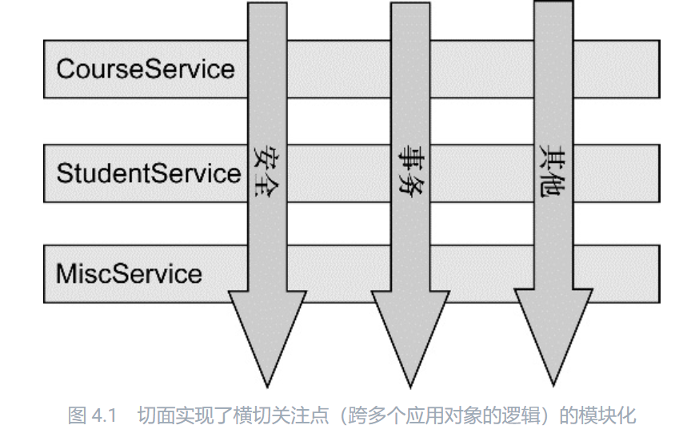
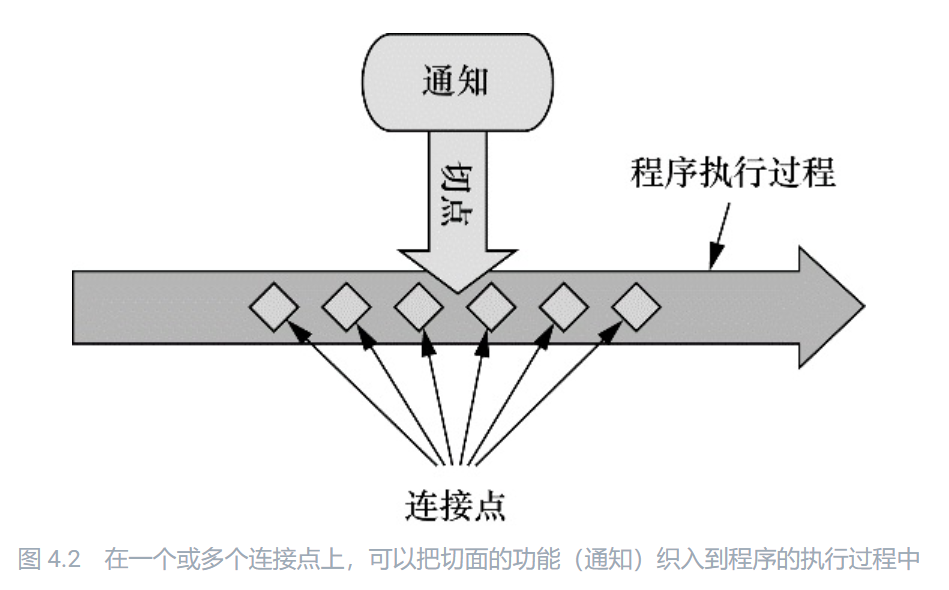
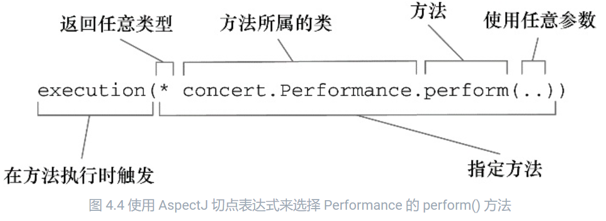
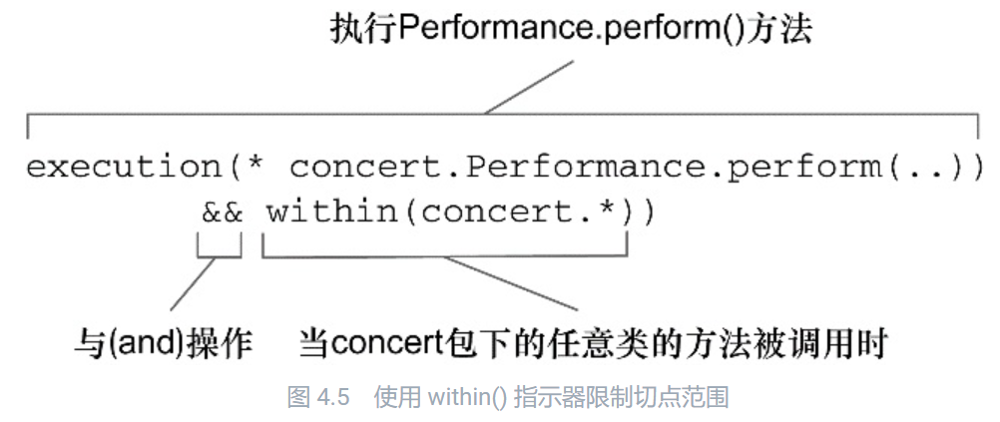
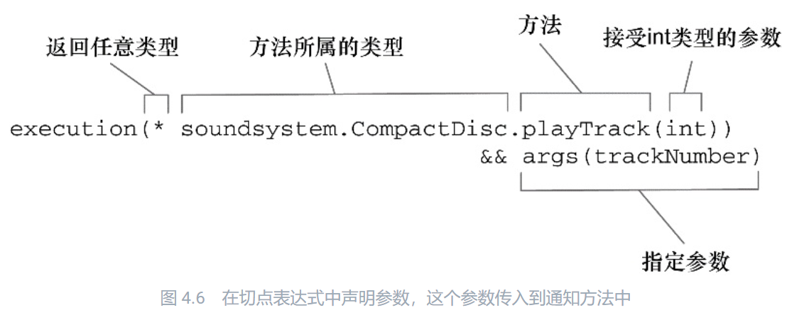
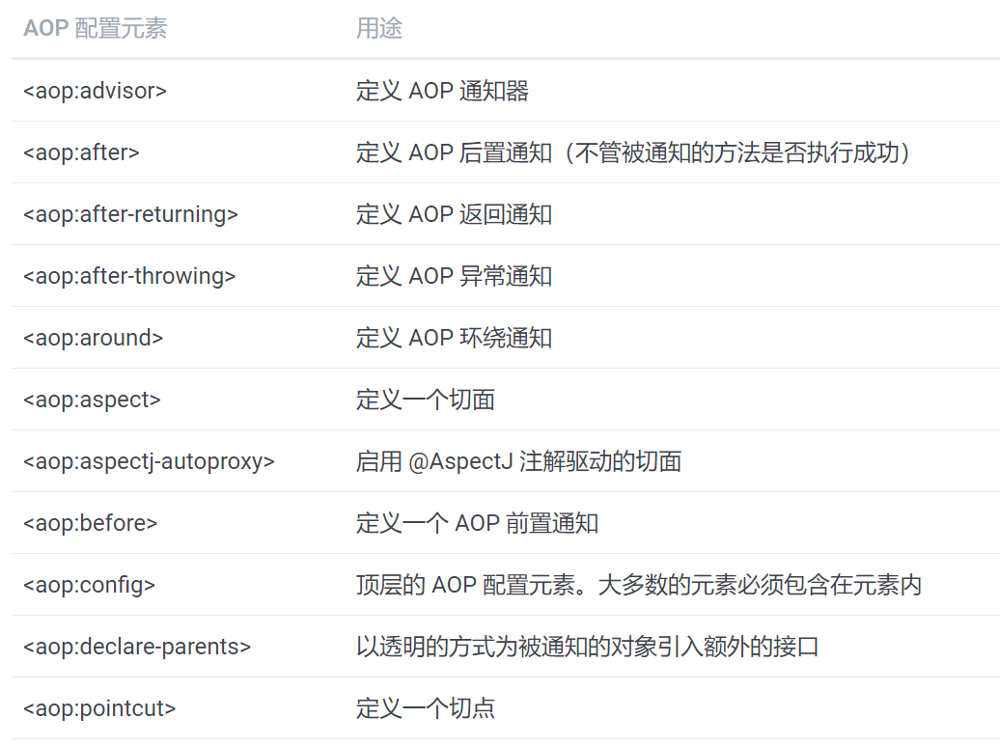

https://potoyang.gitbook.io/spring-in-action-v4

# 一、基础知识

## 1. AOP产生背景

> DI 有助于应用对象之间的解耦，而 AOP 可以实现横切关注点与它们所影响的对象之间的解耦。

​		 软件开发中，散布于应用中多处的功能被称为横切关注点（crosscutting concern）。通常来讲，这些横切关注点从概念上是与应用的业务逻辑相分离的（但是往往会直接嵌入到应用的业务逻辑之中）。把这些横切关注点与业务逻辑相分离正是面向切面编程（AOP）所要解决的问题。

​	    切面能帮助我们模块化横切关注点。简而言之，横切关注点可以被描述为影响应用多处的功能。

​		

​		如果要重用通用功能的话，最常见的面向对象技术是继承（inheritance）或委托（delegation）。但是，如果在整个应用中都使用相同的基类，继承往往会导致一个脆弱的对象体系；而使用委托可能需要对委托对象进行复杂的调用。

​		**切面提供了取代继承和委托的另一种可选方案**，而且在很多场景下更清晰简洁。在使用面向切面编程时，我们仍然在一个地方定义通用功能，但是可以通过声明的方式定义这个功能要以何种方式在何处应用，而无需修改受影响的类。

​		**横切关注点可以被模块化为特殊的类，这些类被称为切面（aspect）。**这样做有两个好处：

​		首先，现在每个关注点都集中于一个地方，而不是分散到多处代码中；

​		其次，服务模块更简洁，因为它们只包含主要关注点（或核心功能）的代码，而次要关注点的代码被转移到切面中了。

## 2. AOP 典型应用场景

​		日志是应用切面的常见范例，但它并不是切面适用的唯一场景。比如声明式事务、安全和缓存。

## 3. 术语

​	

​	**通知：**包含了需要用于多个应用对象的横切行为；

​	**连接点：**程序执行过程中能够应用通知的所有点；

​	**切点：**定义了通知被应用的具体位置（在哪些连接点）。其中关键的概念是切点定义了哪些连接点会得到通知。

### 3.1 通知（Advice）

​	在 AOP 术语中，切面的工作被称为通知。Spring 切面可以应用 5 种类型的通知：

- 前置通知（Before）：在目标方法被调用**之前**调用通知功能；
- 后置通知（After）：在目标方法完成**之后**调用通知，此时不会关心方法的输出是什么；
- 返回通知（After-returning）：在目标方法**成功执行之后**调用通 知；
- 异常通知（After-throwing）：在目标方法**抛出异常后**调用通知；
- 环绕通知（Around）：通知包裹了被通知的方法，在被通知的方法**调用之前和调用之后执**行自定义的行为。

### 3.2 连接点（Join point）

​		连接点是在应用执行过程中能够插入切面的一个点。这个点可以是调用方法时、抛出异常时、甚至修改一个字段时。切面代码可以利用这些点插入到应用的正常流程之中，并添加新的行为。

### 3.3 切点（Pointcut）

​		切点有助于缩小切面所通知的连接点的范围。

​		如果说通知定义了切面的“什么”和“何时”的话，那么**切点就定义了“何处”。****切点的定义会匹配通知所要织入的一个或多个连接点。**我们通常使用明确的类和方法名称，或是利用正则表达式定义所匹配的类和方法名称来指定这些切点。**有些 AOP 框架允许我们创建动态的切点，可以根据运行时的决策（比如方法的参数值）来决定是否应用通知。

### 3.4 切面（Aspect）

​	 切面对应一个类，是通知（Advice）和切点（PointCut）的结合。通知和切点共同定义了切面的全部内容 —— 它是什么，在何时和何处完成其功能。

### 3.5 引入（Introduction）

​	引入允许我们向现有的类添加新方法或属性。例如，我们可以创建一个 Auditable 通知类，该类记录了对象最后一次修改时的状态。这很简单，只需一个方法，setLastModified(Date)，和一个实例变量来保存这个状态。然后，这个新方法和实例变量就可以被引入到现有的类中，从而可以在无需修改这些现有的类的情况下，让它们具 有新的行为和状态。

### 3.6 织入（Weaving）

​	织入是把切面应用到目标对象并创建新的代理对象的过程。切面在指定的连接点被织入到目标对象中。在目标对象的生命周期里有多个点可以进行织入：

- 编译期：切面在目标类编译时被织入。这种方式需要特殊的编译器。AspectJ 的织入编译器就是以这种方式织入切面的。

- 类加载期：切面在目标类加载到 JVM 时被织入。这种方式需要特殊的类加载器（ClassLoader），它可以在目标类被引入应用之前增强该目标类的字节码。AspectJ 5 的加载时织入（load-time weaving，LTW）就支持以这种方式织入切面。

- 运行期：切面在应用运行的某个时刻被织入。一般情况下，在织入切面时，AOP 容器会为目标对象动态地创建一个代理对象。Spring AOP 就是以这种方式织入切面的。JDK 动态代理和cglib两种方案

**不同织入方案的对比：**

- @Aspect注解（编译时织入）：来源于Eclipse Aspect Project，基于接口
- 基于Spring AOP（JDK代理或cglib运行时织入）：基于类

# 二. 通过切点来选择连接点

## 1. AspectJ 指示器

| 指示器      | 描述                                                         |
| ----------- | ------------------------------------------------------------ |
| arg()       | 限制连接点匹配参数为指定类型的执行方法                       |
| @args()     | 限制连接点匹配参数由指定注解标注的执行方法                   |
| execution() | 用于匹配是连接点的执行方法                                   |
| this()      | 限制连接点匹配AOP代理的bean引用为指定类型的类                |
| target      | 限制连接点匹配目标对象为指定类型的类                         |
| @target()   | 限制连接点匹配特定的执行对象，这些对象对应的类要具有指定类 型的注解 |
| within()    | 限制连接点匹配指定的类型                                     |
| @within()   | 限制连接点匹配指定注解所标注的类型（当使用Spring AOP时，方 法定义在由指定的注解所标注的类里） |
| @annotation | 限定匹配带有指定注解的连接点                                 |

**注意只有 execution 指示器是实际执行匹配的，而其他的指示器都是用来限制匹配的**。这说明 execution 指示器是我们在编写切点定义时最主要使用的指示器。在此基础上，我们使用其他指示器来限制所匹配的切点。

## 2. 编写切点







## 3. 在切点中选择 bean

Spring 还引入了一个新的 bean() 指示器，它允许我们在切点表达式中使用 bean 的 ID 来标识 bean。bean() 使用 bean ID 或 bean 名称作为参数来限制切点只匹配特定的 bean。

```java
// 我们希望在执行 Performance 的 perform() 方法时应用通知，但限定 bean 的 ID 为 woodstock。
execution(* concert.Performance.perform()) and bean('woodstock')
// 切面的通知会被编织到所有 ID 不为 woodstock 的 bean 中
execution(* concert.Performance.perform()) and !bean('woodstock')
```

# 三、使用注解创建切面

## 1. 定义切面

```java
import org.aspect.lang.annotation.AfterReturning;
import org.aspect.lang.annotation.AfterThrowing;
import org.aspect.lang.annotation.Aspect;
import org.aspect.lang.annotation.Before;

@Aspect
public class Audience {

  @Before("execution(** concert.Performance.perform(..))")
  public void silenceCellPhones() {
    System.out.println("Silencing cell phones");
  }
  
  @Before("execution(** concert.Performance.perform(..))")
  public void takeSeats() {
    System.out.println("Taking seats");
  }
  
  @AfterReturning("execution(** concert.Performance.perform(..))")
  public void applause() {
    System.out.println("CLAP CLAP CLAP!!!");
  }
  
  @AfterThrowing("execution(** concert.Performance.perform(..))")
  public void demandRefund() {
    System.out.println("Demanding a refund");
  }
}
```

Audience 类使用 @AspectJ 注解进行了标注。该注解表明 Audience 不仅仅是一个 POJO，还是一个切面。Audience 类中的方法都使用注解来定义切面的具体行为。

@Pointcut 注解能够在一个 @AspectJ 切面内定义可重用的切点。接下来的以下程序展现了新的 Audience.

```java
import org.aspect.lang.annotation.AfterReturning;
import org.aspect.lang.annotation.AfterThrowing;
import org.aspect.lang.annotation.Aspect;
import org.aspect.lang.annotation.Before;
import org.aspect.lang.annotation.Pointcut;

@Aspect
public class Audience {

  @Pointcut("execution(** concert.Performance.perform(..))")
  public void performce() { }

  @Before("performce()")
  public void silenceCellPhones() {
    System.out.println("Silencing cell phones");
  }
  
  @Before("performce()")
  public void takeSeats() {
    System.out.println("Taking seats");
  }
  
  @AfterReturning("performce()")
  public void applause() {
    System.out.println("CLAP CLAP CLAP!!!");
  }
  
  @AfterThrowing("performce()")
  public void demandRefund() {
    System.out.println("Demanding a refund");
  }
}
```

如果你使用 Java Config 的话，可以在配置类的类级别上通过使用 EnableAspectJAutoProxy 注解启用自动代理功能。

```java
package concert;

import org.springframework.context.annotation.Bean;
import org.springframework.context.annotation.Component;
import org.springframework.context.annotation.Configuration;
import org.springframework.context.annotation.EnableAspectJAutoProxy;

@Configuration
@EnableAspectJAutoProxy
@Component
public class ConcertConfig {

  @Bean
  public Audience audience() {
    return new Audience();
  }
}
```

假如你在 Spring 中要使用 XML 来装配 bean 的话，那么需要使用 Spring aop 命名空间中的 <aop:aspectj-autoproxy> 元素。

```xml
<?xml version="1.0" encoding="UTF-8"?>
<beans xmlns="http://www.springframework.org/schema/beans"
  xmlns:xsi="http://www.w3.org/2001/XMLSchema-instance"
  xmlns:context="http://www.springframework.org/schema/context"
  xmlns:context="http://www.springframework.org/schema/aop"
  xsi:schemaLocation="
    http://www.springframework.org/schema/aop
    http://www.springframework.org/schema/aop/spring-aop.xsd
    http://www.springframework.org/schema/beans 
    http://www.springframework.org/schema/beans/spring-beans.xsd
    http://www.springframework.org/schema/context
    http://www.springframework.org/schema/context/spring-context.xsd" >
  
  <context:component-scan base-package="context" />
  
  <aop:aspectj-autoproxy />
  
  <bean class="concert.Audience" />

</beans>
```

不管你是使用 JavaConfig 还是 XML，AspectJ 自动代理都会为使用 @Aspect 注解的 bean 创建一个代理，这个代理会围绕着所有该切面的切点所匹配的 bean。在这种情况下，将会为 Concert bean 创建一个代理，Audience 类中的通知方法将会在 perform() 调用前后执行。

我们需要记住的是，Spring 的 AspectJ 自动代理仅仅使用 @AspectJ 作为创建切面的指导，切面依然是基于代理的。在本质上，它依然是 Spring 基于代理的切面。

## 2. 创建@Around Advice

环绕通知是最为强大的通知类型。**它能够让你所编写的逻辑将被通知的目标方法完全包装起来**。实际上就像在一个通知方法中同时编写前置通知和后置通知。为了阐述环绕通知，我们重写 Audience 切面。这次，我们使用一个 环绕通知来代替之前多个不同的前置通知和后置通知。

```java
import org.aspect.lang.annotation.ProceedingJoinPoint;
import org.aspect.lang.annotation.Around;
import org.aspect.lang.annotation.Aspect;
import org.aspect.lang.annotation.Pointcut;

@Aspect
public class Audience {

  @Pointcut("execution(** concert.Performance.perform(..))")
  public void performce() { }

  @Around("performce()")
  public void watchPerformance(ProceedingJoinPoint jp) {
    try {
      System.out.println("Silencing cell phones");
      System.out.println("Taking seats");
      jp.procee();
      System.out.println("CLAP CLAP CLAP!!!");
    } catch (Throwable e) {
      System.out.println("Demanding a refund");
    }
  }
}
```

## 3. 处理Advice中参数

如果切面所通知的方法确实有参数

```java
@Aspect
public class TrackCounter {

  private Map<Integer, Integer> trackCounts = new HashMap<>();
  
  @Pointcut("execution(* soundsystem.CompactDisc.playTrack(int) " +
            "&& args(trackNumber)")
  public void trackPlayed(int trackNumber) { }

  @Before("trackPlayed(trackNumber)")
  public void countTrack(int trackNumber) {
    int currentCount = getPlayCount(trackNumber);
    trackCounts.put(trackNumber, currentCount + 1);
  }
  
  public int getPlayCount(int trackNumber) {
    return trackCounts.containsKey(trackNumber) ? trackCounts.get(trackNumber) : 0;
  }
}
```



这个参数会传递到通知方法中，这个通知方法是通过 @Before 注解和命名切点 trackPlayed(trackNumber) 定义的。切点定义中的参数与切点方法中的参数名称是一样的，这样就完成了从命名切点到通知方法的参数转移。

​	可以在 Spring 配置中将 BlankDisc 和 TrackCounter 定义为 bean，并启用 AspectJ 自动代理

```java
import java.util.ArrayList;
import java.util.List;
import org.springframework.context.annotation.Bean;
import org.springframework.context.annotation.Configuration;
import org.springframework.context.annotation.EnableAspectJAutoProxy;

@Configuration
@EnableAspectJAutoProxy
public class TrackCounterConfig {

  @Bean
  public CompactDisc sgtPeppers() {
    BlankDisc cd = new BlankDisc();
    cd.setTitle("Sgt. Pepper's Lonely Hearts Club Band");
    cd.setArtist("The Beatles");
    List<String> tracks = new ArrayList<>();
    tracks.add("Sgt. Pepper's Lonely Hearts Club Band");
    tracks.add("With a Little Help from My Friends");
    tracks.add("Lucy in the Sky with Diamonds");
    tracks.add("Getting Better");
    tracks.add("Fixing a Hole");
    
    // ...other tracks omitted for brevity...
    cd.setTracks(tracks);
    return cd
  }
  
  @Bean
  public TrackCounter trackCounter() {
    return new TrackCounter();
  }
}
```

简单测试：

```java
import static org.junit.Assert.*;
import org.junit.Assert;
import org.junit.Rule;
import org.junit.Test;
import org.junit.contrib.java.lang.system.StandardOutputStreamLog;
import org.junit.runner.RunWith;

import org.springframework.beans.factory.annotation.Autowired;
import org.springframework.test.context.ContextConfiguration;
import org.springframework.test.context.junit4.SpringJUnit4ClassRunner;

@RunWith(SpringJUnit4ClassRunner.class)
@ContextConfiguration(classes=TrackCounterConfig.class)
public class TrackCounterTest {

  @Rule
  public final StandardOutputStreamLog log = new StandardOutputStreamLog();

  @Autowired
  private CompactDisc cd;
  
  @Autowired
  private TrackCounter counter;

  @Test
  public void testTrackCounter() {
    cd.playTrack(1);
    cd.playTrack(2);
    cd.playTrack(3);
    cd.playTrack(3);
    cd.playTrack(3);
    cd.playTrack(3);
    cd.playTrack(7);
    cd.playTrack(7);
    
    assertEquals(1, counter.getPlayCount(1));
    assertEquals(1, counter.getPlayCount(2));
    assertEquals(4, counter.getPlayCount(3));
    assertEquals(0, counter.getPlayCount(4));
    
    assertEquals(0, counter.getPlayCount(5));
    assertEquals(0, counter.getPlayCount(6));
    assertEquals(2, counter.getPlayCount(7));
  }
}
```

# 四、XML中声明切面



 <aop:aspectj-autoproxy> 元素，它能够自动代理 AspectJ 注解的通知类。aop 命名空间的其他元素能够让我们直接在 Spring 配置中声明切面，而不需要使用注解。

测试

```java
public class Audience {
  
  public void silenceCellPhones() {
    System.out.println("Silencing cell phones");
  }
  
  public void takeSeats() {
    System.out.println("Taking seats");
  }
  
  public void applause() {
    System.out.println("CLAP CLAP CLAP!!!");
  }
  
  public void demandRefund() {
    System.out.println("Demanding a refund");
  }
}
```

## 1. 使用XML声明通知

```xml
<aop:config>
  <aop:aspect ref="audience">
  
    <aop:before
      pointcut="execution(** concert.Performance.perform(..))"
      method="silenceCellPhones" />
    
    <aop:before
      pointcut="execution(** concert.Performance.perform(..))"
      method="takeSeats" />
      
    <aop:after-returning 
      pointcut="execution(** concert.Performance.perform(..))"
      method="applause" />
      
    <aop:after-throwing
      pointcut="execution(** concert.Performance.perform(..))"
      method="demandRefund" />
      
  </aop:aspect>
</aop:config>
```

现在切点是在一个地方定义的，并且被多个通知元素所引用。<aop:pointcut> 元素定义了一个 id 为 performance 的切点。同时修改所有的通知元素，用 pointcut-ref 属性来引用这个命名切点。

```xml
<aop:config>
  <aop:aspect ref="audience">
    <aop:pointcut
      id="performance"
      expressions="execution(** concert.Performance.perform(..))" />
  
    <aop:before
      pointcut-ref="performance"
      method="silenceCellPhones" />
    
    <aop:before
      pointcut-ref="performance"
      method="takeSeats" />
      
    <aop:after-returning 
      pointcut-ref="performance"
      method="applause" />
      
    <aop:after-throwing
      pointcut-ref="performance"
      method="demandRefund" />
      
  </aop:aspect>
</aop:config>
```

<aop:pointcut> 元素所定义的切点可以被同一个 <aop:aspect> 元素之内的所有通知元素引用。

如果想让定义的切点能够在多个切面使用，我们可以把 <aop:pointcut> 元素放在 <aop:config> 元素的范围内。

## 2. 声明环绕通知

```java
import org.aspectj.lang.ProceedingJoinPoint;

public class Audience {

  public void watchPerformance(ProceedingJoinPoint jp) {
    try {
      System.out.println("Silencing cell phones");
      System.out.println("Taking seats");
      jp.procee();
      System.out.println("CLAP CLAP CLAP!!!");
    } catch (Throwable e) {
      System.out.println("Demanding a refund");
    }
  }
}
```


```xml
<aop:config>
  <aop:aspect ref="audience">
    <aop:pointcut
      id="performance"
      expression="execution(** concert.Performance.perform(..))" />
    
    <aop:around
      pointcut-ref="performance"
      method="watchPerformance" />
      
  </aop:aspect>
</aop:config>
```

## 3. 为通知传递参数

```java
import java.util.HashMap;
import java.util.Map;

public class TrackCounter {

  private Map<Integer, Integer> trackCounts = new HashMap<>();
  
  public void trackPlayed(int trackNumber) { }

  public void countTrack(int trackNumber) {
    int currentCount = getPlayCount(trackNumber);
    trackCounts.put(trackNumber, currentCount + 1);
  }
  
  public int getPlayCount(int trackNumber) {
    return trackCounts.containsKey(trackNumber) ? trackCounts.get(trackNumber) : 0;
  }
}
```

XML配置：

```xml
<?xml version="1.0" encoding="UTF-8"?>
<beans xmlns="http://www.springframework.org/schema/beans"
  xmlns:xsi="http://www.w3.org/2001/XMLSchema-instance"
  xmlns:aop="http://www.springframework.org/schema/aop"
  xmlns:util="http://www.springframework.org/schema/util"
  xsi:schemaLocation="
    http://www.springframework.org/schema/aop
    http://www.springframework.org/schema/aop/spring-aop.xsd
    http://www.springframework.org/schema/beans
    http://www.springframework.org/schema/beans/spring-beans.xsd" >
  
  <bean id="trackCounter" class="soundsystem.TrackCounter" />
  
  <bean id="cd" class="soundsystem.BlackDisc" >
    <property name="title" value="Sgt. Pepper's Lonelt Hearts Club Band" />
    <property name="artist" value="The Beatles" />
    <property name="tracks" >
      <list>
        <value>Sgt. Pepper's Lonely Hearts Club Band</value>
        <value>Lucy in the Sky with Diamonds</value>
        <value>Getting Better</value>
        <value>Fixing a Hole</value>
        <!-- ...other tracks omitted for brevity... -->
      </list>
    </property>
  </bean>
  
  <aop:config>
    <aop:aspect ref="trackCounter">
      <aop:pointcut
        id="trackPlayed"
        expression="execution(* soundsystem.CompactDisc.playTrack(int)) and args(trackNumber)" />
        
      <aop:before pointcut-ref="trackPlayed" method="countTrack" />
    </aop:aspect>
  </aop:config>
  
</beans>
```


# 五、典型使用

## 1. 封装异常处理

阿里技术专家详解DDD系列 第五讲：聊聊如何避免写流水账代码 https://zhuanlan.zhihu.com/p/366395817

修改前

```java
@PostMapping("checkout")
public Result<OrderDTO> checkout(Long itemId, Integer quantity) {
    try {
        CheckoutCommand cmd = new CheckoutCommand();
        OrderDTO orderDTO = checkoutService.checkout(cmd);    
        return Result.success(orderDTO);
    } catch (ConstraintViolationException cve) {
        // 捕捉一些特殊异常，比如Validation异常
        return Result.fail(cve.getMessage());
    } catch (Exception e) {
        // 兜底异常捕获
        return Result.fail(e.getMessage());
    }
}
```

定义切面

```java
@Target(ElementType.METHOD)
@Retention(RetentionPolicy.RUNTIME)
public @interface ResultHandler {

}

@Aspect
@Component
public class ResultAspect {
    @Around("@annotation(ResultHandler)")
    public Object logExecutionTime(ProceedingJoinPoint joinPoint) throws Throwable {
        Object proceed = null;
        try {
            proceed = joinPoint.proceed();
        } catch (ConstraintViolationException cve) {
            return Result.fail(cve.getMessage());
        } catch (Exception e) {
            return Result.fail(e.getMessage());
        }
        return proceed;
    }
}
```

使用切面改造后

```java
@PostMapping("checkout")
@ResultHandler
public Result<OrderDTO> checkout(Long itemId, Integer quantity) {
    CheckoutCommand cmd = new CheckoutCommand();
    OrderDTO orderDTO = checkoutService.checkout(cmd);
    return Result.success(orderDTO);
}
```

# 六、其他

