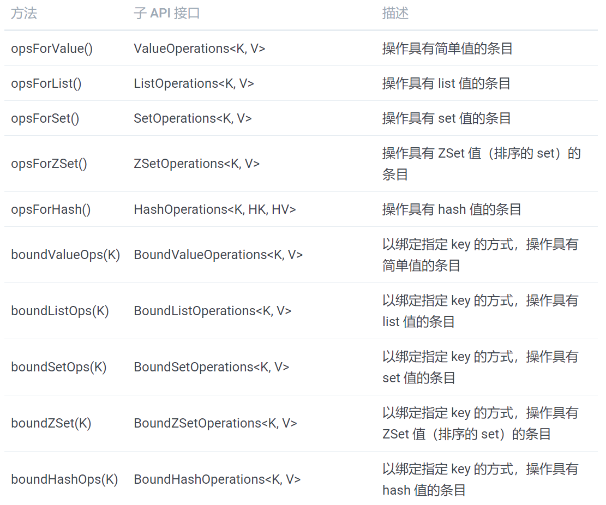

# NoSQL操作

## 0. 参考资料

​		https://potoyang.gitbook.io/spring-in-action-v4/untitled-4/untitled-1

## 1. MongoDB操作


## 2. Neo4j操作


## 3. Redis操作

### 1、基础使用：Jedis/Lettuce连接工厂

Spring Data Redis 为四种 Redis 客户端实现提供了连接工厂：

- JedisConnectionFactory
- JredisConnectionFactory
- LettuceConnectionFactory  --- 推荐
- SrpConnectionFactory

```java
// 默认配置： localhost 上的 6379 端口创建连接，并且没有密码
@Bean
public RedisConnectionFactory redisCF() {
  return new JedisConnectionFactory();
}
// 指定集群且配置密码
@Bean
public RedisConnectionFactory redisCF() {
  JedisConnectionFactory cf = new JedisConnectionFactory();
  cf.setHostName("redis-server");
  cf.setPort(7379);
  cf.setPassword("foobared");
  return cf;
}
// 使用LettuceConnectionFactory
@Bean
public RedisConnectionFactory redisCF() {
  JedisConnectionFactory cf = new LettuceConnectionFactory();
  cf.setHostName("redis-server");
  cf.setPort(7379);
  cf.setPassword("foobared");
  return cf;
}
```

进一步操作：Redis 连接工厂会生成到 Redis key-value 存储的连接（以 RedisConnection 的形式）。借助 RedisConnection，可以存储和读取数据。进一步使用Redis的原生命令来操作。

```java
RedisConnectionFactory cf = ...;
RedisConnection conn = cf.getConnection();
conn.set("greeting".getBytes(), "Hello World".getBytes());

byte[] greetingBytes = conn.get("greeting".getBytes());
String greeting = new String(greetingBytes());      
```

### 2、高级使用：RedisTemplate

Spring Data Redis 提供了两个模板，简化 Redis 数据访问：

- RedisTemplate：**能够让我们持久化各种类型的 key 和 value，并不局限于字节数组**。
- StringRedisTemplate： key 和 value 通常是 String 类型

样例：

```java
RedisConnectionFactory cf = ...;
RedisTemplate<String, Product> redis = new RedisTemplate<String, Product>();
redis.setConnectionFactory(cf);

RedisConnectionFactory cf = ...;
RedisTemplate redis = new StringRedisTemplate();
```

但是如果你经常使用 RedisTemplate 或 StringRedisTemplate 的话，你可以考虑将其配置为 bean，然后注入到需要的地方。如下就是一个声明 RedisTemplate 的简单 @Bean 方法：

```java
@Bean
public RedisTemplate<String, Product> redisTemplate(RedisConnectionFactory cf) {
  RedisTemplate<String, Product> redis = new RedisTemplate<String, Product>();
  redis.setConnectionFactory(cf);
  return redis;
}
// StringRedisTemplate 有一个接受 RedisConnectionFactory 的构造器，因此没有必要在构建后再调用 setConnectionFactory()。

@Bean
public StringRedisTemplate stringRedisTemplate(RedisConnectionFactory cf) {
  return new StringRedisTemplate(cf);
}
```

有了 RedisTemplate（或 StringRedisTemplate）之后，我们就可以开始保存、获取以及删除 key-value 条目了。




```java
redis.opsForValue().set(product.getSku(), product);
Product product = redis.opsForValue().get("123456");

# List操作
redis.opsForList().rightPush("cart", product);
redis.opsForList().leftPush("cart", product);
Product first = redis.opsForList().leftPop("cart");
Product last = redis.opsForList().rightPop("cart");
List<Product> products = redis.opsForList().range("cart", 2, 12);

# Set操作
redis.opsForSet().add("cart", product);
List<Product> diff = redis.opsForSet().difference("cart1", "cart2");
List<Product> union = redis.opsForSet().union("cart1", "cart2");
List<Product> isect = redis.opsForSet().isect("cart1", "cart2");
redis.opsForSet().remove(product);
Product random = redis.opsForSet().randomMember("cart");
```


### 3、序列化

因为涉及到网络传输，所以针对复杂对象必然涉及到数据序列化和反序列化诉求。


## 4. Elastic Search操作

>  ElasticSearchRepository 不如 ElasticSearchTemplate提供更强的查询功能

### 1、ElasticSearchRepository

```java
ElasticsearchRepository  定义 searchSimilar
    - PagingAndSortingRepository  定义 findAll(Sort) 和 findAll(Pageable)
    	- CrudRepository  定义save、findById、findAll、findAllById、count、delete、deleteById、deleteAll...
    		- Repository 空接口
```

​	

### 2、ElasticSearchRestTemplate

```java
ElasticsearchRestTemplate  定义indexOps、doBulkOperation、bulkUpdate、delete、search等
	- AbstractElasticsearchTemplate 定义save、search、delete、bulkIndex等
    	- ElasticsearchOperations  定义indexOps、cluster()等
    	- ApplicationContextAware
    
```


