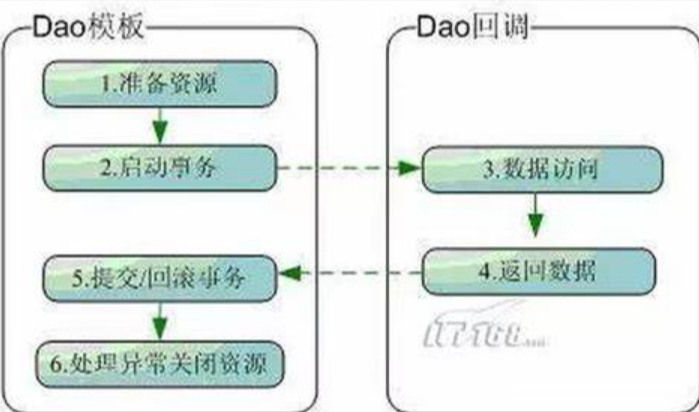
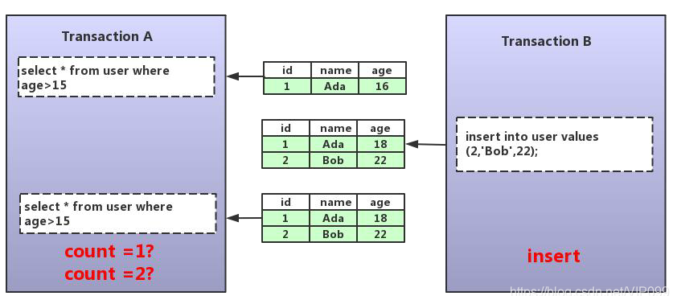
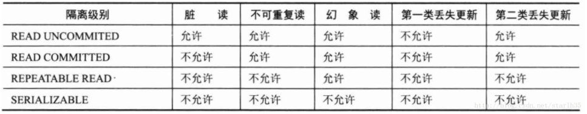

参考：《精通Spring 4.x企业应用开发实战》

# 一、Spring对DAO的支持

​	UserService -> UserDao( JdbcUserDAo、MybatisUserDao、HibernateUserDao 不同的持久化技术)。

## 1. Spring DAO异常体系

普通的API或框架存在的问题：

- 检查型异常被过多使用，业务代码充斥大量try/catch代码。很多时候业务代码比较少；

- 引发异常的问题往往不可恢复，如数据库连接失败，SQL语法问题

Spring异常体系建立在==运行期异常==基础上，开发者根据需要捕捉感兴趣的异常。

Spring在org.springframework.dao包中提供了**完备优雅**的DAO异常体系，继承自DataAccessException（继承自NestedRuntimeException）。NestedRuntimeException封装了源异常，用户可通过getCause()获取原始异常信息。

​	**问题**：普通的JDBC的SQLException，用户通过ErrorCode和SQLState获取错误代码，然后判断原因。问题：偏底层，且ErrorCode与数据库相关。

​	**方案**：Spring以分类方法建立了异常分类目录：1）用户不关注底层细节；2）选择感兴趣异常进行处理。

Spring DAO异常体系：

**DataAccessException下一级异常子类**

- CleanupFailureDataAccessException	执行 DAO 操作成功，但在释放数据资源时发生异常，如关闭 Connection 时发生异常。
- ConcurrencyFailureException	并发地操作数据时发生异常，如无法获取乐观锁或悲观锁时、死锁引发的失败等场景。
- DataAccessResourceFailureException	访问数据资源失败，如无法获取数据连接，无法获取 Hibernate 的会话等场景。
- DataRetrievalFailureException	获取数据失败，如找不到对应主键的数据或使用了错误的列索引等场景。
- DataSourceLookupFailureException	无法从 JNDI 中查找到数据源。
- DataIntegrityViolationException	数据操作违反了数据一致性限制时抛出，如插入重复的主键或引用不存在的外键场景。
- InvalidDataAccessApiUsageException	不正确地调用某一种持久化技术时抛出，如在 Spring JDBC 中查询对象在调用前没有事先进行编译操作，就会抛出该异常。这种异常主要是因为不正确地使用持久化技术而产生的。
- InvalidDataAccessResourceUsageException	在访问数据源时使用了不正确的方法时抛出，如写错 SQL 语句。
- PermissionDeniedDataAccessException	数据访问权限不足时抛出。如仅拥有只读权限却试图更改数据。
- UncategorizedDataAccessException	其它未被分类的异常。

每个子类下又细分子类，对应更详细原因，如BadSqlGrammerException

## 2. JDBC的异常转换器

​	传统的JDBC API在发生所有的数据操作异常时都抛出SQLException，用户必须调用进一步方法获取异常信息。

​	SQLException：

​		1. 错误码：与具体数据库相关，getErrorCode()，int

​		2. SQL状态码：标准的错误代码，getSQLState()，String

Spring根据上述错误码和状态码将SQLException翻译成Spring DAO异常体系，内部定义了org.springframework.jdbc.support下定义接口 SQLExceptionTranslator（实现类 SQLErrorCodeSQLExceptionTranslator和SQLStateSQLExceptionTranslator）

## 3. 持久化模板类jdbcTemplate

​	Spring封装了数据库连接获取等操作，将访问流程固化到模板类中，并将数据访问中固定和变化分开，同时保证**模板类是线程安全**的；使得多给线程访问共享一个模板实例。访问变化的部分通过回调接口开放(定义具体数据访问和结果返回的操作)。



​	针对不同持久化技术的模板类

- JDBC: org.springframework.jdbc.core.JdbcTemplate

- JPA: org.springframework.orm.jpa.JpaTemplate
- Hibernate X.0: org.springframework.orm.hibernateX.HibernateTemplate

如果直接使用模板类，一般需要DAO中定义一个模板对象并提供数据源

- JDBC:  org.springframework.jdbc.core.JdbcDaoSupport
- JPA: org.springframework.orm.jpa.JpaDaoSupport
- Hibernamte X.0: org.springframework.orm.hibernateX.HibernateDaoSupport

上述支持类都继承于dao.support.DaoSupport类。DaoSupport类实现了InitialzingBean接口，在afterPropertiesSet()接口中检查模板对象和数据源是否正确设置，否则抛出异常。

所有支持类都是abstract，并非直接使用。

## 4. 数据源（连接池）

​	spring中数据连接通过数据源获取。不仅可以通过JNDI获取应用服务器的数据源，也可以直接在spring容器配置数据源。

### 4.1  dbcp（三方）

​	Apache DBCP是一个依赖Jakarta commons-pool对象池机制的数据连接池，需引入commons-pool的依赖。

   POM配置：

   ```xml
<dependency>
    <groupId>commons-dbcp</groupId>
    <artifactId>commons-dbcp</artifactId>
    <version>1.4</version>
</dependency>
   ```

xml配置（如下仅列举部分属性）

```xml
<bean id="dataSource"
      class="org.apache.commons.dbcp.BasicDataSource"
      destroy-method="close">
    <property name="driverClassName" value="com.mysql.jdbc.Driver"/>
    <property name="url" value="jdbc:mysql://localhost:3306/test?useUnicode=true&characterEncoding=UTF-8"/>
    <property name="username" value="root"/>
    <property name="password" value="root"/>
    
    <!-- 1.数据源连接数量 -->  
    <!--maxActive: 最大连接数量-->  
    <property name="maxActive" value="150"/>
    <!--minIdle: 最小空闲连接-->  
    <property name="minIdle" value="5"/>
    <!--maxIdle: 最大空闲连接-->  
    <property name="maxIdle" value="20"/>
    <!--initialSize: 初始化连接-->  
    <property name="initialSize" value="30"/>
    <!--maxWait: 超时等待时间以毫秒为单位 1000等于60秒-->
    <property name="maxWait" value="1000"/>

    <!-- 2.连接泄露回收 -->
    <!-- 连接被泄露时是否打印 -->
    <property name="logAbandoned" value="true"/>
    <!--removeAbandoned: 是否自动回收超时连接-->  
    <property name="removeAbandoned"  value="true"/>
    <!--removeAbandonedTimeout: 超时时间(以秒数为单位)-->  
    <property name="removeAbandonedTimeout" value="10"/>
    
    <!-- 3.连接健康状况维护和检测 -->
    <!-- 在连接返回调用者前，用此SQL验证从连接池取出的连接是否可用 -->
    <property name="validationQuery" value="SELECT NOW() FROM DUAL"/>
    <!-- 在空闲连接回收器线程运行期间休眠的时间值,以毫秒为单位. -->
    <property name="timeBetweenEvictionRunsMillis" value="10000"/>
    <!--  在每次空闲连接回收器线程(如果有)运行时检查的连接数量 -->
    <property name="numTestsPerEvictionRun" value="10"/>
    <!-- 1000 * 60 * 30  连接在池中保持空闲而不被空闲连接回收器线程-->
    <property name="minEvictableIdleTimeMillis" value="10000"/>

</bean>
```

> 必须设置destroy-method，确保spring关闭时，数据源能正常关闭。

​	**MySQL 8小时问题：**Mysql默认情况下如发现一个连接空闲时间超过8小时，会在数据库端自动关闭该连接。客户端并不感知，此时如果时用时提示connection异常

​	如果采用DBCP默认配置，由于testOnBorrow默认true，数据源在将连接返回DAO前，事先检测连接是否正常，如异常则取一个其他连接给DAO，从而不会发生“8小时问题”。但每次都检测在高并发场景带来性能问题。

​	推荐方案：设置testOnBorrow=false，testWhileIdle=true，并设置timeBetweenEvictionRunsMillis。从而DBCP后台线程定时对空闲连接检测，并对被数据库关闭的连接清除。只要将timeBetweenEvictionRunsMillis设置小于8小时，就可以避免MySQL的8小时问题。

### 4.2 C3P0（三方）

pom依赖

```xml
<dependency>
    <groupId>com.mchange</groupId>
    <artifactId>c3p0</artifactId>
    <version>0.9.5.5</version>
</dependency>
```

bean.xml配置

```xml
<bean id="dataSource" class="com.mchange.v2.c3p0.ComboPooledDataSource"
      destroy-method="close">
      <property name="driverClass" value="com.mysql.jdbc.Driver"/>
      <property name="jdbcUrl" value="jdbc:mysql://localhost:3306/test?useUnicode=true&characterEncoding=UTF-8"/>
	    <!-- 用户名-->
      <property name="user" value="root"/>
      <!-- 用户密码-->
      <property name="password" value="123456"/>
    

       <!--连接池中保留的最大连接数。默认值: 15 --> 
      <property name="maxPoolSize" value="20"/>
      <!-- 连接池中保留的最小连接数，默认为：3-->
      <property name="minPoolSize" value="2"/>
      <!-- 初始化连接池中的连接数，取值应在minPoolSize与maxPoolSize之间，默认为3-->
      <property name="initialPoolSize" value="2"/>

      <!--最大空闲时间，60秒内未使用则连接被丢弃。若为0则永不丢弃。默认值: 0 --> 
      <property name="maxIdleTime">60</property>

      <!-- 当连接池连接耗尽时，客户端调用getConnection()后等待获取新连接的时间，超时后将抛出SQLException，如设为0则无限期等待。单位毫秒。默认: 0 --> 
      <property name="checkoutTimeout" value="3000"/>

      <!--当连接池中的连接耗尽的时候c3p0一次同时获取的连接数。默认值: 3 --> 
      <property name="acquireIncrement" value="2"/>

     <!--定义在从数据库获取新连接失败后重复尝试的次数。默认值: 30 ；小于等于0表示无限次--> 
      <property name="acquireRetryAttempts" value="0"/>

      <!--重新尝试的时间间隔，默认为：1000毫秒--> 
      <property name="acquireRetryDelay" value="1000" />

      <!--关闭连接时，是否提交未提交的事务，默认为false，即关闭连接，回滚未提交的事务 --> 
      <property name="autoCommitOnClose">false</property>

      <!--c3p0将建一张名为Test的空表，并使用其自带的查询语句进行测试。如果定义了这个参数那么属性preferredTestQuery将被忽略。你不能在这张Test表上进行任何操作，它将只供c3p0测试使用。默认值: null --> 
      <property name="automaticTestTable">Test</property>

      <!--如果为false，则获取连接失败将会引起所有等待连接池来获取连接的线程抛出异常，但是数据源仍有效保留，并在下次调用getConnection()的时候继续尝试获取连接。如果设为true，那么在尝试获取连接失败后该数据源将申明已断开并永久关闭。默认: false--> 
      <property name="breakAfterAcquireFailure">false</property>

      <!--每60秒检查所有连接池中的空闲连接。默认值: 0，不检查 --> 
      <property name="idleConnectionTestPeriod">60</property>
      <!--c3p0全局的PreparedStatements缓存的大小。如果maxStatements与maxStatementsPerConnection均为0，则缓存不生效，只要有一个不为0，则语句的缓存就能生效。如果默认值: 0--> 
      <property name="maxStatements">100</property>
      <!--maxStatementsPerConnection定义了连接池内单个连接所拥有的最大缓存statements数。默认值: 0 --> 
      <property name="maxStatementsPerConnection"></property>
 </bean>
```

### 4.3 DriverManagerDataSource(Spring)

 	org.springframework.jdbc.datasource.DriverManagerDataSource，实现了javax.sql.DataSource接口，**不提供数据库连接池**。每次getConnecton()都是获取新连接，可用于在单元测试或简单应用使用。

# 二、Spring JDBC访问数据库

## 1. JdbcTemplate

线程安全，所以所有DAO都可共享同一个实例。

内部使用PreparedStatement执行SQL语句。

```java
package com.smart.dao;

@Repository
public class ForumDao {
    private JdbcTemplate jdbcTemplate;
    
    @Autowired
    public void setJdbcTemplate(JdbcTemplate jdbcTemplate) {
        this.jdbcTemplate = jdbcTemplate;
    }
    
    public void initDB() {
        String sql = "create table t_user(user_id int primary, user_name varchar(60))";
        jdbcTempalte.execute(sql);
    }
}
```

spring配置文件

```xml
<context:component-scan base-package="com.smart" />

<context:property-placeholder location ="classpath:jdbc.properties" />

<bean id="dataSource" class="com.apache.commons.dbcp.BasicDataSource"
      destroy-method="close"
      p:driverClassName="${jdbc.driverClassName}"
      p:url="${jdbc.url}"
      p:username="${jdbc.username}"
      p:password="${jdbc.password}" />
<bean id="jdbcTemplate"
      class="org.springframework.jdbc.core.JdbcTemplate"
      p:dataSource-ref="dataSource" />
```

### 1.1 更改数据update

update方法：允许对数据表记录进行插入、更新和删除。

- int update(String sql): 不带占位符
- int update(String sql, Object... args): 不定参数场景
- int update(String sql, PreparedStatementSetter pss): 第2个参数是回调接口。
- int update(PreparedStatementCreator psc): 参数是回调接口，负责创建一个PreparedStatement实例。
- int upate(PreparedStatementCreator ps, PreparedStatementSetter pss)

**Parameter values are usually provided as variable arguments or, alternatively, as an object array。**

```java
this.jdbcTemplate.update(
  "update t_actor set last_name = ? where id = ?",
  "Banjo", 5276L);
```

使用样例：

```java
public void addForum(Forum forum) {
    String sql = "INSERT INTO t_forum(forum_name, forum_desc) VALUES(?,?)";
    Object[] params = new Object[]{forum,getForumName(), forum.getForumDesc()};
    jdbcTemplate.update(sql, params);
}
```

更好的方式(显示指定每个占位符对应的字段数据类型，避免上面由Spring猜测错误)

```java
import java.sql.Types;

public void addForum(Forum forum) {
    String sql = "INSERT INTO t_forum(forum_name, forum_desc) VALUES(?,?)";
    Object[] params = new Object[]{forum,getForumName(), forum.getForumDesc()};
    jdbcTemplate.update(sql, params, new int[]{Types.VARCHAR, Types.VARCHAR});
}
```

其他样例：

```java
public void addForum(Forum forum) {
    // .. 
    jdbcTemplate.update(sql, new PreparedStatementSetter() {
        public void setValues(PreparedStatement ps) throws SQLException {
            ps.setString(1, forum.getForumName());
            ps.setString(2, forum.getForumDesc());
        }
    });
}

public void addForum(Forum forum) {
    // .. 
    jdbcTemplate.update(sql, new PreparedStatementCreator() {
        public PreparedStatement createPreparedStatement(Connection conn) throws SQLException {
            PreparedStatement ps = conn.getPreparedStatement(sql);
            ps.setString(1, forum.getForumName());
            ps.setString(2, forum.getForumDesc());
            return ps;
        }
    });
}
```

### 1.2 查询querry


# 三、事务

## 1. 基础知识

### 1.1 事务的特征

​     A(原子）、C（一致）、I（隔离性）、D（永久性）。

​	隔离：并发数据操作时，不同事务有各自的数据空间，各自操作不会对对方产生干扰。

​	数据库系统采用**数据库锁**机制保证事务的隔离性。

### 1.2 数据并发的问题

​	并发访问相同数据的时候，如未采取必要的隔离措施，导致的并发问题：**3类数据读和2类数据更新问题**

- **脏读**：A事务读取B事务尚未提交的更改数据并在此数据基础上操作。如果B事务回滚，则A事务读到的数据是不被承认的。

- **不可重复读**：A事务读取了B事务已提交的更改数据。但是因为读取时机的问题，导致读取的数据不一致。

  同一事务中，对于同一数据，执行完全相同的select语句时可能看到不一样的结果。**通过增加行锁方式解决。**

  

- **幻象读**：A事务读取B事务新提交的新增数据，当用户读取某一范围的数据行时，另一个事务又在该范围内插入了新行，当用户再读取该范围的数据行时，会发现有新的“幻影” 行；

  ​    **通过多版本并发控制(MVCC，Multiversion Concurrency Control)机制解决了该问题。**

  

- 第一类丢失更新：A事务撤销时，把已提交的B事务更新数据覆盖了。

- 第二类丢失更新：A事务覆盖B事务已提交的数据。

### 1.3 数据锁

表锁和行锁。

从并发事务锁定的关系：

- 共享锁：防止独占锁定，但允许其他共享锁定。

- 独占锁：同时防止其他的共享锁定和独占锁定。

具体实现：

- 行共享锁： SELECT FOR UPDATE语句隐式获得行共享锁定；

- 行独占锁定：通过INSERT/UPDATE/DELETE隐式获取或通过LOCK TABLE IN ROW EXCLUSIVE MODE；
- 表共享锁定：通过LOCK TABLE IN SHARE MODE显示获得；
- 表共享行独占锁定：通过LOCK TABLE IN SHARE ROW EXCLUSIVE MODE显示获得；
- 表独占锁定：通过LOCK TABLE IN EXCLUSIVE MODE显示获得。

### 1.4 事务隔离级别

​	数据库为用户提供了自动锁机制：只要用户指定会话的事务隔离级别，数据库就会分析事务中SQL语句，并自动为事务操作的数据资源添加合适的锁。

​	4个等级的事务隔离级别：



### 1.5 JDBC对事务的支持

​	Connection默认自动提交（每条SQL语句对应一个事务）。为支持多个SQL作为一个事务提交，先

1. Connection#setAutoCommit(false)阻止自动提交；

2. Connection#setTransactionIsolation()设置事务隔离级别；

3. Connection#commit()：提交事务；

4. Connection#rollback()：回滚事务。

   JDBC 2.0中，事务最终只能有2个操作：提交和回滚。

## 2. Spring对事务的支持

​	Spring提供了事务模板类 TransactionTemplate，并配合使用事务回调TransactionCallback指定具体的持久化操作，就可以通过编程方式实现事务管理，无需关注资源获取、复用、释放、事务同步和异常处理等操作。

​	Spring支持声明式事务管理：IOC配置指定事务的边界和事务属性。

### 2.1 事务管理关键抽象（接口）

​	Spring事务管理SPI抽象层主要包括3个**接口**（位于org.springframework.transaction）：

- TransactionDefinition：描述事务隔离级别、超时时间、是否只读事务和事务传播规则

- TransactionStatus：事务的具体运行状态，事务管理器可通过该接口获取事务运行期状态，也可以通过该接口间接回滚事务。

- PlatformTransactionManager：根据TransactionDefinition提供的事务配置创建事务，并用TransactionStatus描述激活事务的状态。

  ```java
  public interface PlatformTransactionManager {
      // 根据事务定义返回一个已存在的事务或创建一个新事务
      TransactionStatus getTransaction(TransactionDefinition definition) throws TransactionException;
      
      // 根据事务的状态提交事务。如果事务状态标识为rollback-only，则方法将执行一个回滚事务操作
      void commit(TransactionStatus status) throws TransactionException;
      
      // 将事务回滚，当commit()异常时，rollback方法会隐式调用
      void rollback(TransactionStatus status) throws TransactionException;
  }
  ```

### 2.2 Spring的事务管理器实现类

​	Spring为不同的持久化框架提供PlatformTransactionManager接口的实现类：

- org.springframework.orm.jpa.JpaTransactionManager
- org.springframework.jdbc.datasource.DataSourceTransactionManager 使用Spring JDBC或Mybatis等基于DataSource数据源的持久化技术

- org.springframework.orm.hibernateX.HibernateTransactionManager

使用样例

1. 使用Spring  JDBC或Mybatis，都基于Connection访问数据，所以可以使用DataSourceTransactionManager

```java
<bean id="datasource"
    class="org.apache.commons.dbcp.BasicDataSource"
        destroy-method="close"
        p:driverClassName="${jdbc.driverClassName}"
        p:url="${jdbc.url}"
        p:username="${jdbc.userName}"
        p:password="${jdbc.password}" />
<bean id="transactionManager"
        class="org.springframework.jdbc.datasource.DataSourceTransactionManager"
        p:dataSource-ref="dataSource" />
```

其他场景不列举

### 2.2 事务同步管理器

​	Spring将Connection等访问数据库的连接或会话统称为资源，且资源不可在同一时刻被多线程共享。Spring事务同步管理器类org.springframework.transaction.support.TransactionSynchronizationManager使用ThreadLocal为不同事务线程提供了独立资源副本。

​	Spring为不同持久化技术提供了从TransactionSynchronizationManager获取对应线程绑定资源的工具类

- org.springframework.jdbc.datasource.DataSourceUtils:  Spring JDBC或Mybatis
- org.springframework.orm.HibernateX.SessionFactoryUtils: Hibernate X.0
- org.springframework.orm.jpa.EntityManagerFactoryUtils

上述方法都提供了静态方法，获取和当前线程绑定的资源。如DataSourceUtil.getConnection(DataSource dataSource)

### 2.3 事务传播行为

​	当调用一个基于Spring的Service接口方法时，它将运行在Spring管理的事务环境中，Service接口可能会内部调用其他Service的接口方法以完成一个完整的业务操作，从而产生Service的接口嵌套调用场景。 Spring通过事务传播行为控制当前事务如何传播到被嵌套调用的目标服务接口方法中。

​	Spring在TransactionDefinition中定义了7种类型的事务传播行为

- Propagation.REQUIRED： 如果当前存在事务，则加入该事务，如果当前不存在事务，则创建一个新的事务。
- Propagation.SUPPORTS：如果当前存在事务，则加入该事务；如果当前不存在事务，则以非事务的方式继续运行。
- Propagation.MANDATORY：如果当前存在事务，则加入该事务；如果当前不存在事务，则抛出异常。
- Propagation.REQUIRES_NEW：重新创建一个新的事务，如果当前存在事务，延缓当前的事务。
- Propagation.NOT_SUPPORTED：以非事务的方式运行，如果当前存在事务，暂停当前的事务。
- Propagation.NEVER：以非事务的方式运行，如果当前存在事务，则抛出异常。
- Propagation.NESTED：如果没有，就新建一个事务；如果有，就在当前事务中嵌套其他事务。

## 3. 使用XML配置声明式事务

​	Spring的声明式事务管理是通过Spring AOP实现的。通过声明性信息，Spring负责将事务管理增强逻辑动态织入业务方法的相关连接点中。

​    Service定义：默认使用无事务方式运行。

```java
package org.smart.service;

@Service
public class BbtForum {
    public ForumDao forumDao;
    public TopicDao topicDao;
    public PostDao  postDao;
    
    public void addTopic(Topic topic) {
        topicDao.addTopic(topic);
        postDao.addPost(topic.getPost())
    }
    
    public Forum getForum(int forumId) {
        return forumDao.getForum(forumId);
    }
    
    public void updateForum(Forum forum) {
        forumdao.updateForum(form);
    }
    
    public int getForumNum() {
        return forumDao.getForumNum();
    }
}
```

### 3.1 使用原始的TransactioniProxyFactoryBean

早期方案，推荐后续的tx/aop配置方案

```xml
<!-- 引入DAO和DataSource的配置文件-->
<import resource="classpath:applicationContext-dao.xml" />

<bean id="txManager"
      class="org.springframework.jdbc.datasource.DataSourceTransactionManager">
    <property name="dataSource" ref="dataSource">
</bean>

<!-- 需要实施事务增强的目标业务Bean，习惯上需增强的类一般id取名xxTarget -->
<bean id="bbtForumTarget"
      class="pacakge com.smart.service.BbtForum"
      p:forumDao-ref="forumDao"
      p:topic-ref="topic"
      p:postDao-ref="postDao" />
    
<bean id="bbtForum"
      class="org.springframework.transaction.interceptor.TransactionProxyFactoryBean"
      p:transactionManager-ref="txManager"
      p:targer-ref="bbtForumTarger" >
    
    <property name="transactionAttributes" >
        <props>
            <prop key="get*">PROPAGATION_REQUIRED,readOnly</props>
            <prop key="*">PROPAGATION_REQUIRED</prop>
        </props>
    </property>
</bean>
```

存在的问题：

- 只能通过方法名定义，无法根据入参和访问域修饰符限制
- 对每个需事务支持的service类单独配置

### 3.2  基于aop/tx命名空间配置

context配置

```xml

<?xml version="1.0" encoding="UTF-8"?>
<beans xmlns="http://www.springframework.org/schema/beans"
	xmlns:xsi="http://www.w3.org/2001/XMLSchema-instance"
	xmlns:context="http://www.springframework.org/schema/context"
	xmlns:tx="http://www.springframework.org/schema/tx"
	xmlns:aop="http://www.springframework.org/schema/aop"
	xsi:schemaLocation="http://www.springframework.org/schema/beans http://www.springframework.org/schema/beans/spring-beans.xsd
		http://www.springframework.org/schema/context http://www.springframework.org/schema/context/spring-context-4.0.xsd
		http://www.springframework.org/schema/aop http://www.springframework.org/schema/aop/spring-aop-4.0.xsd
		http://www.springframework.org/schema/tx http://www.springframework.org/schema/tx/spring-tx-4.0.xsd">
	
	<!-- 引入属性文件 -->
	<context:property-placeholder location="db.properties"/>
	
	<!-- 创建数据源 -->
	<bean id="dataSource" class="com.alibaba.druid.pool.DruidDataSource">
		<property name="driverClassName" value="${jdbc.driver}"></property>
		<property name="url" value="${jdbc.url}"></property>
		<property name="username" value="${jdbc.username}"></property>
		<property name="password" value="${jdbc.password}"></property>
	</bean>	
	
	<!-- 扫描组件 -->
	<context:component-scan base-package="com.transaction"></context:component-scan>
	
	<!-- 配置事务管理器 -->
	<bean id="txManager" class="org.springframework.jdbc.datasource.DataSourceTransactionManager">
		<property name="dataSource" ref="dataSource"></property>
	</bean>
		
	<!-- 配置切入点表达式 -->
	<aop:config>
        <!-- 定义事务切面 -->
		<aop:pointcut id="serviceMethod" expression="execution(* com.smart.service.*Forum.*(..))" />
		<aop:advisor advice-ref="txAdvice" pointcut-ref="serviceMethod" />
	</aop:config>
    
    	<!-- 配置事务通知 -->
	<tx:advice id="txAdvice" transaction-manager="txManager">
		<tx:attributes>
			<tx:method name="get*" read-only="false"/>
            <tx:method name="add*" rollback-for="Exception"/>
            <tx:method name="update" />
		</tx:attributes>
	</tx:advice>
```

### 3.3 使用注解配置声明式事务


