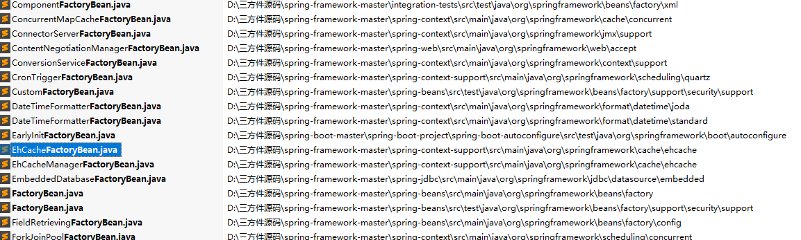
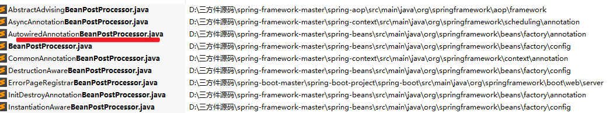
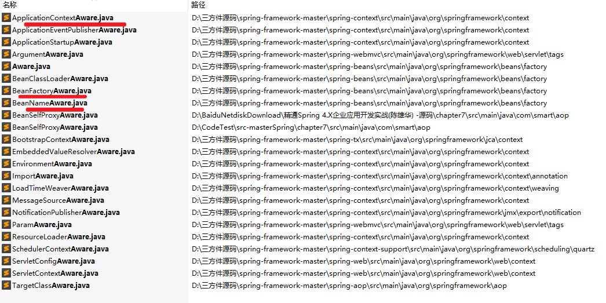
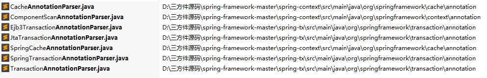
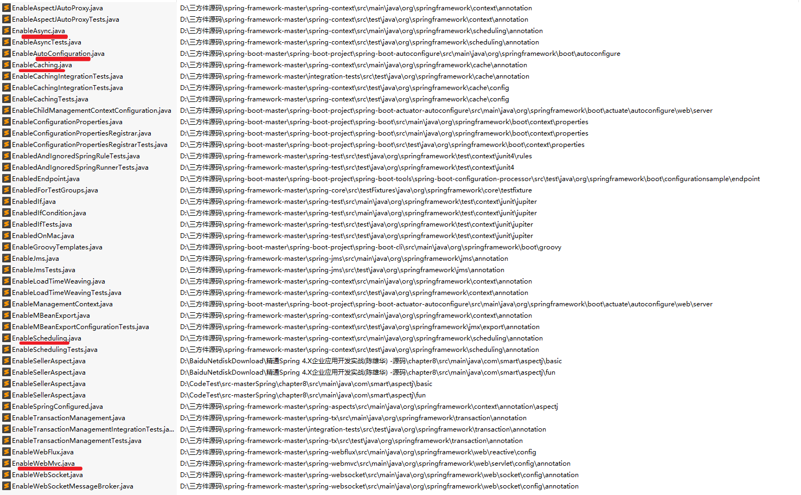
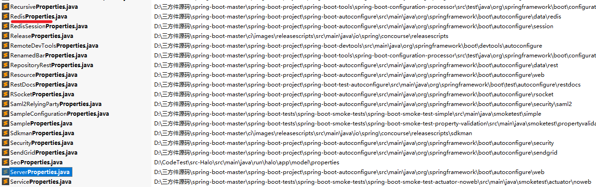
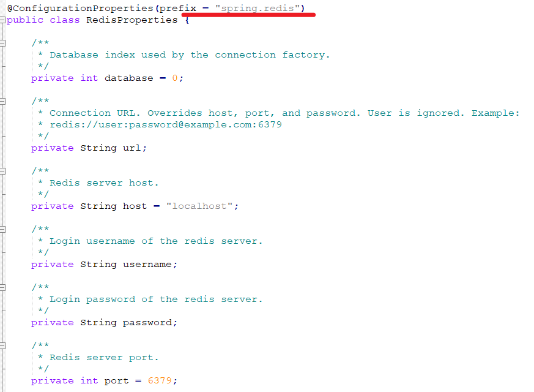

# 一、Spring

## 1. xxFactoryBean.java

功能：

### 1.1 查找结果

仅列举部分



代码样例，实现FactoryBean接口

```java
public class EarlyInitFactoryBean implements FactoryBean<String> {

public class EhCacheFactoryBean extends CacheConfiguration implements FactoryBean<Ehcache>, BeanNameAware, InitializingBean
```


## 2. xxBeanPostProcessor

### 2.1 查找结果

​	仅列举部分




## 3. xxAware

### 3.1 查找结果

- ApplicationContextAware
- BeanFactoryAware：
- BeanNameAware：



## 4. xxAnnotationparser.java




## 5. EnableXXX

### 查找结果



### 实现原理


## 6. xxxBeanFactory


# 二、SpringBoot

## 1. xxProperties.java

定义在application.properties参数的定义和默认值

### 1.1 查找结果



如RedisProperties内容

