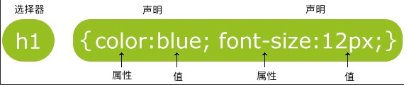

# 一、HTML语法

## 段落p


## 表单form


```xml
<!-- 普通文本 -->
<form>
	First name: <input type="text" name="firstname"><br>
	Last name: <input type="text" name="lastname">
</form>
<!-- 密码 --> 
<form>
	Password: <input type="password" name="pwd">
</form>
<!--单选-->
<form>
	<input type="radio" name="sex" value="male">Male<br>
	<input type="radio" name="sex" value="female">Female
</form>
<!--复选-->
<form>
	<input type="checkbox" name="vehicle" value="Bike">I have a bike<br>
	<input type="checkbox" name="vehicle" value="Car">I have a car
</form>
<!--提交按钮-->
<form name="input" action="html_form_action.php" method="get">
	Username: <input type="text" name="user">
	<input type="submit" value="Submit">
</form>
```


# 二、CSS

## 1、使用方式

### 1.1 内联样式

​	在HTML元素中使用"style" **属性**  

```xml
<p style="color:blue;margin-left:20px;">这是一个段落。</p>
```

### 1.2 内部样式表

​	在HTML文档头部 <head> 区域使用<style> **元素** 来包含CSS

```xml
<head>
	<style type="text/css">
		body {background-color:yellow;}
		p {color:blue;}
	</style>
</head>
```

### 1.3 外部引用（推荐）

​	使用外部 CSS **文件**

```xml
<head>
	<link rel="stylesheet" type="text/css" href="mystyle.css">
</head>
```

## 2、详细CSS语法

选择器，以及一条或多条声明:




# 三、JSP语法

