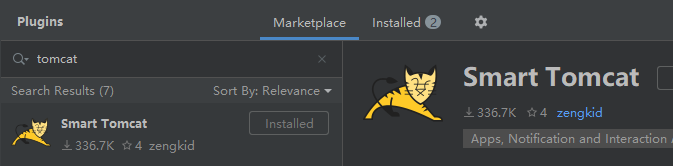

# Servlet

## IDEA创建基础WEB程序

1、IDEA创建工程，选择maven->create from archetype ->maven-archetype-webapp

2、手工新建src/java和src/resources目录，默认生成其他的文件和目录


3、增加pom依赖: servlet-api

    ```xml
<dependency>
  <groupId>javax.servlet</groupId>
  <artifactId>servlet-api</artifactId>
  <version>2.5</version>
</dependency>
    ```

4、自定义servlet

```java
public class HelloServlet extends HttpServlet {
    @Override
    protected void doGet(HttpServletRequest req, HttpServletResponse resp) throws ServletException, IOException {
        // super.doGet(req, resp); 
        // TODO: 自定义实现
        resp.getWriter().write("hello world, web");
        
        System.out.println(this.getInitParameter("helloParam1"));
        System.out.println(this.getInitParameter("helloParam2"));

        System.out.println(this.getServletContext().getInitParameter("globalParam1"));
        System.out.println(this.getServletContext().getInitParameter("globalParam2"));
    }
}
```

5、配置web.xml

```xml
<!DOCTYPE web-app PUBLIC
        "-//Sun Microsystems, Inc.//DTD Web Application 2.3//EN"
        "http://java.sun.com/dtd/web-app_2_3.dtd" >

<web-app>
    <display-name>Archetype Created Web Application</display-name>
    <context-param>
        <param-name>globalParam1</param-name>
        <param-value>global1</param-value>
    </context-param>
    <context-param>
        <param-name>globalParam2</param-name>
        <param-value>global2</param-value>
    </context-param>

    <servlet>
        <servlet-name>helloServlet</servlet-name>
        <servlet-class>com.demo.servlet.HelloServlet</servlet-class>
        <init-param>
            <param-name>helloParam1</param-name>
            <param-value>hello1</param-value>
        </init-param>
        <init-param>
            <param-name>helloParam2</param-name>
            <param-value>hello2</param-value>
        </init-param>
    </servlet>
    <servlet-mapping>
        <servlet-name>helloServlet</servlet-name>
        <url-pattern>/hello</url-pattern>
    </servlet-mapping>
</web-app>
```

6、配置调试配置，指定tomcat和待启动web工程

​	 社区版不支持配置Tomcat，所以使用Smart Tomcat插件做替换方案（重启生效），参考 https://www.cnblogs.com/niceyoo/p/14090782.html



​    

7、执行结果

控制台

   ```bash
四月 15, 2021 11:47:04 下午 org.apache.catalina.startup.Catalina start
http://localhost:8080/WebStudy
信息: Server startup in 923 ms
hello1
hello2
global1
global2
   ```

网页


## web.xml说明

内容构成：

​	context-param配置:   this.getServletContext().getInitialParameters(""); web容器级别

   filter

   servlet定义和mapping，内部也可以context-param

  session-config：

## ServletContext

整个web容器全局唯一

this.servlet


## 拦截器Interpreter

## 监听器Listener

## 过滤器Filter

​	如增加消息头，不 符合鉴权直接返回403


## Cookie&Session


IDEA基础调试


