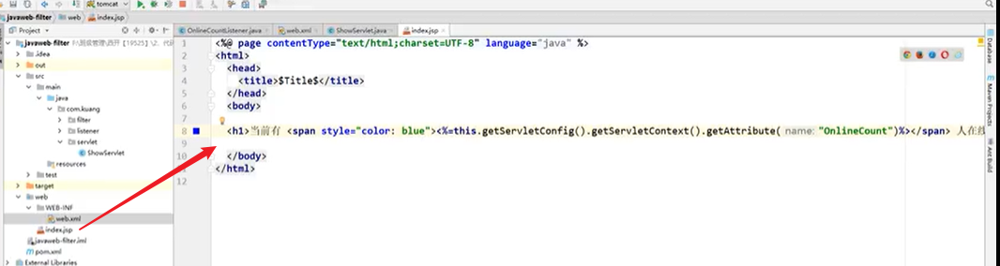
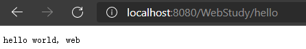

# 零、参考

【狂神说Java】JavaWeb入门到实战


# 一、预备知识

## 1. web.xml构成

典型样例：

```xml
<context-pararm>
    <param-name></param-name>
    <param-value></param-value>
</context-pararm>
<context-pararm>
    <param-name></param-name>
    <param-value></param-value>
</context-pararm>

<servlet>
    <servlet-name></servlet-name>
    <servlet-class></servlet-class>
</servlet>
<servlet-mapping>
    <servlet-name></servlet-name>
    <url-pattern></url-pattern>
</servlet-mapping>

过滤器
<filter>
    <filter-name></filter-name>
    <filter-class></filter-class>
</filter>
<filter-mapping>
    <filter-name></filter-name>
    <url-pattern></url-pattern>
</filter-mapping>

session
<session-config>
    <session-timeout></session-timeout>
</session-config>

监听器
<listener>
    <listener-class></listener-class>
</listener>
```

内容构成：

- context-param配置:   可以通过this.getServletContext().getInitialParameters(""); web容器级别

- filter

  配置过滤器等

- servlet

  定义和mapping，内部也可以context-param

- session-config

  配置session超时等信息

- 拦截器（springMVC

- 


# 二、Servlet

## 类继承关系


## HTTPServlet

## 常用方法

getInitParameter：初始化参数

getServletConfig()： Servlet配置

getServletContext： Servlet上下文


## ServletContext

整个web容器全局唯一

context.setAttribute()

context.getAttribute()

context.getRequestDispatcher("/gp").forward(req, resp)


## 拦截器Interpreter

## 监听器Listener

实现监听器接口，各种不同的监听器接口


样例：web.xml配置


实现类：session的数量统计


使用jsp打印




## 过滤器Filter

### 解决乱码

  ```java
class CharacterEncodingFilter implements Filter {
    
}
  ```

response.setCharacterEncoding("utf-8");

response.setContentType("text/html;charset=UTF-8");


### 鉴权拦截

1、正常业务逻辑，登录后设置session属性

  登录servlet定义


  登出Servlet定义：


2、web.xml增加过滤器配置


3、实现过滤器


## Cookie

Cookie有大小限制，数组形式

```java
Cookies[] cookies = req.getCookies();

// 响应增加cookie
Cookie cookie = new Cookie("xx", "xx");
resp.addCookie(cookie);

// cookie有效期
cookie.setMaxAget(24 * 60 * 60);
```

## Session

​	Header: JSESESSIONID


```xml
<session-config>
    <session-timeout></session-timeout>
</session-config>
```


# 三、创建WEB项目

1、IDEA创建工程，选择maven->create from archetype ->maven-archetype-webapp

2、手工新建src/java和src/resources目录，默认生成其他的文件和目录


3、增加pom依赖: servlet-api

```xml
<dependency>
  <groupId>javax.servlet</groupId>
  <artifactId>servlet-api</artifactId>
  <version>2.5</version>
</dependency>
```

4、自定义servlet

```java
public class HelloServlet extends HttpServlet {
    @Override
    protected void doGet(HttpServletRequest req, HttpServletResponse resp) throws ServletException, IOException {
        // super.doGet(req, resp); 
        // TODO: 自定义实现
        resp.getWriter().write("hello world, web");
        
        System.out.println(this.getInitParameter("helloParam1"));
        System.out.println(this.getInitParameter("helloParam2"));

        System.out.println(this.getServletContext().getInitParameter("globalParam1"));
        System.out.println(this.getServletContext().getInitParameter("globalParam2"));
    }
}
```

5、配置web.xml

```xml
<!DOCTYPE web-app PUBLIC
        "-//Sun Microsystems, Inc.//DTD Web Application 2.3//EN"
        "http://java.sun.com/dtd/web-app_2_3.dtd" >

<web-app>
    <display-name>Archetype Created Web Application</display-name>
    <context-param>
        <param-name>globalParam1</param-name>
        <param-value>global1</param-value>
    </context-param>
    <context-param>
        <param-name>globalParam2</param-name>
        <param-value>global2</param-value>
    </context-param>

    <servlet>
        <servlet-name>helloServlet</servlet-name>
        <servlet-class>com.demo.servlet.HelloServlet</servlet-class>
        <init-param>
            <param-name>helloParam1</param-name>
            <param-value>hello1</param-value>
        </init-param>
        <init-param>
            <param-name>helloParam2</param-name>
            <param-value>hello2</param-value>
        </init-param>
    </servlet>
    <servlet-mapping>
        <servlet-name>helloServlet</servlet-name>
        <url-pattern>/hello</url-pattern>
    </servlet-mapping>
</web-app>
```

6、配置调试配置，指定tomcat和待启动web工程

​	 社区版不支持配置Tomcat，所以使用Smart Tomcat插件做替换方案（重启生效），参考 https://www.cnblogs.com/niceyoo/p/14090782.html


​    

7、执行结果

控制台

   ```bash
四月 15, 2021 11:47:04 下午 org.apache.catalina.startup.Catalina start
http://localhost:8080/WebStudy
信息: Server startup in 923 ms
hello1
hello2
global1
global2
   ```

网页




# 四、JSP（过时技术）

这8个java对象在Jsp页面中是可以直接使用的

```java
<%
    session.setAttribute("name", "session对象");//使用session对象,设置session对象的属性
    out.print(session.getAttribute("name")+"<br/>");//获取session对象的属性
    pageContext.setAttribute("name", "pageContext对象");//使用pageContext对象,设置pageContext对象的属性
    out.print(pageContext.getAttribute("name")+"<br/>");//获取pageContext对象的属性
    application.setAttribute("name", "application对象");//使用application对象,设置application对象的属性
    out.print(application.getAttribute("name")+"<br/>");//获取application对象的属性
    out.print("Hello Jsp"+"<br/>");//使用out对象
    out.print("服务器调用index.jsp页面时翻译成的类的名字是："+page.getClass()+"<br/>");//使用page对象
    out.print("处理请求的Servlet的名字是："+config.getServletName()+"<br/>");//使用config对象
    out.print(response.getContentType()+"<br/>");//使用response对象
    out.print(request.getContextPath()+"<br/>");//使用request对象
%>
```

JSP基本语法：参考  https://www.cnblogs.com/xdp-gacl/p/3776512.html


# 五、专题

## 1. 加载WEB目录下文件

- 方法1：this.class.getClassLoader().getResourceAsStream("db.properties") 对应classes目录开始

```java
// 方法1：
Properties props = new Properties();
props.load(this.class.getClassLoader().getResourceAsStream("db.properties"));

// 方法2：
InputStream is = this.getServletContext().getResourceAsStream("/WEB-INFO/classes/db.properties");
Properties pros = new Properties();

props.load(is);
```

- 方法2：this.getServletContext().getResourceAsStream("/WEB-INF\XXXX"))  对应webapps目录开始

## 2. 中文乱码

​	URLEncoder.encode("内容", "UTF-8")

​	场景：1）中文名文件下载时文件名乱码；2）cookie显示中文乱码

​	对应解码：URLDecoder.decode(cookies[i].getValue(), "UTF-8")

## 3. 国际化

​	参考 https://www.cnblogs.com/xdp-gacl/p/3945800.html

​	ResourceBundle/MessageFormat/Local/DateFormat/NumberFormat

## 文件上传

​	使用commons-flleupload.jar实现

## 文件下载

1、设置响应头 content-dis     attachment;filename=URLEncoder.encode("文件名"， "utf-8")

2、定义FileInputStream流fis访问本地待下载的文件

3、获取resp.getOutputSteam() 

4、fis.read(byte[1024]) -》输出流.write(byte[])


# JDBC

## 处理BLOB/CLOB数据

## 处理大数据文件