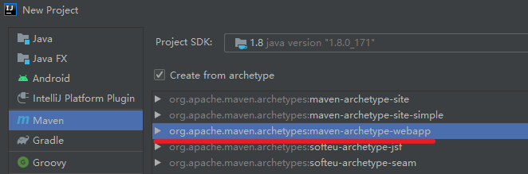
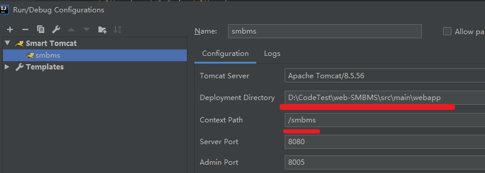

# 参考

遇见狂神说 smbms相关章节

https://www.bilibili.com/video/BV12J411M7Sj?from=search&seid=219405121312256280

# 准备过程

工具：IDEA+dbeaver

## 数据库

dbeaver

### 表设计


# 开发过程

1、新建Maven工程



​      项目的pom文件仅保留项目的GAV+packaging信息，其他全部删除；

2、配合项目使用Tomcat启动验证是否正常

​     此处使用社区版，左侧目录树无Tomcat可选，所以使用smart tomcat插件



3、在工程目录main目录下新建java和resource目录，并标记成源码和资源目录

4、启动测试空白工程，访问 http://localhost:8080/smbms/ 可看到页面显示 Hello World!

5、新增pom依赖

     ```xml
<dependency>
      <groupId>javax.servlet</groupId>
      <artifactId>servlet-api</artifactId>
      <version>2.5</version>
    </dependency>
    <dependency>
      <groupId>javax.servlet.jsp</groupId>
      <artifactId>javax.servlet.jsp-api</artifactId>
      <version>2.3.3</version>
    </dependency>
    <dependency>
      <groupId>mysql</groupId>
      <artifactId>mysql-connector-java</artifactId>
      <version>5.1.29</version>
    </dependency>
     ```


