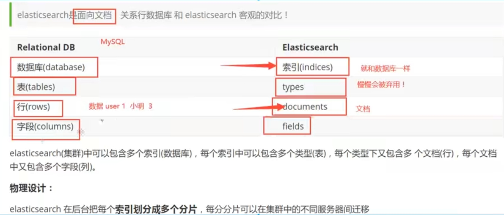

## 原理篇

### 存储原理

​	倒排索引



### 概念

- 索引Index =》Table
- 

### 监控工具

​	Kibana


## 客户端篇

### 

### Spring Data ElasticSearch

​	ElasticsearchRepository可以做Elasticsearch的相关增删改查，用法和普通的CRUDRepository是一样的。但同时功能是比较少的，简单查询够用，但复杂查询就不够了。而ElasticsearchTemplate则提供了更多的方法来完成更多的功能，也包括分页之类的，他其实就是一个封装好的ElasticSearch Util功能类，通过直接连接client来完成数据的操作。

#### ElasticSearchTemplate

#### ElasticSearchRepository

```java
ElasticsearchRepository：searchSimilar
	PagingAndSortingRepository：findAll(Sort var1)， findAll(Pageable var1);
    	CrudRepository： findById，findAll，deleteAll、deleteById、save等
    		Repository  空接口
```


