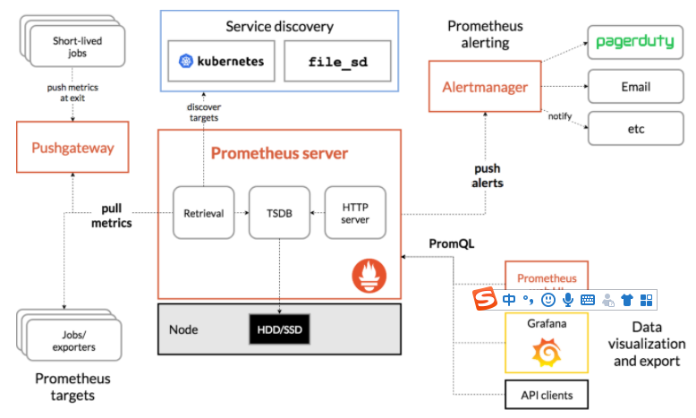
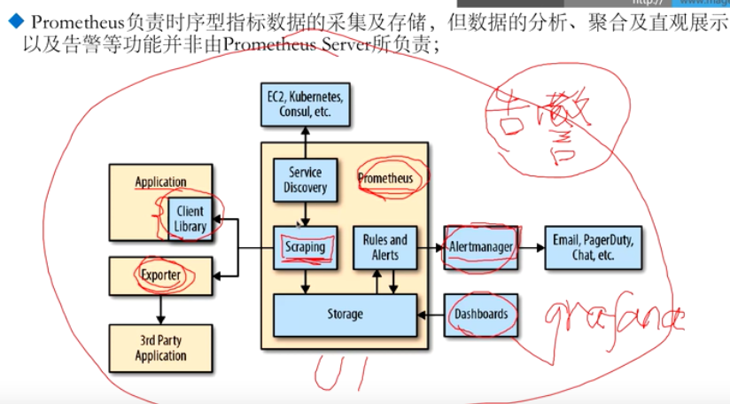
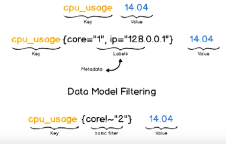

# 参考文档

官网： https://prometheus.io/docs/introduction/overview/ 

IBM（入门与实践）： https://developer.ibm.com/zh/articles/cl-lo-prometheus-getting-started-and-practice/ 

互联网常用系统监控工具对比：监控目标、方法、核心、工具、流程、指标（硬件、系统、应用）

https://blog.csdn.net/luoqinglong850102/article/details/106090904

Prometheus马哥亲讲   https://www.bilibili.com/video/BV1PT4y1P7bX?p=1

https://www.bilibili.com/video/BV1mz4y1d7qw?from=search&seid=13974519123448433602


# Prometheus

## 架构





Prometheus 生态圈中包含了多个组件，其中许多组件是可选的：

- **Prometheus Server**: 用于收集和存储时间序列数据。
- **Client Library**: 客户端库，为需要监控的服务生成相应的 metrics 并暴露给 Prometheus server。当 Prometheus server 来 pull 时，直接返回实时状态的 metrics。
- **Push Gateway**: 主要用于**短期**的 jobs。由于这类 jobs 存在时间较短，可能在 Prometheus 来 pull 之前就消失了。为此，这次 jobs 可以直接向 Prometheus server 端推送它们的 metrics。这种方式主要用于服务层面的 metrics，对于机器层面的 metrices，需要使用 node exporter。
- **Exporters**: 用于暴露已有的第三方服务的 metrics 给 Prometheus。
- **Alertmanager**: 从 Prometheus server 端接收到 alerts 后，会进行去除重复数据，分组，并路由到对收的接受方式，发出报警。常见的接收方式有：电子邮件，pagerduty，OpsGenie, webhook 等。
- 一些其他的工具。

**大概的工作流程：**

1. Prometheus server 定期从配置好的 jobs 或者 exporters 中拉 metrics，或者接收来自 Pushgateway 发过来的 metrics，或者从其他的 Prometheus server 中拉 metrics。

2. Prometheus server 在本地存储收集到的 metrics，并运行已定义好的 alert.rules，记录新的时间序列或者向 Alertmanager 推送警报。

3. Alertmanager 根据配置文件，对接收到的警报进行处理，发出告警。

4. 在图形界面中，可视化采集数据。

   

## 基础入门（来自IBM)

 https://developer.ibm.com/zh/articles/cl-lo-prometheus-getting-started-and-practice/ 

16年加入CNCF， 成为受欢迎度仅次于 Kubernetes 的项目。 


### 1、功能特点

- 强大的多维度数据模型：
  1. 时间序列数据通过 metric 名和键值对来区分。
  2. 所有的 metrics 都可以设置任意的多维标签。
  3. 数据模型更随意，不需要刻意设置为以点分隔的字符串。
  4. 可以对数据模型进行聚合，切割和切片操作。
  5. 支持双精度浮点类型，标签可以设为全 unicode。
- 灵活而强大的查询语句（**PromQL**）：同一个查询语句，可以对多个 metrics 进行乘法、加法、连接、取分数位等操作。
- 易于管理： Prometheus server 是一个单独的二进制文件，可直接在本地工作，不依赖于分布式存储。
- 高效：**平均每个采样点仅占 3.5 bytes**，且一个 Prometheus server 可以处理数百万的 metrics。
- 使用 **pull 模式**采集时间序列数据，这样不仅有利于本机测试而且可以避免有问题的服务器推送坏的 metrics。
- 可以采用 **push gateway** 的方式把时间序列数据推送至 Prometheus server 端。
- 可以通过服务发现或者静态配置去获取监控的 targets。
- 有多种可视化图形界面。
- 易于伸缩。


## 基础知识

#### 1、监控系统组件

- 指标数据采集（抓取）

- 指标数据存储

- 指标数据分析

- 告警

#### 2、监控体系

系统级监控

- 系统监控：CPU/Load/Memory/Swap/Disk IO/Processes/Kernel Parameters
- 网络监控：网络设备、工作负载、网络延迟、丢包率

中间件及基础设备类系统监控

- 消息中间件：Kafka、RocketMQ、RabbitMQ
- Web服务容器：Tomcat、Jetty
- 数据库及缓存系统：Mysql、PostgreSQL、ElasticSearch、Redis
- 数据库连接池：
- 存储系统：Ceph等

应用层监控

- 衡量应用程序代码的状态和监控

业务层监控

- 衡量应用程序的价值，例如电子商务网站的销售量
- QPS、DAU日活、转化率
- 业务接口：登录数、注册数、订单量、搜索量、支付量

#### 3、云原生时代的可观测性

可观测性系统：

- 指标监控Metrics：随时间推移产生的一些与监控相关的可聚合数据点
- 日志监控Logging：离散式日志和事件
- 链路追踪Tracing：分布式应用调用链跟踪

CNCF将可观测性和数据分析归类一个单独类别，并划分四个子类

- 监控系统：Prometheus
- 日志系统：ElasticStack和PLG Stack
- 分布式调用链跟踪系统：Zipkin、Jaeger、SkyWalking、Pinpoint
- 混沌工程系统：ChaoMonkey、ChaosBlade

#### 4、监控方法论

**1) Google四个黄金指标**

​	用于服务级别帮助衡量终端用户体验、服务终端、业务影响等层面问题

​	适用于应用及服务监控

- 延迟Latency：如HTTP请求平均延迟，需区分请求和失败
- 流量Traffic：每秒处理HTTP请求数或数据库事务数量
- 错误Errors：请求失败速率
- 饱和度Saturation：衡量资源使用情况，如内存、CPU、I/O、磁盘使用量

**2) Netflix的USE方法：**

​	Utilization Saturation and Errors Method

​	分析系统性能问题，指导用户快速识别资源瓶颈及错误方法

​	应用于主机指标监控

**3) Weave Cloud的RED方法**

​	基于Google四个黄金指标原则下结合Prometheus及Kubernetes容器实践，细化和总结的方法论，特别适合云原生应用及微服务架构应用的监控和度量

- Request Rate：每秒接收请求数
- Request Errors：每秒失败请求数
- Request Duration：每个请求花费时长

## Prometheus介绍




内置的UI仅用于PromSQL的调试，具体展示还是依赖Grafana组件

内部可以产生告警，但是如何通知展示，依赖AlertManager组件

内部提供了PromQL（查询语言）

#### Prometheus数据模型

仅用于以键值方式存储时序式的聚合数据，并不支持存储文本

- 键：称为指标Metrics，常意味着CPU速率、内存使用率或分区空闲比例等
- 同一指标可能适配到多个目标或设备， 因而它使用标签作为元数据，从而为Metrics添加更多信息描述维度（截图第2行，表示IP等信息）
- 标签还可作为过滤器进行指标过滤及聚合运算（截图第3行中间为过滤条件）



prometheus使用4种方法来保存监视的指标：

- Counter计数器：保存单调递增型数据，如站点访问次数，不能为负数，也不支持减少，可以重置回0；
- Gauge仪表盘：存储有起伏特征的指标数据，如内存空闲大小；Gauge式Counter的超集，但存在指标数据丢失的可能性（Counter能让用户确切了解指标随时间变化状态，Gauge可能随时间流逝而精准度越来越低
- Histogram直方图，会在一段时间方位内对数据进行采样，并将其计入可配置的bucket中；Histogram能存储更多信息，包括样本值分布在每个bucket中数量、所有样本值之和及总的样本数量，从而Prometheus能使用内置的函数进行如下操作：
  - 计算样本平均值：以值得总和除以值得数量
  - 计算样本分位置：分位数有助于了解符合特定标准的数据个数；如评估响应时长超过1s的请求比例，若超过20%即发送告警
- Summary摘要：Histogram扩展类型，但它是直接由被检测端自行聚合计算出分位数，并将计算结果响应给Prometheus Server的样本采集请求。因而，分位数计算由监控端完成。

https://www.bilibili.com/video/BV1PT4y1P7bX?p=2&spm_id_from=pageDriver 

08min


# 官网

## 一、导论

### 1.1、概览

#### 功能特点

Prometheus's main features are:

- a multi-dimensional [data model](https://prometheus.io/docs/concepts/data_model/) with time series data identified by metric name and key/value pairs
- PromQL, a [flexible query language](https://prometheus.io/docs/prometheus/latest/querying/basics/) to leverage this dimensionality
- no reliance on distributed storage; single server nodes are autonomous
- time series collection happens via a pull model over HTTP
- [pushing time series](https://prometheus.io/docs/instrumenting/pushing/) is supported via an intermediary gateway
- targets are discovered via service discovery or static configuration
- multiple modes of graphing and dashboarding support

#### 组成部分

The Prometheus ecosystem consists of multiple components, many of which are optional:

- the main [Prometheus server](https://github.com/prometheus/prometheus) which scrapes and stores time series data
- [client libraries](https://prometheus.io/docs/instrumenting/clientlibs/) for instrumenting application code
- a [push gateway](https://github.com/prometheus/pushgateway) for supporting short-lived jobs
- special-purpose [exporters](https://prometheus.io/docs/instrumenting/exporters/) for services like HAProxy, StatsD, Graphite, etc.
- an [alertmanager](https://github.com/prometheus/alertmanager) to handle alerts
- various support tools

#### 架构

 Prometheus scrapes metrics from instrumented jobs, either directly or via an intermediary push gateway for short-lived jobs.

It stores all scraped samples locally and runs rules over this data to either aggregate and record new time series from existing data or generate alerts. 

[Grafana](https://grafana.com/) or other API consumers can be used to visualize the collected data. 


Prometheus 生态圈中包含了多个组件，其中许多组件是可选的：

- **Prometheus Server**: 用于收集和存储时间序列数据。TSDB(基于时间序列化数据DB)
- **Client Library**: 客户端库，为需要监控的服务生成相应的 metrics 并暴露给 Prometheus server。当 Prometheus server 来 pull 时，直接返回实时状态的 metrics。
- **Push Gateway**: 主要用于**短期**的 jobs。由于这类 jobs 存在时间较短，可能在 Prometheus 来 pull 之前就消失了。为此，这次 jobs 可以直接向 Prometheus server 端推送它们的 metrics。这种方式主要用于服务层面的 metrics，对于机器层面的 metrices，需要使用 node exporter。
- **Exporters**: 用于暴露已有的第三方服务的 metrics 给 Prometheus。
- **Alertmanager**: 从 Prometheus server 端接收到 alerts 后，会进行去除重复数据，分组，并路由到对收的接受方式，发出报警。常见的接收方式有：电子邮件，pagerduty，OpsGenie, webhook 等。
- 一些其他的工具。

**大概的工作流程：**

1. Prometheus server 定期从配置好的 jobs 或者 exporters 中拉 metrics，或者接收来自 Pushgateway 发过来的 metrics，或者从其他的 Prometheus server 中拉 metrics。

2. Prometheus server 在本地存储收集到的 metrics，并运行已定义好的 alert.rules，记录新的时间序列或者向 Alertmanager 推送警报。

3. Alertmanager 根据配置文件，对接收到的警报进行处理，发出告警。

4. 在图形界面中，可视化采集数据。


#### 适合和不适合场景

**不适合场景：**

​		由于数据采集可能会有丢失，所以 Prometheus 不适用对采集数据要 100% 准确的情形。但如果用于记录时间序列数据，Prometheus 具有很大的查询优势，此外，Prometheus 适用于微服务的体系架构。 If you need 100% accuracy, such as for per-request billing, Prometheus is not a good choice as the collected data will likely not be detailed and complete enough.  

**适合场景：**

 		Prometheus works well for recording any purely numeric time series. It fits both machine-centric monitoring as well as monitoring of highly dynamic service-oriented architectures. In a world of microservices, its support for multi-dimensional data collection and querying is a particular strength. 

### 1.2、安装部署（简单上手）

- 启动

```bash
tar xvfz prometheus-*.tar.gz
cd prometheus-*
# 查看命令帮助
./prometheus --help
```

- 启动前的配置动作

  	配置文件格式为yaml格式。自带样例文件 prometheus.yml 

   ```yaml
   
   ```
# 全局配置，
global:
  scrape_interval:     15s   # 间隔多久拉取数据
  evaluation_interval: 15s   # 间隔多久评估Rules，用于产生新的时间序列和产生告警

rule_files:
  # - "first.rules"
  # - "second.rules"

# 控制监控的资源
# 部分Prometheus服务器通过HTTP Endpoint也自己产生数据，从而可以自己监控自己
# 如下是默认配置，抓取Prometheus服务器自身的时间序列数据
scrape_configs:
  - job_name: prometheus
    static_configs:
      - targets: ['localhost:9090']
   ```

​	==Prometheus expects metrics to be available on targets on a path of `/metrics` ；==

​	所以上述在抓取数据 http://localhost:9090/metrics. 

- 启动

​```bash
./prometheus --config.file=prometheus.yml
   ```

​		查看状态： [http://localhost:9090](http://localhost:9090/)     http://localhost:9090/metrics. 

​		等待30s收集本地数据

- 图形化展示

​	http://localhost:9090/graph  

​    	1）promhttp_metric_handler_requests_total

   	 2）promhttp_metric_handler_requests_total{code="200"}

​    	3）count(promhttp_metric_handler_requests_total)

- 图形化接口

  输入表达式：rate(promhttp_metric_handler_requests_total{code="200"}[1m])

### 1.3、与其他竞品三方件对比

​		Prometheus vs. Graphite
​		Prometheus vs. InfluxDB
​		Prometheus vs. OpenTSDB
​		Prometheus vs. Nagios
​		Prometheus vs. Sensu


## 二、概念

### 2.1 数据模型

 Prometheus stores all data as [*time series*](https://en.wikipedia.org/wiki/Time_series): streams of timestamped values belonging to the same metric and the same set of labeled dimensions. Besides stored time series, Prometheus may generate temporary derived time series as the result of queries. 

- **The *metric name*** 

  specifies the general feature of a system that is measured (e.g. `http_requests_total` - the total number of HTTP requests received). It may contain ASCII letters and digits, as well as underscores and colons. It must match the regex `[a-zA-Z_:][a-zA-Z0-9_:]*`.

  Note: The colons are reserved for user defined recording rules. They should not be used by exporters or direct instrumentation.

- **Labels** 

  enable Prometheus's dimensional data model: any given combination of labels for the same metric name identifies a particular dimensional instantiation of that metric (for example: all HTTP requests that used the method `POST` to the `/api/tracks` handler). The query language allows filtering and aggregation based on these dimensions. Changing any label value, including adding or removing a label, will create a new time series.

  - **Label names** may contain ASCII letters, numbers, as well as underscores. They must match the regex `[a-zA-Z_][a-zA-Z0-9_]*`. Label names beginning with `__` are reserved for internal use.

  - **Label values** may contain any Unicode characters.

  ​       A label with an empty label value is considered equivalent to a label that does not exist.

 **样例：**api_http_requests_total{method="POST", handler="/messages"}


### **2.2 支持的四种 Metric 类型** 

**Counter**

​    一种累加的 metric，典型的应用如：请求的个数，结束的任务数， 出现的错误数等等。

​    例如，查询 http_requests_total{method=”get”, job=”Prometheus”, handler=”query”} 返回 8，10 秒后，再   次查询，则返回 14。

**Gauge**

- 一种常规的 metric，典型的应用如：温度，运行的 goroutines 的个数。

- 可以任意加减。

  例如：go_goroutines{instance=”172.17.0.2″, job=”Prometheus”} 返回值 147，10 秒后返回 124。

**Histogram**

- 可以理解为柱状图，典型的应用如：请求持续时间，响应大小。

- 可以对观察结果采样，分组及统计。

  例如，查询 http_request_duration_microseconds_sum{job=”Prometheus”, handler=”query”} 时，返回结果如下：


**Summary**

- 类似于 Histogram, 典型的应用如：请求持续时间，响应大小。
- 提供观测值的 count 和 sum 功能。
- 提供百分位的功能，即可以按百分比划分跟踪结果。

###  **2.3 instance 和 jobs** 

- instance: 一个单独 scrape 的目标， 一般对应于一个进程。

- jobs: 一组同种类型的 instances（主要用于保证可扩展性和可靠性），例如

  ```json
  job: api-server
      instance 1: 1.2.3.4:5670
      instance 2: 1.2.3.4:5671
      instance 3: 5.6.7.8:5670
      instance 4: 5.6.7.8:5671
  ```


## **三、正式内容**

### 3.1 配置文件

 Prometheus is configured via **command-line flags** and a **configuration file.**  

- command-line flags：

  configure **immutable system parameters** (such as storage locations, amount of data to keep on disk and in memory, etc.), 

- configuration file：

  defines everything related to scraping [jobs and their instances](https://prometheus.io/docs/concepts/jobs_instances/), as well as which [rule files to load](https://prometheus.io/docs/prometheus/latest/configuration/recording_rules/#configuring-rules). 

​       文件中如果不配置某参数，则按照默认配置来操作

**配置参数名称和取值规范**

```properties
<boolean>: a boolean that can take the values true or false
<duration>: a duration matching the regular expression ((([0-9]+)y)?(([0-9]+)w)?(([0-9]+)d)?(([0-9]+)h)?(([0-9]+)m)?(([0-9]+)s)?(([0-9]+)ms)?|0), e.g. 1d, 1h30m, 5m, 10s
<filename>: a valid path in the current working directory
<host>: a valid string consisting of a hostname or IP followed by an optional port number
<int>: an integer value
<labelname>: a string matching the regular expression [a-zA-Z_][a-zA-Z0-9_]*
<labelvalue>: a string of unicode characters
<path>: a valid URL path
<scheme>: a string that can take the values http or https
<secret>: a regular string that is a secret, such as a password
<string>: a regular string
<tmpl_string>: a string which is template-expanded before usage
```

#### 3.1.1 配置文件整体格式

```yaml
global:
  # How frequently to scrape targets by default.
  [ scrape_interval: <duration> | default = 1m ]

  # How long until a scrape request times out.
  [ scrape_timeout: <duration> | default = 10s ]

  # How frequently to evaluate rules.
  [ evaluation_interval: <duration> | default = 1m ]

  # The labels to add to any time series or alerts when communicating with
  # external systems (federation, remote storage, Alertmanager).
  external_labels:
    [ <labelname>: <labelvalue> ... ]

  # File to which PromQL queries are logged.
  # Reloading the configuration will reopen the file.
  [ query_log_file: <string> ]

# Rule files specifies a list of globs. Rules and alerts are read from
# all matching files.
rule_files:
  [ - <filepath_glob> ... ]

# A list of scrape configurations.
scrape_configs:
  [ - <scrape_config> ... ]

# Alerting specifies settings related to the Alertmanager.
alerting:
  alert_relabel_configs:
    [ - <relabel_config> ... ]
  alertmanagers:
    [ - <alertmanager_config> ... ]

# Settings related to the remote write feature.
remote_write:
  [ - <remote_write> ... ]

# Settings related to the remote read feature.
remote_read:
  [ - <remote_read> ... ]
```

#### 3.1.2 <scrape_config>

 A `scrape_config` section specifies a set of targets and parameters describing how to scrape them. 

One scrape configuration specifies a single job.

==Targets may be statically configured via the `static_configs` parameter or dynamically discovered using one of the supported service-discovery mechanisms.==


## 参考：命令

- 查看命令清单

   ./prometheus -h 

- 指定启动的配置文件

   `--config.file` flag. 

- 