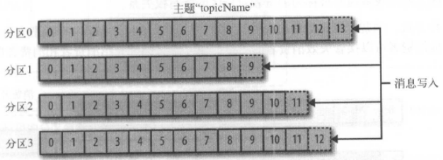
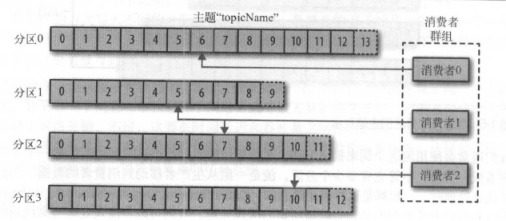
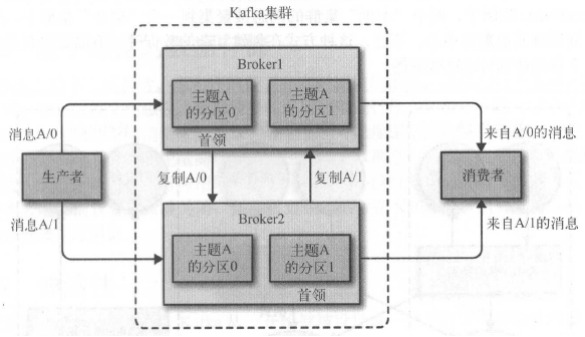

## 1、基础入门

http://kafka.apache.org/quickstart

http://kafka.apache.org/documentation


#### 1.1. 与其他消息队列比较

1. 分布式系统，集群方式运行，可自由伸缩；

2. 可复制、持久化、保留多长时间都可以；

3. 提供流式处理能力，极少代码动态处理派生流和数据集。

####  1.2 Kafka消息特征

1、数据分布在整个系统中，具备数据故障保护和性能伸缩能力。 

​     按照一定顺序持久化保存，可按需读取。

2、消息：键（一致性Hash值），对主题分区数取模选择分区，保证相同键的消息总写到相同批次上。

3、为提升效率：消息被分批写入Kafka，这些消息属于同一主题和分区。

#### 1.3 Kafa消息模式（序列化）

对kafka来说，消息是难懂的字节数组，建议使用额外结构定义消息内容。

消息模式：JSON和XML虽然易用，但缺乏强类型处理能力。

推荐使用**Apache Avro（为Hadoop开发的序列化框架），紧凑序列化模式**。

模式和消息体分开，模式变化时不需要重新生成代码。

支持强类型和模式进化，支持前后向兼容。 

数据格式一致性：消除消息读写操作之间耦合性。如果读写操作耦合，消费者必须升级应用程序才能同时处理新旧数据格式。

#### 1.4 Kafka主题和分区

消息以追加方式写入分区，先入先出方式顺序读取。

由于一个主题包含几个分区，无法保证整个主题范围内消息顺序，仅保证消息在单个分区内内顺序。

Kafka通过分区实现数据冗余和伸缩性。




#### 1.1 概念

##### broker： 每个节点有一个全局唯一的broker-id

##### 消费者组: 

​	保证每个分区只能被一个消费者使用，可以消费包含大量消息**。



##### Offset: 

1. 创建消息时，Kakfa添加到消息中。在给定分区中，每个消息偏移量是唯一的。

2. 消费者对每个分区读取的offset保存在ZK或Kafka上。如果消费者关闭或重启，读取状态不会丢失。

> 适用场景

1. payment transactions   // 金融交易

2. geolocation updates from mobile phones  // 地址位置更新

3. shipping orders

4. sensor measurements from IoT devices  // IOT传感器测量数据

5. medical equipment, and much more.   

## 2、启动

1. 获取Kafka

2. 解压Kafka

   ```bash
   $ tar -xzf kafka_2.13-2.7.0.tgz
   $ cd kafka_2.13-2.7.0
   ```

3. 启动zk

   ```bash
   # Start the ZooKeeper service
   # Note: Soon, ZooKeeper will no longer be required by Apache Kafka.
   $ bin/zookeeper-server-start.sh config/zookeeper.properties
   ```

4. 启动Kafka

   ```bash
   # Start the Kafka broker service
   $ bin/kafka-server-start.sh config/server.properties
   ```

5. 创建topic

   ```bash
   $ bin/kafka-topics.sh --create --topic quickstart-events --bootstrap-server localhost:9092
   ```

6. 查看topic分区

   ```bash
   $ bin/kafka-topics.sh --describe --topic quickstart-events --bootstrap-server localhost:9092
   Topic:quickstart-events  PartitionCount:1    ReplicationFactor:1 Configs:
       Topic: quickstart-events Partition: 0    Leader: 0   Replicas: 0 Isr: 0
   ```

7. 发送消息（生产者）

   ```bash
   $ bin/kafka-console-producer.sh --topic quickstart-events --bootstrap-server localhost:9092
   This is my first event
   This is my second event
   ```

8. 接收消息（消费者）

   ```bash
   $ bin/kafka-console-consumer.sh --topic quickstart-events --from-beginning --bootstrap-server localhost:9092
   This is my first event
   This is my second event
   ```

## 3、核心配置文件

#### zookeeper.properties

如果启动Kafka自带的zk，则配置该文件

```bash
# the directory where the snapshot is stored.
dataDir=/tmp/zookeeper
# the port at which the clients will connect
clientPort=2181
# disable the per-ip limit on the number of connections since this is a non-production config
maxClientCnxns=0
# Disable the adminserver by default to avoid port conflicts.
# Set the port to something non-conflicting if choosing to enable this
admin.enableServer=false
# admin.serverPort=8080
```

#### server.properties

```bash
############################# Server Basics #############################
# The id of the broker. This must be set to a unique integer for each broker.
broker.id=0

############################# Socket Server Settings #############################

# The address the socket server listens on. It will get the value returned from 
# java.net.InetAddress.getCanonicalHostName() if not configured.
#   FORMAT:
#     listeners = listener_name://host_name:port
#   EXAMPLE:
#     listeners = PLAINTEXT://your.host.name:9092
#listeners=PLAINTEXT://:9092

# Hostname and port the broker will advertise to producers and consumers. If not set, 
# it uses the value for "listeners" if configured.  Otherwise, it will use the value
# returned from java.net.InetAddress.getCanonicalHostName().
#advertised.listeners=PLAINTEXT://your.host.name:9092

# Maps listener names to security protocols, the default is for them to be the same. See the config documentation for more details
#listener.security.protocol.map=PLAINTEXT:PLAINTEXT,SSL:SSL,SASL_PLAINTEXT:SASL_PLAINTEXT,SASL_SSL:SASL_SSL

# The number of threads that the server uses for receiving requests from the network and sending responses to the network
num.network.threads=3

# The number of threads that the server uses for processing requests, which may include disk I/O
num.io.threads=8

# The send buffer (SO_SNDBUF) used by the socket server
socket.send.buffer.bytes=102400

# The receive buffer (SO_RCVBUF) used by the socket server
socket.receive.buffer.bytes=102400

# The maximum size of a request that the socket server will accept (protection against OOM)
socket.request.max.bytes=104857600

############################# Log Basics #############################

# A comma separated list of directories under which to store log files
log.dirs=/tmp/kafka-logs

# The default number of log partitions per topic. More partitions allow greater
# parallelism for consumption, but this will also result in more files across
# the brokers.
num.partitions=1

# The number of threads per data directory to be used for log recovery at startup and flushing at shutdown.
# This value is recommended to be increased for installations with data dirs located in RAID array.
num.recovery.threads.per.data.dir=1

############################# Internal Topic Settings  #############################
# The replication factor for the group metadata internal topics "__consumer_offsets" and "__transaction_state"
# For anything other than development testing, a value greater than 1 is recommended to ensure availability such as 3.
offsets.topic.replication.factor=1
transaction.state.log.replication.factor=1
transaction.state.log.min.isr=1

############################# Log Flush Policy #############################

# Messages are immediately written to the filesystem but by default we only fsync() to sync
# the OS cache lazily. The following configurations control the flush of data to disk.
# There are a few important trade-offs here:
#    1. Durability: Unflushed data may be lost if you are not using replication.
#    2. Latency: Very large flush intervals may lead to latency spikes when the flush does occur as there will be a lot of data to flush.
#    3. Throughput: The flush is generally the most expensive operation, and a small flush interval may lead to excessive seeks.
# The settings below allow one to configure the flush policy to flush data after a period of time or
# every N messages (or both). This can be done globally and overridden on a per-topic basis.

# The number of messages to accept before forcing a flush of data to disk
#log.flush.interval.messages=10000

# The maximum amount of time a message can sit in a log before we force a flush
#log.flush.interval.ms=1000

############################# Log Retention Policy #############################

# The following configurations control the disposal of log segments. The policy can
# be set to delete segments after a period of time, or after a given size has accumulated.
# A segment will be deleted whenever *either* of these criteria are met. Deletion always happens
# from the end of the log.

# The minimum age of a log file to be eligible for deletion due to age
log.retention.hours=168

# A size-based retention policy for logs. Segments are pruned from the log unless the remaining
# segments drop below log.retention.bytes. Functions independently of log.retention.hours.
#log.retention.bytes=1073741824

# The maximum size of a log segment file. When this size is reached a new log segment will be created.
log.segment.bytes=1073741824

# The interval at which log segments are checked to see if they can be deleted according
# to the retention policies
log.retention.check.interval.ms=300000

############################# Zookeeper #############################

# Zookeeper connection string (see zookeeper docs for details).
# This is a comma separated host:port pairs, each corresponding to a zk
# server. e.g. "127.0.0.1:3000,127.0.0.1:3001,127.0.0.1:3002".
# You can also append an optional chroot string to the urls to specify the
# root directory for all kafka znodes.
zookeeper.connect=localhost:2181

# Timeout in ms for connecting to zookeeper
zookeeper.connection.timeout.ms=18000


############################# Group Coordinator Settings #############################

# The following configuration specifies the time, in milliseconds, that the GroupCoordinator will delay the initial consumer rebalance.
# The rebalance will be further delayed by the value of group.initial.rebalance.delay.ms as new members join the group, up to a maximum of max.poll.interval.ms.
# The default value for this is 3 seconds.
# We override this to 0 here as it makes for a better out-of-the-box experience for development and testing.
# However, in production environments the default value of 3 seconds is more suitable as this will help to avoid unnecessary, and potentially expensive, rebalances during application startup.
group.initial.rebalance.delay.ms=0
```


#### consumer.properties

```bash
# list of brokers used for bootstrapping knowledge about the rest of the cluster
# format: host1:port1,host2:port2 ...
bootstrap.servers=localhost:9092

# consumer group id
group.id=test-consumer-group

# What to do when there is no initial offset in Kafka or if the current
# offset does not exist any more on the server: latest, earliest, none
#auto.offset.reset=
```

#### producer.properties

```bash
############################# Producer Basics #############################

# list of brokers used for bootstrapping knowledge about the rest of the cluster
# format: host1:port1,host2:port2 ...
bootstrap.servers=localhost:9092

# specify the compression codec for all data generated: none, gzip, snappy, lz4, zstd
compression.type=none

# name of the partitioner class for partitioning events; default partition spreads data randomly
#partitioner.class=

# the maximum amount of time the client will wait for the response of a request
#request.timeout.ms=

# how long `KafkaProducer.send` and `KafkaProducer.partitionsFor` will block for
#max.block.ms=

# the producer will wait for up to the given delay to allow other records to be sent so that the sends can be batched together
#linger.ms=

# the maximum size of a request in bytes
#max.request.size=

# the default batch size in bytes when batching multiple records sent to a partition
#batch.size=

# the total bytes of memory the producer can use to buffer records waiting to be sent to the server
#buffer.memory=
```

## Partition和副本


## 持久化

broker默认消息保留策略：达到一定时间如7天，或达到一定大小字节数如1G。达到上限时，旧消息清理。

主题可配置自己保留策略，将消息保留到不再使用它们。

支持消费者非实时读取信息：消息被提交到磁盘，根据设置的保留规则保存。

每个主题可设置单独保留规则；

每个主题可保留不同数量消息。


## MirrorMarker

Kafka消息复制机制只能单个集群里复制，不支持多个集群。

Kafka提供：MirrorMarker工具，实现集群间消息复制。

Mirror核心组件：生产者；2、消费者；之间通过队列相连。


### Kafka集群

一个独立的kafka服务器称为broker。

1）接收生产者消息，对消息设置偏移量，并提交消息到磁盘保存。

2）为消息者提供服务，对读取分区请求作出响应，返回已提交磁盘的消息。

**单个broker可轻松处理数千个分区及每秒百万级消息量。**


broker是集群组成部分，每个集群都有一个broker作为集群控制器角色，负责将分区分配给broker和监控broker。
一个分区Partition属于一个broker。
分区赋值：提供消息冗余能力。
如果broker失效，其他broker接管领导权，消费者和生产者必须重新连接。



## 创建Kafka生产者


## 创建Kafka消费者


### Kafka日志

## Kafka Connect（数据集成）


#### 功能

IMPORT/EXPORT YOUR DATA AS STREAMS OF EVENTS WITH KAFKA CONNECT

 Kafka Connect is a tool for scalably and reliably streaming data between Apache Kafka and other systems. It makes it simple to quickly define *connectors* that move large collections of data into and out of Kafka.  

You probably have lots of data in existing systems like relational databases or traditional messaging systems, along with many applications that already use these systems. [Kafka Connect](http://kafka.apache.org/documentation/#connect) allows you to continuously ingest data from external systems into Kafka, and vice versa. It is thus very easy to integrate existing systems with Kafka. To make this process even easier, there are hundreds of such connectors readily available. 

#### 代码样例

```java
KStream<String, String> textLines = builder.stream("quickstart-events");

KTable<String, Long> wordCounts = textLines
            .flatMapValues(line -> Arrays.asList(line.toLowerCase().split(" ")))
            .groupBy((keyIgnored, word) -> word)
            .count();

wordCounts.toStream().to("output-topic"), Produced.with(Serdes.String(), Serdes.Long()));
```


## Kafka Stream（流式处理）


