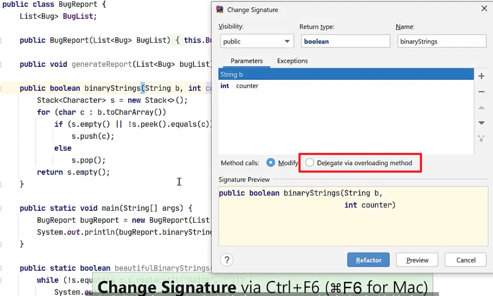
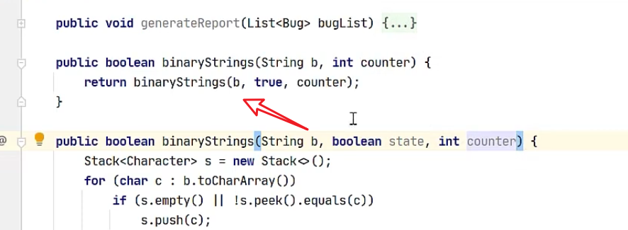
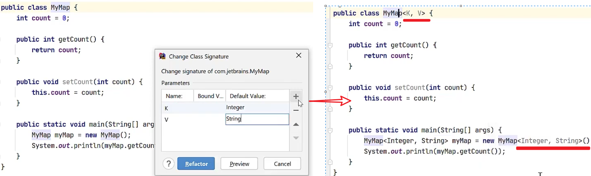
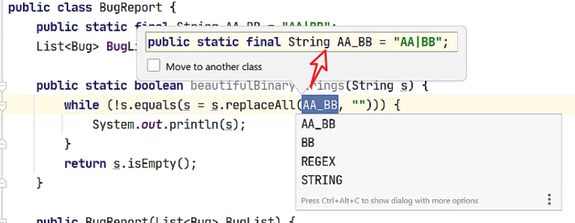
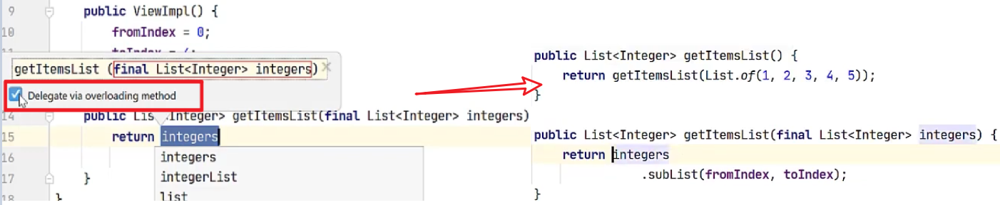
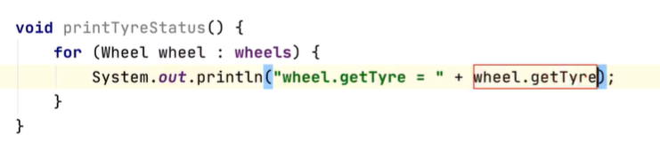

## 重构

参考：https://www.bilibili.com/video/BV1a64y1d7EN  【IDEA官方教程】IDEA 日常重构 (2020)

### Ctrl+F6 

#### 修改方法签名

执行后

#### 修改类签名

### Ctrl+Alt+C 

#### 提取常量

Ctrl+Alt+P

#### 引入参数变量

## 代码生成技巧 

参考：https://www.bilibili.com/video/BV1xB4y1F7DK   IDEA代码生成技巧 

### Alt+Insert

生成Builder模式的setter方法

#### iter

​	快速生成for(Wheel wheel: wheels) 类型格式语句

#### soutv

打印一个值，见下文，当调用对象方法时，左侧打印key内容会同步增加该变量名

