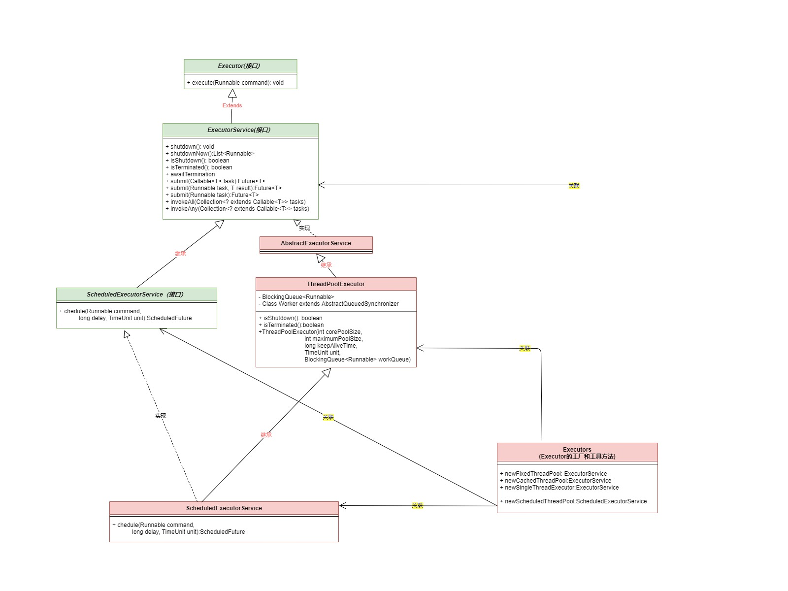

### 一、JUC家族


### 二、锁的基本获取和释放

#### 2.1 基本用法(JDK 1.0)

##### 2.1.1 Object::wait()/notify()/notifyAll()

```java
wait():   // 阻塞，直至其他线程调用notify方法
native void wait(long timeout) // 阻塞，直至其他线程调用notify唤醒或timeout到期

// wakes up a single thread that is waiting on this object's monitor.    
native void notify();  
// Wakes up all threads that are waiting on this object's monitor.
native void notifyAll(); 
```


> 使用要求必须首先获取当前对象monitor，否则提示“IllegalMonitorStateException”

样例：


#### 2.2 高阶用法（JDK 1.5)

##### 2.2.1 接口Lock.lock/tryLock/unlock

```java
// Acquires the lock.一直等待
void lock();

// Acquires the lock 
// if it is available and returns immediately.
// 休眠等待直至获取锁或其他线程中断了当前线程
void lockInterruptibly() throws InterruptedException;

// true：Acquires the lock if it is available
// false：The lock is not available
boolean tryLock();    // 直接返回true和false，不阻塞

// true：在给定时间内获取锁
// false: 给定时间内获取锁失败
// InterruptedException: 其他线程中断了当前线程 
boolean tryLock(long time, TimeUnit unit) throws InterruptedException;

// 释放锁
void unlock();

Condition newCondition();
```

1. Lock的使用

   ```java
   Lock lock = ...;
   lock.lock();
   xxxx
   lock.unlock;
   ```

   

2. tryLock使用

```java
Lock lock = ...;
if (lock.tryLock()) {
    try {
    	  // manipulate protected state
  	} finally {
    	lock.unlock();    // 释放锁
  	}
 } else {
    // perform alternative actions
 }
```


##### 2.2.2 LockSupport::park/parkNanos/unpark

> 静态方法，直接使用
>
> 效果类似Object::wait和notify

```java
// If the permit is available then it is consumed 直接返回
// 否则阻塞，直至满足如下条件
// 1）当前其他线程出发当前线程unpark方法；2）其他线程interrupt当前线程；
static void park()
static void park(Object blocker) 
    
// If the permit is available then it is consumed 直接返回
// 否则阻塞，直至满足如下条件
// 1）当前其他线程出发当前线程unpark方法；2）其他线程interrupt当前线程；3）超时时间到
static void parkNanos(long nanos)

static void parkNanos(Object blocker, long nanos)

static void parkUntil(Object blocker, long deadline)
// Makes available the permit for the given thread
static void unpark(Thread thread) 
```

1. 基本使用样例

   ```java
   public static void main(String[] args) {
        Thread thread1 = new Thread(() -> {
           log.debug("start...");
           log.debug("park...");
           LockSupport.park();//  thread1线程执行阻塞，直至最后1行unpark调用
           log.debug("resume...");
       }, "thread1");
       thread1.start();
   
       sleep(2);//主线程睡眠二秒
       log.debug("unpark...");
       LockSupport.unpark(thread1); // 使能 thread1 继续执行
   }
   ```

   

2. 


### 三、锁的进阶

#### 3.1 AbstractQueuedSynchronizer(AQS)


#### 3.2 Condition(接口)

```java
void await() throws InterruptedException
void awaitUninterruptibly();
long awaitNanos(long nanosTimeout) throws InterruptedException;
boolean await(long time, TimeUnit unit) throws InterruptedException;
boolean awaitUntil(Date deadline) throws InterruptedException;

// Wakes up waiting threads.
void signal();
void signalAll();
```


#### 3.3 ReadWriteLock


#### 3.4 ReentrantLock


#### 3.5 ReentrantReadWriteLock


#### 3.6 StampedLock


### 三、接口BlockingQueue(JDK1.5)

#### 4.1 基本方法(含阻塞方法)

##### 4.1.1 基本操作

 ```java
// 队列满提示队列满异常
add(Object)
// true：入队成功；false：入队失败
boolean offer(Object)
// 出队列

 ```


##### 4.1.2  阻塞入和出队列(生产者消费者)

``` java
put(Object)   // 阻塞直到队列有空闲
take()  // 阻塞直到有数据可以获取
```

生产者消费者样例

```java

```


#### 4.2 ArrayListBlockingQueue


代码样例

```java

```

执行结果

```

```


### 五、同步工具类(JDK 1.5)

#### 5.1 CountDownLatch


#### 5.2 CyclicBarrier


#### 5.3 Exchanger


#### 5.4 Semaphore


## 参考：源码类图

### Executor/Executors/ExecutorService

 **ExecutorService pool = Executors.newFixedThreadPool(5);**  




