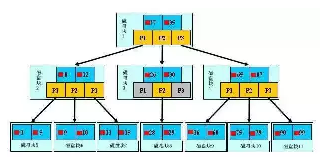
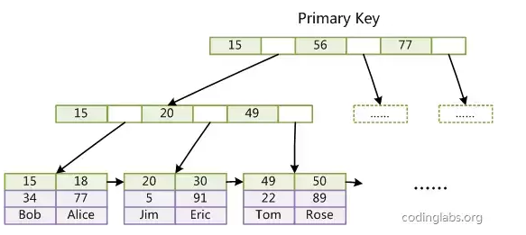
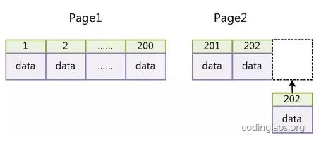

# 0、参考

《MySQL 技术内幕 InnoDB 存储引擎 第 2 版》


# 一、MySQL架构

整体架构


存储引擎：插件式，用户可以根据Mysql预定义的存储引擎接口编写自己的存储引擎。比如曾作为三方提供的InnoDB引擎（后oracle收购，从V5开始作为默认存储引擎）。


# 二、存储引擎

## 2.1 InnoDB存储引擎

Since 5.5.8，默认存储引擎

- 支持事务：面向OLAP(在线事务处理)应用；

​					特点：行锁设计、支持外键，非锁定读（默认读取操作不产生锁）

- 通过MVVC（多版本并发技术）来获取高并发性，

- 实现四种隔离级别：默认REPEATABLE级别，同时使用next-key locking策略避免幻读

- 提供：插入缓冲（insert buffer）、二次写（double write）、自适应hash索引（adaptive hash index），预读（read ahead）等高性能和高可用措施。

- 聚集索引clustered方式，每个表存储都是按主键顺序存放。

- 如果没显式在表定义时指定主键，InnoDB引擎会默认为每一行生成一个6字节的ROWID主键。


## 2.2 MyISAM引擎

v5.5.8前的默认存储引擎

- 不支持事务和表锁设计
- 支持全文索引，主要面向一些OLAP数据库应用。

- 缓冲池只缓冲索引文件，不缓冲数据文件
- 存储引擎表由MYI和MYD组成


## 2.3 不同存储引擎的对比


# 三、InnoDB存储引擎

## 3.1 特点

- 支持事务：面向OLAP(在线事务处理)应用；

​					特点：行锁设计、支持外键，非锁定读（默认读取操作不产生锁）

- 通过MVVC（多版本并发技术）来获取高并发性，

- 实现四种隔离级别：默认REPEATABLE级别，同时使用next-key locking策略避免幻读

- 提供：插入缓冲（insert buffer）、二次写（double write）、自适应hash索引（adaptive hash index），预读（read ahead）等高性能和高可用措施。

- 聚集索引clustered方式，每个表存储都是按主键顺序存放。

- 如果没显式在表定义时指定主键，InnoDB引擎会默认为每一行生成一个6字节的ROWID主键。

## 3.2 体系结构

​	存储引擎有多个内存块，负责如下工作

- 维护所有进程、线程需要访问的多个内部数据结构
- 缓存磁盘上的数据，方便快速读取，同时在对磁盘文件的数据修改之前在这里缓存
- 重做日志redo log缓冲

后台线程的主要作用：负责刷新内存中的数据，保证缓存中的内存缓存的是最近的数据。此外将已修改的数据文件刷新到磁盘文件，保证数据库异常时InnoDB能恢复到正常运行状态。


# 一、索引

索引目的：提高查询效率，可以类比字典。

MySQL支持诸多存储引擎，而各种存储引擎对索引的支持也各不相同，因此MySQL数据库支持多种索引类型，如BTree索引，哈希索引，全文索引等等。

MySQL官方对索引的定义为：索引（Index）是帮助MySQL高效获取数据的数据结构。提取句子主干，就可以得到索引的本质：==索引是数据结构。需要占据磁盘空间==

## 1. 索引原理

所有索引原理都是一样的，通过不断的缩小想要获得数据的范围来筛选出最终想要的结果，同时把随机的事件变成顺序的事件，也就是我们总是通过同一种查找方式来锁定数据。

数据库也是一样，但显然要复杂许多，因为不仅面临着等值查询，还有范围查询(>、<、between)、模糊查询(like)、并集查询(or)、多值匹配（in【in本质上属于多个or】）等等。数据库应该选择怎么样的方式来应对所有的问题呢？

## 2. 索引结构（b+树）



浅蓝色的块我们称之为一个磁盘块，可以看到每个磁盘块包含几个数据项（深蓝色所示）和指针（黄色所示）

如磁盘块1包含数据项17和35，包含指针P1、P2、P3，P1表示小于17的磁盘块，P2表示在17和35之间的磁盘块，P3表示大于35的磁盘块。

==非叶子节点不存储真实的数据，只存储指引搜索方向的数据项==

 ### 1. b+树查找过程 

如图所示，如果要查找数据项29，那么首先会把磁盘块1由磁盘加载到内存，此时发生一次IO，在内存中用二分查找确定29在17和35之间，锁定磁盘块1的P2指针，内存时间因为非常短（相比磁盘的IO）可以忽略不计

通过磁盘块1的P2指针的磁盘地址把磁盘块3由磁盘加载到内存，发生第二次IO，29在26和30之间，锁定磁盘块3的P2指针

通过指针加载磁盘块8到内存，发生第三次IO，同时内存中做二分查找找到29，结束查询，总计三次IO。

真实的情况是，==3层的b+树可以表示上百万的数据，如果上百万的数据查找只需要三次IO，性能提高将是巨大的==

### 2. b+树性质

1、通过上面的分析，我们知道间越小，数据项的数量越多，树的高度越低。

这就是为什么每个数据项，即索引字段要尽量的小，比如int占4字节，要比bigint8字节少一半。

这也是为什么b+树要求把真实的数据放到叶子节点而不是内层节点，一旦放到内层节点，磁盘块的数据项会大幅度下降，导致树增高。当数据项等于1时将会退化成线性表。

2、当b+树的数据项是复合的数据结构，比如(name,age,sex)的时候，b+数是按照从左到右的顺序来建立搜索树的，比如当(张三,20,F)这样的数据来检索的时候，b+树会优先比较name来确定下一步的所搜方向，如果name相同再依次比较age和sex，最后得到检索的数据

但当(20,F)这样的没有name的数据来的时候，b+树就不知道下一步该查哪个节点，因为建立搜索树的时候name就是第一个比较因子，必须要先根据name来搜索才能知道下一步去哪里查询。

比如当(张三,F)这样的数据来检索时，b+树可以用name来指定搜索方向，但下一个字段age的缺失，所以只能把名字等于张三的数据都找到，然后再匹配性别是F的数据了

这个是非常重要的性质，即索引的最左匹配特性。

## 3. MySQL 索引实现

 在MySQL中，索引属于存储引擎级别的概念，不同存储引擎对索引的实现方式是不同的。

### 1. MyISAM(非聚集索引)

> MyISAM引擎使用B+Tree作为索引结构，叶节点的data域存放的是数据记录的地址。

MyISAM索引文件和数据文件是分离的，索引文件仅保存数据记录的地址。


==data域保存数据记录的地址==。因此，MyISAM中索引检索的算法为首先按照B+Tree搜索算法搜索索引，如果指定的Key存在，则取出其data域的值，然后以data域的值为地址，读取相应数据记录。

MyISAM的索引方式也叫做“非聚集”的。

### 2. InnoDB（聚集索引）

第一个重大区别是InnoDB的数据文件本身就是索引文件。

从上文知道，MyISAM索引文件和数据文件是分离的，索引文件仅保存数据记录的地址。

而在InnoDB中，表数据文件本身就是按B+Tree组织的一个索引结构，这棵树的叶节点data域保存了完整的数据记录。这个索引的key是数据表的主键，因此InnoDB表数据文件本身就是主索引。



==叶节点包含了完整的数据记录，这种索引叫做聚集索引。==

因为InnoDB的数据文件本身要按主键聚集，所以InnoDB要求表必须有主键（MyISAM可以没有）

如果没有显式指定，则MySQL系统会自动选择一个可以唯一标识数据记录的列作为主键，如果不存在这种列，则MySQL自动为InnoDB表生成一个隐含字段作为主键，这个字段长度为6个字节，类型为长整形。

第二个与MyISAM索引的不同是InnoDB的辅助索引data域存储相应记录主键的值而不是地址。换句话说，InnoDB的所有辅助索引都引用主键作为data域。例如，下图为定义在Col3上的一个辅助索引：


这里以英文字符的ASCII码作为比较准则。聚集索引这种实现方式使得按主键的搜索十分高效，但是辅助索引搜索需要检索两遍索引：首先检索辅助索引获得主键，然后用主键到主索引中检索获得记录。

了解不同存储引擎的索引实现方式对于正确使用和优化索引都非常有帮助，例如知道了InnoDB的索引实现后，就很容易明白为什么不建议使用过长的字段作为主键，因为所有辅助索引都引用主索引，过长的主索引会令辅助索引变得过大。

再例如，用非单调的字段作为主键在InnoDB中不是个好主意，因为InnoDB数据文件本身是一颗B+Tree，非单调的主键会造成在插入新记录时数据文件为了维持B+Tree的特性而频繁的分裂调整，十分低效，而使用自增字段作为主键则是一个很好的选择。

## 4.如何建立合适的索引

**建立索引的原理**

一个最重要的原则是最左前缀原理，在提这个之前要先说下联合索引，MySQL中的索引可以以一定顺序引用多个列，这种索引叫做联合索引

一般的，一个联合索引是一个有序元组，其中各个元素均为数据表的一列。另外，单列索引可以看成联合索引元素数为1的特例。

索引匹配的最左原则具体是说，假如索引列分别为A，B，C，顺序也是A，B，C：

- 那么查询的时候，如果查询【A】【A，B】 【A，B，C】，那么可以通过索引查询
- 如果查询的时候，采用【A，C】，那么C这个虽然是索引，但是由于中间缺失了B，因此C这个索引是用不到的，只能用到A索引
- 如果查询的时候，采用【B】 【B，C】 【C】，由于没有用到第一列索引，不是最左前缀，那么后面的索引也是用不到了
- 如果查询的时候，采用范围查询，并且是最左前缀，也就是第一列索引，那么可以用到索引，但是范围后面的列无法用到索引

因为索引虽然加快了查询速度，但索引也是有代价的：索引文件本身要消耗存储空间，同时索引会加重插入、删除和修改记录时的负担，另外，MySQL在运行时也要消耗资源维护索引，因此索引并不是越多越好

在使用InnoDB存储引擎时，如果没有特别的需要，请永远使用一个与业务无关的自增字段作为主键。如果从数据库索引优化角度看，使用InnoDB引擎而不使用自增主键绝对是一个糟糕的主意。

InnoDB使用聚集索引，数据记录本身被存于主索引（一颗B+Tree）的叶子节点上。这就要求同一个叶子节点内（大小为一个内存页或磁盘页）的各条数据记录按主键顺序存放

因此每当有一条新的记录插入时，MySQL会根据其主键将其插入适当的节点和位置，如果页面达到装载因子（InnoDB默认为15/16），则开辟一个新的页（节点）。

如果表使用自增主键，那么每次插入新的记录，记录就会顺序添加到当前索引节点的后续位置，当一页写满，就会自动开辟一个新的页。如下：



这样就会形成一个紧凑的索引结构，近似顺序填满。由于每次插入时也不需要移动已有数据，因此效率很高，也不会增加很多开销在维护索引上。

如果使用非自增主键（如果身份证号或学号等），由于每次插入主键的值近似于随机，因此每次新纪录都要被插到现有索引页得中间某个位置，如下：


此时MySQL不得不为了将新记录插到合适位置而移动数据，甚至目标页面可能已经被回写到磁盘上而从缓存中清掉

此时又要从磁盘上读回来，这增加了很多开销，同时频繁的移动、分页操作造成了大量的碎片，得到了不够紧凑的索引结构，后续不得不通过OPTIMIZE TABLE来重建表并优化填充页面。

因此，只要可以，请尽量在InnoDB上采用自增字段做主键。

## 5.建立索引的常用技巧

- 最左前缀匹配原则，非常重要的原则，mysql会一直向右匹配直到遇到范围查询(>、<、between、like)就停止匹配

  比如a 1="" and="" b="2" c=""> 3 and d = 4 如果建立(a,b,c,d)顺序的索引，d是用不到索引的，如果建立(a,b,d,c)的索引则都可以用到，a,b,d的顺序可以任意调整。

- =和in可以乱序，比如a = 1 and b = 2 and c = 3 建立(a,b,c)索引可以任意顺序，mysql的查询优化器会帮你优化成索引可以识别的形式

- 尽量选择区分度高的列作为索引,区分度的公式是count(distinct col)/count(*)，表示字段不重复的比例，比例越大我们扫描的记录数越少，唯一键的区分度是1，而一些状态、性别字段可能在大数据面前区分度就是0

  那可能有人会问，这个比例有什么经验值吗？使用场景不同，这个值也很难确定，一般需要join的字段我们都要求是0.1以上，即平均1条扫描10条记录

- 索引列不能参与计算，保持列“干净”，比如from_unixtime(create_time) = ’2014-05-29’就不能使用到索引

  原因很简单，b+树中存的都是数据表中的字段值，但进行检索时，需要把所有元素都应用函数才能比较，显然成本太大。所以语句应该写成create_time = unix_timestamp(’2014-05-29’);

- 尽量的扩展索引，不要新建索引。比如表中已经有a的索引，现在要加(a,b)的索引，那么只需要修改原来的索引即可，当然要考虑原有数据和线上使用情况

# 二、MySQL优化

## 1. 配置优化

​	 配置优化指的MySQL 的 server端的配置，一般对于业务方而言，可以不用关注，毕竟会有专门的DBA来处理，但是对于原理的了解，我想，我们开发，是需要了解的。 

### 基本配置 

```
innodb_buffer_pool_size
```

这是安装完InnoDB后第一个应该设置的选项。缓冲池是数据和索引缓存的地方：这个值越大越好，这能保证你在大多数的读取操作时使用的是内存而不是硬盘。典型的值是5-6GB(8GB内存)，20-25GB(32GB内存)，100-120GB(128GB内存)。

```
innodb_log_file_size
```

这是redo日志的大小。redo日志被用于确保写操作快速而可靠并且在崩溃时恢复。一直到MySQL 5.1，它都难于调整，因为一方面你想让它更大来提高性能，另一方面你想让它更小来使得崩溃后更快恢复。

幸运的是从MySQL 5.5之后，崩溃恢复的性能的到了很大提升，这样你就可以同时拥有较高的写入性能和崩溃恢复性能了。

一直到MySQL 5.5，redo日志的总尺寸被限定在4GB(默认可以有2个log文件)。这在MySQL 5.6里被提高了。

如果你知道你的应用程序需要频繁的写入数据并且你使用的时MySQL 5.6，你可以一开始就把它这是成4G。

```
max_connections
```

如果你经常看到‘Too many connections'错误，是因为max_connections的值太低了。这非常常见因为应用程序没有正确的关闭数据库连接，你需要比默认的151连接数更大的值。

max_connection值被设高了(例如1000或更高)之后一个主要缺陷是当服务器运行1000个或更高的活动事务时会变的没有响应。在应用程序里使用连接池或者在MySQL里使用进程池有助于解决这一问题。

### InnoDB配置

```
innodb_file_per_table
```

这项设置告知InnoDB是否需要将所有表的数据和索引存放在共享表空间里（innodb_file_per_table = OFF） 或者为每张表的数据单独放在一个.ibd文件（innodb_file_per_table = ON）。每张表一个文件允许你在drop、truncate或者rebuild表时回收磁盘空间。

这对于一些高级特性也是有必要的，比如数据压缩。但是它不会带来任何性能收益。你不想让每张表一个文件的主要场景是：有非常多的表（比如10k+）。MySQL 5.6中，这个属性默认值是ON，因此大部分情况下你什么都不需要做。对于之前的版本你必需在加载数据之前将这个属性设置为ON，因为它只对新创建的表有影响。

```
innodb_flush_log_at_trx_commit
```

默认值为1，表示InnoDB完全支持ACID特性。当你的主要关注点是数据安全的时候这个值是最合适的，比如在一个主节点上。但是对于磁盘（读写）速度较慢的系统，它会带来很巨大的开销，因为每次将改变flush到redo日志都需要额外的fsyncs。

将它的值设置为2会导致不太可靠（reliable）因为提交的事务仅仅每秒才flush一次到redo日志，但对于一些场景是可以接受的，比如对于主节点的备份节点这个值是可以接受的。如果值为0速度就更快了，但在系统崩溃时可能丢失一些数据：只适用于备份节点。

```
innodb_flush_method
```

这项配置决定了数据和日志写入硬盘的方式。一般来说，如果你有硬件RAID控制器，并且其独立缓存采用write-back机制，并有着电池断电保护，那么应该设置配置为O_DIRECT；否则，大多数情况下应将其设为fdatasync（默认值）。sysbench是一个可以帮助你决定这个选项的好工具。

```
innodb_log_buffer_size
```

这项配置决定了为尚未执行的事务分配的缓存。其默认值（1MB）一般来说已经够用了，但是如果你的事务中包含有二进制大对象或者大文本字段的话，这点缓存很快就会被填满并触发额外的I/O操作。看看Innodb_log_waits状态变量，如果它不是0，增加innodb_log_buffer_size。

### 其他设置

```
query_cache_size
```

query cache（查询缓存）是一个众所周知的瓶颈，甚至在并发并不多的时候也是如此。最佳选项是将其从一开始就停用，设置query_cache_size = 0（现在MySQL 5.6的默认值）并利用其他方法加速查询：优化索引、增加拷贝分散负载或者启用额外的缓存（比如memcache或redis）。

如果你已经为你的应用启用了query cache并且还没有发现任何问题，query cache可能对你有用。这是如果你想停用它，那就得小心了。

```
log_bin
```

如果你想让数据库服务器充当主节点的备份节点，那么开启二进制日志是必须的。

如果这么做了之后，还别忘了设置server_id为一个唯一的值。就算只有一个服务器，如果你想做基于时间点的数据恢复，这（开启二进制日志）也是很有用的：从你最近的备份中恢复（全量备份），并应用二进制日志中的修改（增量备份）。

二进制日志一旦创建就将永久保存。所以如果你不想让磁盘空间耗尽，你可以用 PURGE BINARY LOGS 来清除旧文件，或者设置 expire_logs_days 来指定过多少天日志将被自动清除。

记录二进制日志不是没有开销的，所以如果你在一个非主节点的复制节点上不需要它的话，那么建议关闭这个选项。

```
skip_name_resolve
```

当客户端连接数据库服务器时，服务器会进行主机名解析，并且当DNS很慢时，建立连接也会很慢。

因此建议在启动服务器时关闭skip_name_resolve选项而不进行DNS查找。唯一的局限是之后GRANT语句中只能使用IP地址了，因此在添加这项设置到一个已有系统中必须格外小心。

## 2. SQL调优

一般要进行SQL调优，那么就说有慢查询的SQL，系统或者server可以开启慢查询日志，尤其是线上系统，一般都会开启慢查询日志，如果有慢查询，可以通过日志来过滤。但是知道了有需要优化的SQL后，下面要做的就是如何进行调优

**慢查询优化基本步骤**

1. 先运行看看是否真的很慢，注意设置SQL_NO_CACHE
2. where条件单表查，锁定最小返回记录表。这句话的意思是把查询语句的where都应用到表中返回的记录数最小的表开始查起，单表每个字段分别查询，看哪个字段的区分度最高
3. explain查看执行计划，是否与1预期一致（从锁定记录较少的表开始查询）
4. order by limit 形式的sql语句让排序的表优先查
5. 了解业务方使用场景
6. 加索引时参照建索引的几大原则
7. 观察结果，不符合预期继续从0分析

## 3. 常用调优手段

**执行计划explain**

在日常工作中，我们有时会开慢查询去记录一些执行时间比较久的SQL语句，找出这些SQL语句并不意味着完事了，我们常常用到explain这个命令来查看一个这些SQL语句的执行计划，查看该SQL语句有没有使用上了索引，有没有做全表扫描，这都可以通过explain命令来查看。

所以我们深入了解MySQL的基于开销的优化器，还可以获得很多可能被优化器考虑到的访问策略的细节，以及当运行SQL语句时哪种策略预计会被优化器采用。使用explain 只需要在原有select 基础上加上explain关键字就可以了，如下：


简要解释下explain各个字段的含义

- id : 表示SQL执行的顺序的标识,SQL从大到小的执行
- select_type：表示查询中每个select子句的类型
- table：显示这一行的数据是关于哪张表的，有时不是真实的表名字
- type：表示MySQL在表中找到所需行的方式，又称“访问类型”。常用的类型有：ALL, index, range, ref, eq_ref, const, system, NULL（从左到右，性能从差到好）
- possible_keys：指出MySQL能使用哪个索引在表中找到记录，查询涉及到的字段上若存在索引，则该索引将被列出，但不一定被查询使用
- Key：key列显示MySQL实际决定使用的键（索引），如果没有选择索引，键是NULL。
- key_len：表示索引中使用的字节数，可通过该列计算查询中使用的索引的长度（key_len显示的值为索引字段的最大可能长度，并非实际使用长度，即key_len是根据表定义计算而得，不是通过表内检索出的）
- ref：表示上述表的连接匹配条件，即哪些列或常量被用于查找索引列上的值
- rows：表示MySQL根据表统计信息及索引选用情况，估算的找到所需的记录所需要读取的行数，理论上行数越少，查询性能越好
- Extra：该列包含MySQL解决查询的详细信息

**EXPLAIN的特性**

- EXPLAIN不会告诉你关于触发器、存储过程的信息或用户自定义函数对查询的影响情况
- EXPLAIN不考虑各种Cache
- EXPLAIN不能显示MySQL在执行查询时所作的优化工作
- 部分统计信息是估算的，并非精确值
- EXPALIN只能解释SELECT操作，其他操作要重写为SELECT后查看执行计划。

# 三、实战演练

## 1. 表结构和查询语句

假如有如下表结构

```sql
circlemessage_idx_0 | CREATE TABLE `circlemessage_idx_0` (
  `circle_id` bigint(20) unsigned NOT NULL COMMENT '群组id',
  `from_id` bigint(20) unsigned NOT NULL COMMENT '发送用户id',
  `to_id` bigint(20) unsigned NOT NULL COMMENT '指定接收用户id',
  `msg_id` bigint(20) unsigned NOT NULL COMMENT '消息ID',
  `type` tinyint(3) unsigned NOT NULL DEFAULT '0' COMMENT '消息类型',
  PRIMARY KEY (`msg_id`,`to_id`),
  KEY `idx_from_circle` (`from_id`,`circle_id`)
) ENGINE=InnoDB DEFAULT CHARSET=utf8mb4 COLLATE=utf8mb4_bin
```

 通过执行计划explain分析如下查询语句 

```bash
mysql> explain select msg_id from circlemessage_idx_0 where  to_id = 113487 and circle_id=10019063  and msg_id>=6273803462253938690  and from_id != 113487 order by msg_id asc limit 30;
+----+-------------+---------------------+-------+-------------------------+---------+---------+------+--------+-------------+
| id | select_type | table               | type  | possible_keys           | key     | key_len | ref  | rows   | Extra       |
+----+-------------+---------------------+-------+-------------------------+---------+---------+------+--------+-------------+
|  1 | SIMPLE      | circlemessage_idx_0 | range | PRIMARY,idx_from_circle | PRIMARY | 16      | NULL | 349780 | Using where |
+----+-------------+---------------------+-------+-------------------------+---------+---------+------+--------+-------------+
1 row in set (0.00 sec)
```

```bash
mysql> explain select msg_id from circlemessage_idx_0 where  to_id = 113487 and circle_id=10019063   and from_id != 113487 order by msg_id asc limit 30;
+----+-------------+---------------------+-------+-----------------+---------+---------+------+------+-------------+
| id | select_type | table               | type  | possible_keys   | key     | key_len | ref  | rows | Extra       |
+----+-------------+---------------------+-------+-----------------+---------+---------+------+------+-------------+
|  1 | SIMPLE      | circlemessage_idx_0 | index | idx_from_circle | PRIMARY | 16      | NULL |   30 | Using where |
+----+-------------+---------------------+-------+-----------------+---------+---------+------+------+-------------+
1 row in set (0.00 sec)
```

## 2. 问题分析

通过上面两个执行计划可以发现当没有`msg_id >= xxx这`个查询条件的时候，检索的rows要少很多，并且两者查询的时候都用到了索引，而且用到的还只是主键索引。那说明索引应该是不合理的，没有发挥最大作用。

分析这个执行计划可以看到，当包含`msg_id >= xxx` 查询条件的时候，rows有34w多行，这种情况，说明检索太多，要么就是表里面确实有这么大，要么就是索引不合理没有用到索引，大都情况是没用合理用到索引。

列中所用到的索引也是PRIMARY，那就可能是(msg_id,to_id)的其中一个，注意我们建立表的时候msg_id索引的顺序是在to_id前面的，因此MySQL查询一定会优先用msg_id索引，在使用了msg_id索引后，就已经检索出了34w行，并且由于msg_id的查询条件是大于等于，因此，再这个查询条件后，就不能再用到to_id的索引。

然后再看key_len长度为16，结合 key为PRIMARY，那么可以分析得知，只有一个主键索引被用到。

最后看看 type 值，是range，那么就说明这个查询要么是范围查询，要么就是多值匹配。

 请注意，`from_id != xxx`这样的语句，是无法用到索引的。只有`from_id = xxx`就可以用到所以，因此from id 的索引其实可以不用，建立索引的时候就要考虑清楚 

## 3. 如何优化

既然知道索引不合理，那么就要分析并调整索引。一般而言，我们既然要从单表里面查询，那么就需要能够知道大体，单表里面大致会有哪些数据，现在的量级大概是多少。

然后开始下一步的分析，既然msgid是被设置为了主键，那一定是全局唯一的，所有，有多少数据量就至少会有多少条msgid；那么检索msg_id基本就是检索整个表了。

我们要做的优化就是要尽量减少索引，减少查询的行数；那么就需要思考，通过查询哪些字段才能够减少行数？比如，一个张表里面，所属某个用户的数据，会不会比查询msgid的行数要少？查询某个用户并且是属于某个圈子的，那会不会就更少了？等等。

然后根据实际情况分析，单表里面命中to_id 的行数应该是会小于命中msg_id的，因此要首先保证能够使用到to_id的索引

为此，可以设置主键的时候把msg_id和to_id的顺序交互一下；但是，由于已经是线上的表，已经有了大量数据，并且业务开始运行，这种情况下，修改主键会引发很多问题（当然修改索引是OK的），因此，不建议直接修改主键。

那么，为了保证有效使用to_id的索引，就要新建一个联合索引；那么新建的联合索引的第一索引字段必然是to_id

针对此业务场景，最好能够再加上circle_id索引，这样可以快速索引；这样就得到了新的联合索引(to_id,circle_id)的索引，然后，因为要找msg_id，为此，在此基础上，再加上msg_id。最终得到的联合索引为(to_id,circle_id,msg_id)；这样的话，就能够快速检索这样的查询语句了：`where to_id = xxx and circle_id = xxx and msgId >= xxx`

当然，索引的建立，也不是说某个sql 语句需要啥索引，就建立某个联合索引，这样的话，索引太多的话，写的性能受影响（插入、删除、修改），然后存储空间也会相应增大；另外mysql在运行时也会消耗资源维护索引，所以，索引并不是越多越好，需要结合查询最频繁、最影响性能的sql来建立合适的索引。需要再说明的是，一个联合索引或者一组主键就是一个btree，多个索引就是多个btree


# 四、Mysql基础开发

## 1. 原始用法

```java
String url = "jdbc::mysql://localhost:3306/jdbc?useUnicode=true&characterEncoding=utf-8"
String username = "root";
String password = "123456";

Class.forName("com.mysql.jdbc.Driver");
Connection conn = DriverManager.getConnection(url, username,password);
Statement stat = conn.createStatement();

String sql = "delete from users where id = 4";

Result rs = stat.executeQuery(sql);

while(rs.next())
{
    
}

rs.close();
stat.close();
conn.close();    
```

## 2. 进阶版

​     url+username+password从配置文件读取，且password是加密的（代码中使用算法解密）

​	使用Properties类读取

## 3. Statement的几种用法

- executeQuery：
- executeUpdate：

## 4. 预编译SQL，解决注入问题


```java
String sql = "insert into user(id, name, password, email) values(?,?,?,?);"
    
PreparedStatement preparedStat = conn.prepareStatement(sql);
preparedStat.setInt(1, 1);
preparedStat.setString(2, "admin");
preparedStat.setString(3, "123456");
preparedStat.setString(4, "123@xx.com");

preparedStat.executeUpdate()
preparedStat.close();  
```

