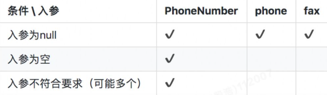
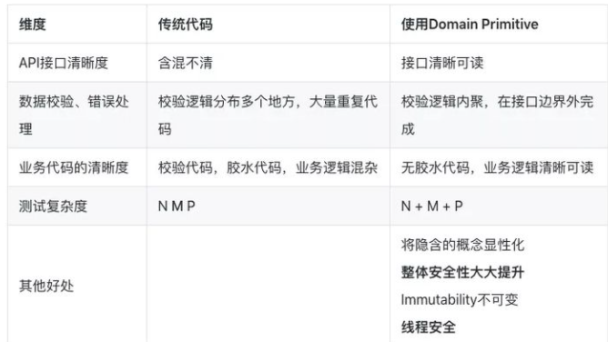
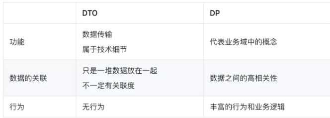

# 参考

阿里技术专家详解DDD系列 https://zhuanlan.zhihu.com/p/366395817

# 零、需掌握的内容

- 最佳架构实践：六边形应用架构 / Clean 架构的核心思想和落地方案
- 持续发现和交付：Event Storming > Context Map > Design Heuristics > Modelling
- 降低架构腐败速度：通过 Anti-Corruption Layer 集成第三方库的模块化方案
- 标准组件的规范和边界：Entity, Aggregate, Repository, Domain Service, Application Service, Event, DTO Assembler 等
- 基于 Use Case 重定义应用服务的边界
- 基于 DDD 的微服务化改造及颗粒度控制
- CQRS 架构的改造和挑战
- 基于事件驱动的架构的挑战

# 一、第1讲 Domain Primitive（原语）

## 1. CASE

​	 一个新应用在全国通过 地推业务员 做推广，需要做一个用户注册系统，同时希望在用户注册后能够通过用户电话（先假设仅限座机）的地域（区号）对业务员发奖金。

常规实现：

```java
// 贫血模型
public class User {
    Long userId;
    String name;
    String phone;
    String address;
    Long repId;
}

public class RegistrationServiceImpl implements RegistrationService {

    private SalesRepRepository salesRepRepo;
    private UserRepository userRepo;

    public User register(String name, String phone, String address) 
      throws ValidationException {
        // 校验逻辑
        if (name == null || name.length() == 0) {
            throw new ValidationException("name");
        }
        if (phone == null || !isValidPhoneNumber(phone)) {
            throw new ValidationException("phone");
        }
        // 此处省略address的校验逻辑

        // 取电话号里的区号，然后通过区号找到区域内的SalesRep
        String areaCode = null;
        String[] areas = new String[]{"0571", "021", "010"};
        for (int i = 0; i < phone.length(); i++) {
            String prefix = phone.substring(0, i);
            if (Arrays.asList(areas).contains(prefix)) {
                areaCode = prefix;
                break;
            }
        }
        SalesRep rep = salesRepRepo.findRep(areaCode);

        // 最后创建用户，落盘，然后返回
        User user = new User();
        user.name = name;
        user.phone = phone;
        user.address = address;
        if (rep != null) {
            user.repId = rep.repId;
        }

        return userRepo.save(user);
    }

    private boolean isValidPhoneNumber(String phone) {
        String pattern = "^0[1-9]{2,3}-?\\d{8}$";
        return phone.matches(pattern);
    }
}
```

## 2. 传统开发存在的问题

 接口的清晰度（可阅读性）、数据验证和错误处理、业务逻辑代码的清晰度、和可测试性。

### 2.1 接口的清晰度

​		在Java代码中，对于一个方法来说所有的参数名在编译时丢失，留下的仅仅是一个参数类型的列表，所以我们重新看一下以上的接口定义，其实在运行时仅仅是：**User register(String, String, String);**

所以以下的代码是一段编译器完全不会报错的，很难通过看代码就能发现的 bug ：

```java
service.register("殷浩", "浙江省杭州市余杭区文三西路969号", "0571-12345678");
```

​		在真实代码中运行时会报错，但这种 bug 是在运行时被发现的，而不是在编译时。普通的 Code Review 也很难发现这种问题，很有可能是代码上线后才会被暴露出来。这里的思考是，有没有办法在编码时就避免这种可能会出现的问题？

​		另外一种常见的，特别是在查询服务中容易出现的例子如下：

```java
User findByName(String name);
User findByPhone(String phone);
User findByNameAndPhone(String name, String phone);
```

​		入参都是 String 类型，不得不在方法名上面加上 `ByXXX `来区分;

​	 	`findByNameAndPhone `会陷入前面入参顺序错误问题，参数顺序如果输错，方法不会报错只会返回 `null`，而这种 bug 更难被发现。

### 2.2 数据验证和错误处理

​	在前面这段数据校验代码：

```java
if (phone == null || !isValidPhoneNumber(phone)) {
    throw new ValidationException("phone");
}
```

​	在日常编码中经常会出现，一般来说这种代码需要出现在方法的最前端，确保能够 fail-fast 。但是假设你有多个类似的接口和类似的入参，在每个方法里这段逻辑会被重复。而更严重的是如果未来我们要拓展电话号去包含手机时，很可能需要加入 **!isValidCellNumber(phone)**代码，如果你有很多个地方用到了 phone 这个入参，但是有个地方忘记修改了，会造成 bug 。这是一个 DRY 原则被违背时经常会发生的问题。如果有个新的需求，需要把入参错误的原因返回，那么这段代码就变得更加复杂：

最后，这个业务方法里，会（隐性或显性的）抛 `ValidationException`，所以需要外部调用方去try/catch，而业务逻辑异常和数据校验异常被混在了一起，是否是合理的？

​	传统Java架构使用BeanValidation注解或ValidationUtils类，比如：

```text
// Use Bean Validation
User registerWithBeanValidation(
  @NotNull @NotBlank String name,
  @NotNull @Pattern(regexp = "^0?[1-9]{2,3}-?\\d{8}$") String phone,
  @NotNull String address
);

// Use ValidationUtils:
public User registerWithUtils(String name, String phone, String address) {
    ValidationUtils.validateName(name); // throws ValidationException
    ValidationUtils.validatePhone(phone);
    ValidationUtils.validateAddress(address);
    ...
}
```

但这几个传统的方法同样有问题，

**BeanValidation：**

- 通常只能解决简单的校验逻辑，复杂的校验逻辑一样要写代码实现定制校验器
- 在添加了新校验逻辑时，同样会出现在某些地方忘记添加一个注解的情况，DRY原则还是会被违背

**ValidationUtils类：**

- 当大量的校验逻辑集中在一个类里之后，违背了Single Responsibility单一性原则，导致代码混乱和不可维护
- 业务异常和校验异常还是会混杂

### 2.3 业务代码的清晰度

```java
String areaCode = null;
String[] areas = new String[]{"0571", "021", "010"};
for (int i = 0; i < phone.length(); i++) {
    String prefix = phone.substring(0, i);
    if (Arrays.asList(areas).contains(prefix)) {
        areaCode = prefix;
        break;
    }
}
SalesRep rep = salesRepRepo.findRep(areaCode);
```

实际上出现了另外一种常见的情况，那就是从一些入参里抽取一部分数据，然后调用一个外部依赖获取更多的数据，然后通常从新的数据中再抽取部分数据用作其他的作用。这种代码通常被称作“胶水代码”。

其本质是由于外部依赖的服务的入参并不符合我们原始的入参导致的。比如，如果`SalesRepRepository`包含一个`findRepByPhone`的方法，则上面大部分的代码都不必要了。

一个常见的办法是将这段代码抽离出来，变成独立的一个或多个方法：

```java
private static String findAreaCode(String phone) {
    for (int i = 0; i < phone.length(); i++) {
        String prefix = phone.substring(0, i);
        if (isAreaCode(prefix)) {
            return prefix;
        }
    }
    return null;
}

private static boolean isAreaCode(String prefix) {
    String[] areas = new String[]{"0571", "021"};
    return Arrays.asList(areas).contains(prefix);
}
```

然后原始代码变为：

```java
String areaCode = findAreaCode(phone);
SalesRep rep = salesRepRepo.findRep(areaCode);
```

可能会抽离出一个静态工具类 `PhoneUtils `。但是这里要思考的是，静态工具类是否是最好的实现方式呢？当你的项目里充斥着大量的静态工具类，业务代码散在多个文件当中时，你是否还能找到核心的业务逻辑呢？

### 2.4 可测试性

​	为了保证代码质量，每个方法里的每个入参的每个可能出现的条件都要有 TC 覆盖（假设我们先不去测试内部业务逻辑），所以在我们这个方法里需要以下的 TC（Test Case） ：


假如一个方法有 N 个参数，每个参数有 M 个校验逻辑，至少要有 N * M 个 TC 。

而假设有 P 个方法中都用到了 `phone `这个字段，这 P 个方法都需要对该字段进行测试，也就是说整体需要：**P \* N \* M**

## 3. 解决方案

### 3.1 DP原则：**将隐性的概念显性化**

​	**Make Implicit Concepts Explicit**

​	地推业务员、用户本身自带 ID 属性：属于 Entity（实体）

​	注册系统：属于 Application Service（应用服务）

​	取电话号的区号的逻辑是否属于用户（用户的区号？）？是否属于注册服务（注册的区号？）？原来电话号仅仅是用户的一个参数，属于隐形概念，但实际上**电话号的区号才是真正的业务逻辑**，而我们需要将电话号的概念显性化，通过写一个Value Object：

```java
public class PhoneNumber {
    // 确保 PhoneNumber 是一个（Immutable）Value Object
    private final String number;
    public String getNumber() {
        return number;
    }
    // 校验逻辑都放在constructor里面，确保只要PhoneNumber类被创建出来后，一定是校验通过的。
    public PhoneNumber(String number) {
        if (number == null) {
            throw new ValidationException("number不能为空");
        } else if (isValid(number)) {
            throw new ValidationException("number格式错误");
        }
        this.number = number;
    }

    public String getAreaCode() {
        for (int i = 0; i < number.length(); i++) {
            String prefix = number.substring(0, i);
            if (isAreaCode(prefix)) {
                return prefix;
            }
        }
        return null;
    }

    private static boolean isAreaCode(String prefix) {
        String[] areas = new String[]{"0571", "021", "010"};
        return Arrays.asList(areas).contains(prefix);
    }

    public static boolean isValid(String number) {
        String pattern = "^0?[1-9]{2,3}-?\\d{8}$";
        return number.matches(pattern);
    }

}
```

把 `PhoneNumber` 显性化之后，其实是生成了一个 Type（数据类型）和一个 Class（类）：

- Type 指我们在今后的代码里可以通过 `PhoneNumber` 去显性的标识电话号这个概念

- Class 指我们可以把所有跟电话号相关的逻辑完整的收集到一个文件里

  这两个概念加起来，构造成了本文标题的 Domain Primitive（DP）。

改造后逻辑

```java
public class User {
    UserId userId;
    Name name;
    PhoneNumber phone;
    Address address;
    RepId repId;
}

public User register(
  @NotNull Name name,
  @NotNull PhoneNumber phone,
  @NotNull Address address
) {
    // 找到区域内的SalesRep, Repository
    SalesRep rep = salesRepRepo.findRep(phone.getAreaCode());

    // 最后创建用户，落盘，然后返回，这部分代码实际上也能用Builder解决
    User user = new User();
    user.name = name;
    user.phone = phone;
    user.address = address;
    if (rep != null) {
        user.repId = rep.repId;
    }
    // Repository
    return userRepo.saveUser(user);
}
```

重构后效果

- 接口的清晰度

​       public User register(Name, PhoneNumber, Address)

- 数据验证和错误处理

  ​      1) 重构后的方法里，完全没有了任何数据验证的逻辑，也不会抛 `ValidationException` 。原因是因为 DP 的特性，只要是能够带到入参里的一定是正确的或 null（Bean Validation 或 lombok 的注解能解决 null 的问题）。所以我们把数据验证的工作量前置到了调用方，而调用方本来就是应该提供合法数据的，所以更加合适。

  ​	   2) 使用DP的另一个好处就是代码遵循了 DRY 原则和单一性原则，如果未来需要修改 `PhoneNumber `的校验逻辑，只需要在一个文件里修改即可，所有使用到了 `PhoneNumber` 的地方都会生效。

- 业务代码的清晰度      

```text
SalesRep rep = salesRepRepo.findRep(phone.getAreaCode());
User user = xxx;
return userRepo.save(user);
```

- 可测试性



当我们将 `PhoneNumber `抽取出来之后，在来看测试的 Test Case ：

- 首先 `PhoneNumber` 本身还是需要 M 个测试用例，但是由于我们只需要测试单一对象，每个用例的代码量会大大降低，维护成本降低。
- 每个方法里的每个参数，现在只需要覆盖为 null 的情况就可以了，其他的 case 不可能发生（因为只要不是 null 就一定是合法的）

所以，单个方法的 TC 从原来的 N * M 变成了今天的 N + M 。同样的，多个方法的 TC 数量变成了 N + M + P

这个数量一般来说要远低于原来的数量 N* M * P ，让测试成本极大的降低。



### 3.2 DP原则：将隐性的上下文 显性化

​	**Make Implicit Context Explicit**

CASE: 假设现在要实现一个功能，让A用户可以支付 x 元给用户 B ，可能的实现如下：

```java
public void pay(BigDecimal money, Long recipientId) {
    BankService.transfer(money, "CNY", recipientId);
}
```

​		但如果有一天货币变更了（比如欧元区曾经出现的问题），或者我们需要做跨境转账，该方法是明显的 bug ，因为 `money `对应的货币不一定是 CNY 。而 CNY 货币是默认的，是一个隐含的条件，

​		所以当我们做这个支付功能时，实际上需要的一个入参是支付金额 + 支付货币。我们可以把这两个概念组合成为独立完整概念：`Money`。

```java
@Value
public class Money {
    private BigDecimal amount;
    private Currency currency;
    public Money(BigDecimal amount, Currency currency) {
        this.amount = amount;
        this.currency = currency;
    }
}
```

原有实现变更为：

```java
public void pay(Money money, Long recipientId) {
    BankService.transfer(money, recipientId);
}
```

### 3.3 DP原则：封装 多对象 行为

​	**Encapsulate Multi-Object Behavior**

​	CASE: 假设用户可能要做跨境转账从 CNY 到 USD ，并且货币汇率随时在波动：

```java
public void pay(Money money, Currency targetCurrency, Long recipientId) {
    if (money.getCurrency().equals(targetCurrency)) {
        BankService.transfer(money, recipientId);
    } else {
        BigDecimal rate = ExchangeService.getRate(money.getCurrency(), targetCurrency);
        BigDecimal targetAmount = money.getAmount().multiply(new BigDecimal(rate));
        Money targetMoney = new Money(targetAmount, targetCurrency);
        BankService.transfer(targetMoney, recipientId);
    }
}
```

​	由于 `targetCurrency `不一定和 `money` 的 `Curreny `一致，需要调用一个服务去取汇率，然后做计算。最后用计算后的结果做转账。

​	case最大的问题：金额的计算被包含在了支付的服务中，涉及到的对象也有2个 `Currency` ，2 个 `Money` ，1 个 `BigDecimal `，总共 5 个对象。这种涉及到多个对象的业务逻辑，需要用 DP 包装掉：将转换汇率的功能，封装到一个叫做 `ExchangeRate `的 DP 里：

```java
@Value
public class ExchangeRate {
    private BigDecimal rate;
    private Currency from;
    private Currency to;

    public ExchangeRate(BigDecimal rate, Currency from, Currency to) {
        this.rate = rate;
        this.from = from;
        this.to = to;
    }

    public Money exchange(Money fromMoney) {
        notNull(fromMoney);
        isTrue(this.from.equals(fromMoney.getCurrency()));
        BigDecimal targetAmount = fromMoney.getAmount().multiply(rate);
        return new Money(targetAmount, to);
    }
}
```

通过封装金额计算逻辑以及各种校验逻辑，让原始代码变得极其简单：

```java
public void pay(Money money, Currency targetCurrency, Long recipientId) {
    ExchangeRate rate = ExchangeService.getRate(money.getCurrency(), targetCurrency);
    Money targetMoney = rate.exchange(money);
    BankService.transfer(targetMoney, recipientId);
}
```

## 4. 讨论总结

​	Domain Primitive 是一个在特定领域里，拥有精准定义的、可自我验证的、拥有行为的 Value Object 。

   	DP是一个传统意义上的Value Object，拥有Immutable的特性

​		   DP是一个完整的概念整体，拥有精准定义

​		   DP使用业务域中的原生语言

​		   DP可以是业务域的最小组成部分、也可以构建复杂组合

### 4.1  Domain Primitive 和 DDD 里 Value Object 的区别

​		Domain Primitive 是 Value Object 的进阶版，在原始 VO 的基础上要求每个 DP 拥有概念的整体，而不仅仅是值对象。

​		在 VO 的 Immutable 基础上**增加了 Validity 和行为**。当然同样的要求无副作用（side-effect free）。

### 4.2 与DTO区别



### 4.3 常见的 DP 的使用场景

​	有格式限制的 String：比如Name，PhoneNumber，OrderNumber，ZipCode，Address等

​	有限制的Integer：比如OrderId（>0），Percentage（0-100%），Quantity（>=0）等
​	可枚举的 int ：比如 Status（一般不用Enum因为反序列化问题）
​	Double 或 BigDecimal：一般用到的 Double 或 BigDecimal 都有业务含义，比如 Temperature、Money、Amount、ExchangeRate、Rating 等
​	复杂的数据结构：比如 Map<String, List<Integer>> 等，尽量能把 Map 的所有操作包装掉，仅暴露必要行为

## 5. 老应用重构的流程

- 创建 Domain Primitive，收集所有 DP 行为

  在真实的项目中，以前散落在各个服务或工具类里面的代码，可以都抽出来放在 DP 里，成为 DP 自己的行为或属性。

  原则：所有抽离出来的方法要做到无状态，比如原来是 static 的方法。如果原来的方法有状态变更，需要将改变状态的部分和不改状态的部分分离，然后将无状态的部分融入 DP 。因为 DP 本身不能带状态，所以一切需要改变状态的代码都不属于 DP 的范畴。

  比如提取PhoneNumber 、User

- 替换数据校验和无状态逻辑

  替换后

  ```java
  public User register(String name, String phone, String address)
          throws ValidationException {
      
      Name _name = new Name(name);
      PhoneNumber _phone = new PhoneNumber(phone);
      Address _address = new Address(address);
      
      SalesRep rep = salesRepRepo.findRep(_phone.getAreaCode());
      // 其他代码...
  }
  ```

  通过 new PhoneNumber(phone) 这种代码，替代了原有的校验代码。

  通过 _phone.getAreaCode() 替换了原有的无状态的业务逻辑。

- 创建新接口

  创建新接口，将DP的代码提升到接口参数层：

  ```java
  public User register(Name name, PhoneNumber phone, Address address) {
      SalesRep rep = salesRepRepo.findRep(phone.getAreaCode());
  }
  ```

- 修改外部调用

​      外部调用从：**service.register("殷浩", "0571-12345678", "浙江省杭州市余杭区文三西路969号");**  变更为 

​       service.register(new Name("殷浩"), new PhoneNumber("0571-12345678"), new Address("浙江省杭州市余杭区文三西路969号"));


# 二、第2讲 应用架构（改造DDD)

介绍了一个具体例子从基于传统模式（controller->service(复杂实现逻辑) ，即Matin Follower提到的事务脚本模式）到基于DDD改造一步步过程

传统模式：service直接包含各种判断和各详细步骤，可维护性、可扩展性、可测试性差

- 数据结构不稳定，直接依赖DAO，可能表有变化，或由mysql切换oracle
- 依赖三方件升级不稳定带来的影响
- 中间件更换：如从kafka到RocketMQ
- 依赖多个步骤，可能涉及DB/三方件，测试搭建复杂
- 。。。

## 1. 改造逻辑

1. 提取基于领域逻辑的Entity类，包含其业务接口，

​	它的字段和数据库储存不需要有必然的联系。Entity包含数据，同时也应该包含行为

```java
@Data
public class Account {
    private AccountId id;
    private AccountNumber accountNumber;
    private UserId userId;
    private Money available;
    private Money dailyLimit;

    public void withdraw(Money money) {
        // 转出
    }

    public void deposit(Money money) {
        // 转入
    }
}
```

2. 如果涉及操作DB场景，定义相关Repository接口和实现类

```java
public interface AccountRepository {
    Account find(AccountId id);
    Account find(AccountNumber accountNumber);
    Account find(UserId userId);
    Account save(Account account);
}

public class AccountRepositoryImpl implements AccountRepository {

    @Autowired
    private AccountMapper accountDAO;

    @Autowired
    private AccountBuilder accountBuilder;

    @Override
    public Account find(AccountId id) {
        AccountDO accountDO = accountDAO.selectById(id.getValue());
        return accountBuilder.toAccount(accountDO);
    }

    @Override
    public Account find(AccountNumber accountNumber) {
        AccountDO accountDO = accountDAO.selectByAccountNumber(accountNumber.getValue());
        return accountBuilder.toAccount(accountDO);
    }
    // ...
```

## 2. 概念对比

### 2.1 DAO vs Repository

- DAO对应的是一个特定的数据库类型的操作，相当于SQL的封装。所有操作的对象都是DO类，所有接口都可以根据数据库实现的不同而改变。比如，insert 和 update 属于数据库专属的操作。
- Repository对应的是Entity对象读取储存的抽象，在接口层面做统一，不关注底层实现。比如，通过 save 保存一个Entity对象，但至于具体是 insert 还是 update 并不关心。Repository的具体实现类通过调用DAO来实现各种操作，通过Builder/Factory对象实现AccountDO 到 Account之间的转化

### 2.2 Repository vs Entity

- 通过Account对象，避免了其他业务逻辑代码和数据库的直接耦合，避免了当数据库字段变化时，大量业务逻辑也跟着变的问题。
- 通过Repository，改变业务代码的思维方式，让业务逻辑不再面向数据库编程，而是面向领域模型编程。
- Account属于一个完整的内存中对象，可以比较容易的做完整的测试覆盖，包含其行为。
- Repository作为一个接口类，可以比较容易的实现Mock或Stub，可以很容易测试。
- AccountRepositoryImpl实现类，由于其职责被单一出来，只需要关注Account到AccountDO的映射关系和Repository方法到DAO方法之间的映射关系，相对于来说更容易测试。

# 三、第3讲 Repository模式

## 1. 贫血模型的不足之处；

## 2. Entity、DTO和DO概念


在实际开发中DO、Entity和DTO不一定是1:1:1的关系。一些常见的非1:1关系如下：

- 复杂的Entity拆分多张数据库表：常见的原因在于字段过多，导致查询性能降低，需要将非检索、大字段等单独存为一张表，提升基础信息表的检索效率。常见的案例如商品模型，将商品详细描述等大字段单独保存，提升查询性能：


- 多个关联的Entity合并一张数据库表：这种情况通常出现在拥有复杂的Aggregate Root - Entity关系的情况下，且需要分库分表，为了避免多次查询和分库分表带来的不一致性，牺牲了单表的简洁性，提升查询和插入性能。常见的案例如主子订单模型：


- 从复杂Entity里抽取部分信息形成多个DTO：这种情况通常在Entity复杂，但是调用方只需要部分核心信息的情况下，通过一个小的DTO降低信息传输成本。同样拿商品模型举例，基础DTO可能出现在商品列表里，这个时候不需要复杂详情：


- 合并多个Entity为一个DTO：这种情况通常为了降低网络传输成本，降低服务端请求次数，将多个Entity、DP等对象合并序列化，并且让DTO可以嵌套其他DTO。同样常见的案例是在订单详情里需要展示商品信息：


## 3. Entity、DO和DTO转换实现

由于现在从一个对象变为3+个对象，对象间需要通过转化器（Converter/Mapper）来互相转化。而这三种对象在代码中所在的位置也不一样，简单总结如下：

**1. DTO Assembler**：

在Application层，Entity到DTO的转化器有一个标准的名称叫DTO Assembler。Martin Fowler在P of EAA一书里对于DTO 和 Assembler的描述：Data Transfer Object。DTO Assembler的核心作用就是将1个或多个相关联的Entity转化为1个或多个DTO。

**2. Data Converter**：

在Infrastructure层，Entity到DO的转化器没有一个标准名称，但是为了区分Data Mapper，我们叫这种转化器Data Converter。这里要注意Data Mapper通常情况下指的是DAO，比如Mybatis的Mapper。Data Mapper的出处也在P of EAA一书里：Data Mapper如果是手写一个Assembler，通常我们会去实现2种类型的方法，如下；Data Converter的逻辑和此类似，略过。

```java
public class DtoAssembler {
    // 通过各种实体，生成DTO
    public OrderDTO toDTO(Order order, Item item) {
        OrderDTO dto = new OrderDTO();
        dto.setId(order.getId());
        dto.setItemTitle(item.getTitle()); // 从多个对象里取值，且字段名称不一样
        dto.setDetailAddress(order.getAddress.getDetail()); // 可以读取复杂嵌套字段
        // 省略N行
        return dto;
    }

    // 通过DTO，生成实体
    public Item toEntity(ItemDTO itemDTO) {
        Item entity = new Item();
        entity.setId(itemDTO.getId());
        // 省略N行
        return entity;
    }
}

public class Application {
    private DtoAssembler assembler;
    private OrderRepository orderRepository;
    private ItemRepository itemRepository;

    public OrderDTO getOrderDetail(Long orderId) {
        Order order = orderRepository.find(orderId);
        Item item = itemRepository.find(order.getItemId());
        return assembler.toDTO(order, item); // 原来的很多复杂转化逻辑都收敛到一行代码了
    }
}
```

### 3.1 MapStruct三方件

避免手写Assembler和Converter的错误

```java
@org.mapstruct.Mapper
public interface DtoAssembler { // 注意这里变成了一个接口，MapStruct会生成实现类
    DtoAssembler INSTANCE = Mappers.getMapper(DtoAssembler.class);

    // 在这里只需要指出字段不一致的情况，支持复杂嵌套
    @Mapping(target = "itemTitle", source = "item.title")
    @Mapping(target = "detailAddress", source = "order.address.detail")
    OrderDTO toDTO(Order order, Item item);

    // 如果字段没有不一致，一行注解都不需要
    Item toEntity(ItemDTO itemDTO);
}
```

## 4. Repository规范

1. **接口名称不应该使用底层实现的语法：**我们常见的insert、select、update、delete都属于SQL语法，使用这几个词相当于和DB底层实现做了绑定。相反，我们应该把 Repository 当成一个中性的类 似Collection 的接口，使用语法如 find、save、remove。在这里特别需要指出的是区分 insert/add 和 update 本身也是一种和底层强绑定的逻辑，一些储存如缓存实际上不存在insert和update的差异，在这个 case 里，使用中性的 save 接口，然后在具体实现上根据情况调用 DAO 的 insert 或 update 接口。
2. **出参入参不应该使用底层数据格式：**需要记得的是 Repository 操作的是 Entity 对象（实际上应该是Aggregate Root），而不应该直接操作底层的 DO 。更近一步，Repository 接口实际上应该存在于Domain层，根本看不到 DO 的实现。这个也是为了避免底层实现逻辑渗透到业务代码中的强保障。
3. **应该避免所谓的“通用”Repository模式：**很多 ORM 框架都提供一个“通用”的Repository接口，然后框架通过注解自动实现接口，比较典型的例子是Spring Data、Entity Framework等，这种框架的好处是在简单场景下很容易通过配置实现，但是坏处是基本上无扩展的可能性（比如加定制缓存逻辑），在未来有可能还是会被推翻重做。当然，这里避免通用不代表不能有基础接口和通用的帮助类，具体如下。


- # 参考：《实现领域驱动设计》

https://blog.csdn.net/pushiqiang/article/details/115218721

https://www.deathearth.com/1255.html


# 术语

### 领域事件


### Entity（实体）

​	基于领域逻辑的业务对象，与数据表无必然联系，同时应该包含相关业务行为

```java
@Data
public class Account {
    private AccountId id;
    private AccountNumber accountNumber;
    private UserId userId;
    private Money available;
    private Money dailyLimit;

    public void withdraw(Money money) {
        // 转出
    }

    public void deposit(Money money) {
        // 转入
    }
}
```

### DTO


### DO

​	直接对应数据库表

### 值对象


### 聚合

聚合根


## CQRS

命令与查询分离

Command: 创建、配置和修改

Query：


