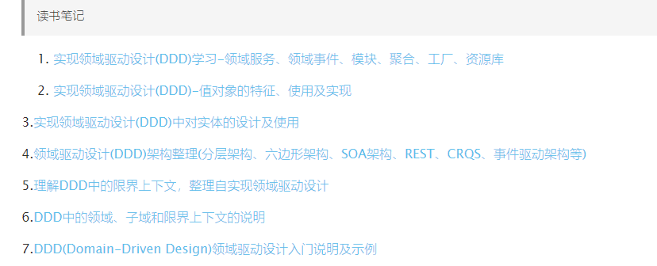

# 参考：阿里专家详解DDD

阿里技术专家详解DDD系列 https://zhuanlan.zhihu.com/p/366395817


## 第二讲 - 应用架构（改造DDD)

介绍了一个具体例子从基于传统模式（controller->service(复杂实现逻辑) ，即Matin Follower提到的事务脚本模式）到基于DDD改造一步步过程

传统模式：service直接包含各种判断和各详细步骤，可维护性、可扩展性、可测试性差

- 数据结构不稳定，直接依赖DAO，可能表有变化，或由mysql切换oracle
- 依赖三方件升级不稳定带来的影响
- 中间件更换：如从kafka到RocketMQ
- 依赖多个步骤，可能涉及DB/三方件，测试搭建复杂
- 。。。

改造逻辑：

1、提取基于领域逻辑的Entity类，包含其业务接口，

它的字段和数据库储存不需要有必然的联系。Entity包含数据，同时也应该包含行为

```java
@Data
public class Account {
    private AccountId id;
    private AccountNumber accountNumber;
    private UserId userId;
    private Money available;
    private Money dailyLimit;

    public void withdraw(Money money) {
        // 转出
    }

    public void deposit(Money money) {
        // 转入
    }
}
```

2、如果涉及操作DB场景，定义相关Repository接口和实现类

```java
public interface AccountRepository {
    Account find(AccountId id);
    Account find(AccountNumber accountNumber);
    Account find(UserId userId);
    Account save(Account account);
}

public class AccountRepositoryImpl implements AccountRepository {

    @Autowired
    private AccountMapper accountDAO;

    @Autowired
    private AccountBuilder accountBuilder;

    @Override
    public Account find(AccountId id) {
        AccountDO accountDO = accountDAO.selectById(id.getValue());
        return accountBuilder.toAccount(accountDO);
    }

    @Override
    public Account find(AccountNumber accountNumber) {
        AccountDO accountDO = accountDAO.selectByAccountNumber(accountNumber.getValue());
        return accountBuilder.toAccount(accountDO);
    }
    // ...
```

### DAO 和 Repository 类的对比：

- DAO对应的是一个特定的数据库类型的操作，相当于SQL的封装。所有操作的对象都是DO类，所有接口都可以根据数据库实现的不同而改变。比如，insert 和 update 属于数据库专属的操作。
- Repository对应的是Entity对象读取储存的抽象，在接口层面做统一，不关注底层实现。比如，通过 save 保存一个Entity对象，但至于具体是 insert 还是 update 并不关心。Repository的具体实现类通过调用DAO来实现各种操作，通过Builder/Factory对象实现AccountDO 到 Account之间的转化

###  Repository和Entity对比

- 通过Account对象，避免了其他业务逻辑代码和数据库的直接耦合，避免了当数据库字段变化时，大量业务逻辑也跟着变的问题。
- 通过Repository，改变业务代码的思维方式，让业务逻辑不再面向数据库编程，而是面向领域模型编程。
- Account属于一个完整的内存中对象，可以比较容易的做完整的测试覆盖，包含其行为。
- Repository作为一个接口类，可以比较容易的实现Mock或Stub，可以很容易测试。
- AccountRepositoryImpl实现类，由于其职责被单一出来，只需要关注Account到AccountDO的映射关系和Repository方法到DAO方法之间的映射关系，相对于来说更容易测试。

## 第三讲 - Repository模式

贫血模型的不足之处；

### Entity、DTO和DO关系


在实际开发中DO、Entity和DTO不一定是1:1:1的关系。一些常见的非1:1关系如下：

- 复杂的Entity拆分多张数据库表：常见的原因在于字段过多，导致查询性能降低，需要将非检索、大字段等单独存为一张表，提升基础信息表的检索效率。常见的案例如商品模型，将商品详细描述等大字段单独保存，提升查询性能：


- 多个关联的Entity合并一张数据库表：这种情况通常出现在拥有复杂的Aggregate Root - Entity关系的情况下，且需要分库分表，为了避免多次查询和分库分表带来的不一致性，牺牲了单表的简洁性，提升查询和插入性能。常见的案例如主子订单模型：


- 从复杂Entity里抽取部分信息形成多个DTO：这种情况通常在Entity复杂，但是调用方只需要部分核心信息的情况下，通过一个小的DTO降低信息传输成本。同样拿商品模型举例，基础DTO可能出现在商品列表里，这个时候不需要复杂详情：


- 合并多个Entity为一个DTO：这种情况通常为了降低网络传输成本，降低服务端请求次数，将多个Entity、DP等对象合并序列化，并且让DTO可以嵌套其他DTO。同样常见的案例是在订单详情里需要展示商品信息：


### Entity、DO和DTO所在模块和转换

由于现在从一个对象变为3+个对象，对象间需要通过转化器（Converter/Mapper）来互相转化。而这三种对象在代码中所在的位置也不一样，简单总结如下：

**1. DTO Assembler**：

在Application层，Entity到DTO的转化器有一个标准的名称叫DTO Assembler。Martin Fowler在P of EAA一书里对于DTO 和 Assembler的描述：Data Transfer Object。DTO Assembler的核心作用就是将1个或多个相关联的Entity转化为1个或多个DTO。

**2. Data Converter**：

在Infrastructure层，Entity到DO的转化器没有一个标准名称，但是为了区分Data Mapper，我们叫这种转化器Data Converter。这里要注意Data Mapper通常情况下指的是DAO，比如Mybatis的Mapper。Data Mapper的出处也在P of EAA一书里：Data Mapper如果是手写一个Assembler，通常我们会去实现2种类型的方法，如下；Data Converter的逻辑和此类似，略过。

```java
public class DtoAssembler {
    // 通过各种实体，生成DTO
    public OrderDTO toDTO(Order order, Item item) {
        OrderDTO dto = new OrderDTO();
        dto.setId(order.getId());
        dto.setItemTitle(item.getTitle()); // 从多个对象里取值，且字段名称不一样
        dto.setDetailAddress(order.getAddress.getDetail()); // 可以读取复杂嵌套字段
        // 省略N行
        return dto;
    }

    // 通过DTO，生成实体
    public Item toEntity(ItemDTO itemDTO) {
        Item entity = new Item();
        entity.setId(itemDTO.getId());
        // 省略N行
        return entity;
    }
}

public class Application {
    private DtoAssembler assembler;
    private OrderRepository orderRepository;
    private ItemRepository itemRepository;

    public OrderDTO getOrderDetail(Long orderId) {
        Order order = orderRepository.find(orderId);
        Item item = itemRepository.find(order.getItemId());
        return assembler.toDTO(order, item); // 原来的很多复杂转化逻辑都收敛到一行代码了
    }
}
```

#### MapStruct三方件

避免手写Assembler和Converter的错误

```java
@org.mapstruct.Mapper
public interface DtoAssembler { // 注意这里变成了一个接口，MapStruct会生成实现类
    DtoAssembler INSTANCE = Mappers.getMapper(DtoAssembler.class);

    // 在这里只需要指出字段不一致的情况，支持复杂嵌套
    @Mapping(target = "itemTitle", source = "item.title")
    @Mapping(target = "detailAddress", source = "order.address.detail")
    OrderDTO toDTO(Order order, Item item);

    // 如果字段没有不一致，一行注解都不需要
    Item toEntity(ItemDTO itemDTO);
}
```

#### Repository代码规范（未完）

1. **接口名称不应该使用底层实现的语法：**我们常见的insert、select、update、delete都属于SQL语法，使用这几个词相当于和DB底层实现做了绑定。相反，我们应该把 Repository 当成一个中性的类 似Collection 的接口，使用语法如 find、save、remove。在这里特别需要指出的是区分 insert/add 和 update 本身也是一种和底层强绑定的逻辑，一些储存如缓存实际上不存在insert和update的差异，在这个 case 里，使用中性的 save 接口，然后在具体实现上根据情况调用 DAO 的 insert 或 update 接口。
2. **出参入参不应该使用底层数据格式：**需要记得的是 Repository 操作的是 Entity 对象（实际上应该是Aggregate Root），而不应该直接操作底层的 DO 。更近一步，Repository 接口实际上应该存在于Domain层，根本看不到 DO 的实现。这个也是为了避免底层实现逻辑渗透到业务代码中的强保障。
3. **应该避免所谓的“通用”Repository模式：**很多 ORM 框架都提供一个“通用”的Repository接口，然后框架通过注解自动实现接口，比较典型的例子是Spring Data、Entity Framework等，这种框架的好处是在简单场景下很容易通过配置实现，但是坏处是基本上无扩展的可能性（比如加定制缓存逻辑），在未来有可能还是会被推翻重做。当然，这里避免通用不代表不能有基础接口和通用的帮助类，具体如下。


- # 参考：《实现领域驱动设计》

https://blog.csdn.net/pushiqiang/article/details/115218721

https://www.deathearth.com/1255.html

页面底部




# 术语

### 领域事件


### Entity（实体）

基于领域逻辑的业务对象，与数据表无必然联系，同时应该包含相关业务行为

```java
@Data
public class Account {
    private AccountId id;
    private AccountNumber accountNumber;
    private UserId userId;
    private Money available;
    private Money dailyLimit;

    public void withdraw(Money money) {
        // 转出
    }

    public void deposit(Money money) {
        // 转入
    }
}
```

### DTO


### DO

直接对应数据库表

### 值对象


### 聚合

聚合根


## CQRS

命令与查询分责

Command Query：


