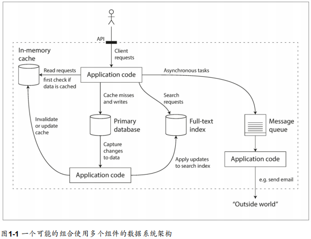
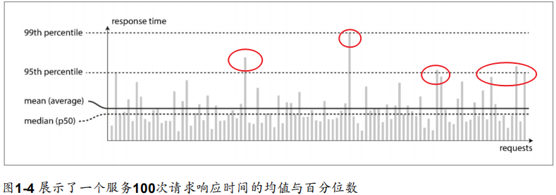

# 参考

《企业应用架构模式》

《数据密集型应用设计》

# 第一章：可靠、可扩展、可维护性

数据密集型应用通常由标准组件构建：数据库、缓存（Redis..）、索引（Elastic Search）、流Stream处理、批Batch处理

 

## 1. 可靠性（**Reliability**）

系统在困境（**adversity**）（硬件故障、软件故障、人为错误）中仍可正常工作（正确完成功能，并能达到期望的性能水准）。 

- 应用程序表现出用户所期望的功能。 
- 允许用户犯错，允许用户以出乎意料的方式使用软件。 
- 在预期的负载和数据量下，性能满足要求。 
- 系统能防止未经授权的访问和滥用。 

名词：

- fault：造成错误的原因，系统部分状态偏离预期
- failure：整个系统状态偏离预期
- fault-tolerant/resilient： 能预料并应对故障
- Chaos Monkey:  故意引发故障来确保容错机制不断运行并接受考验，从而提高故障自然发生时系统能正确处理

> 故障的概率不可能降到零，因此最好设计容错机制以防因故障而导致失效。

### 1.1 硬件故障

名词：

- MTTF（mean time to failure）: 平均无故障时间；

常见硬件故障：

- 硬盘：据报道称，硬盘的平均无故障时间（**MTTF, mean time to failure**）约为10到50年。因此从数学期望上讲，在拥有10000个磁盘的存储集群上，平均每天会有1个磁盘出故障。

但是随着数据量和应用计算需求的增加，越来越多的应用开始大量使用机器，这会相应地增加硬件故障率。此外在一些云平台（如AWS） 中，虚拟机实例不可用却没有任何警告也是很常见的【7】，因为**云平台的设计就是优先考虑 灵活性（flexibility）和弹性（elasticity）**，而不是单机可靠性。 

### 1.2 软件错误

如何应对软件错误：

- 仔细考虑系统中的假设和交互；
- 彻底的测试；
- 进程隔离；
- 允许进程崩溃并重启；
- 测量、监控并分析生产环境中的系统行为。如果系统能够提供一些保证（例如在一个消息队列中，进入与发出的消息数量相等），那么系统就可以在运行时不断自检，并在出现差异（**discrepancy**）时报警 

### 1.3 人为错误

> 一项关于大型互联网服务的研究发现，运维配置错误是导致服务中断的首要原因，而硬件故障（服务器或网络）仅导致了10-25％的服务中断 

尽管人类不可靠，但怎么做才能让系统变得可靠？最好的系统会组合使用以下几种办法： 

- **以最小化犯错机会的方式设计系统。**例如，精心设计的抽象、API和管理后台使做对事情更容易，搞砸事情更困难。但如果接口限制太多，人们就会忽略它们的好处而想办法绕开。很难正确把握这种微妙的平衡。 
- **将人们最容易犯错的地方与可能导致失效的地方解耦（decouple）**。特别是提供一个功能齐全的非生产环境沙箱（**sandbox**），使人们可以在不影响真实用户的情况下，使用真实数据安全地探索和实验
- **在各个层次进行彻底的测试**，从单元测试、全系统集成测试到手动测试。自动化测试易于理解，已经被广泛使用，特别适合用来覆盖正常情况中少见的边缘场景（**corner** case）。
- **允许从人为错误中简单快速地恢复**，以最大限度地减少失效情况带来的影响。 例如，快速回滚配置变更，分批发布新代码（以便任何意外错误只影响一小部分用户），并提供数据重算工具（以备旧的计算出错）。
- **配置详细和明确的监控**，比如性能指标和错误率。 监控可以向我们发出预警信号，并允许我们检查是否有任何地方违反了假设和约束。当出现问题时，指标数据对于问题诊断是非常宝贵的。 
- 良好的管理实践与充分的培训

## 2. 可扩展性（**Scalability**） 

​	有合理的办法应对系统的增长（数据量、流量、复杂性）

名词：

- 服务降级（**degradation**）：负载增加，如负载已经从万并发增长到十万并发，或从百万增长到千万。现在处理的数据量级要比过去大得多。 

**如何描述负载**（**load parameters**）：

- QPS: 每秒向Web服务器发出的请求

- 数据库中的读写比率

- 聊天室中同时活跃的用户数量

- 缓存命中率： Cache Hit、Cache Miss

- 其他

  例子：Twitter

  - 发布推文：用户可以向其粉丝发布新消息（平均 4.6k请求/秒，峰值超过 12k请求/秒）。 
  - 主页时间线：用户可以查阅他们关注的人发布的推文（300k请求/秒）。 
  - 处理每秒12,000次写入（发推文的速率峰值）。
  - 推特量：最大挑战，每个用户关注了很多人，也被很多人关注。

**如何描述性能**

- 增加负载参数保持系统资源不变（CPU/内存/网络带宽），性能变化？
- 增加负载参数并希望保持性能不变，需增加多少系统资源？

指标：

- **吞吐量**：throughput，每秒可处理的记录数量，或特性规模数据集上运行作业总时间
- **响应时间**：response time，排队延迟等待处理+后台实际处理时间+网络延迟

> ​		通常使用百分位点（**percentiles**）会更好。如果将响应时间列表按最快到最慢排序，那么中位数（**median**）就在正中间：举个例子，如果你的响应时间中位数是200毫秒，这意味着一半请求的返回时间少于200毫秒，另一半比这个要长。中位数也被称为第50百分位点，有时缩写为p50。注意中位数是关于单个请求的；如果用户同时发出几个请求（在一个会话过程中，或者由于一个页面中包含了多个资源），则至少一个请求比中位数慢的概率远大于50％。
>
> ​		第95、99和99.9百分位点（缩写为p95，p99和p999）。它们意味着95％，99％或99.9％的请求响应时间要比该阈值快，例如：如果第95百分位点响应时间是1.5秒，则意味着100个请求中的95个响应时间快于1.5秒，而100个请求中的5个响应时间超过1.5秒。
>
> ​		如亚马逊在描述内部服务的响应时间要求时以99.9百分位点为准，即使它只影响一千个请求中的一个。这是因为请求响应最慢的客户往往也是数据最多的客户，也可以说是最有价值的客户。保证网站响应迅速对于保持客户的满意度非常重要，亚马逊观察到：响应时间增加100毫秒，销售量就减少1％；而另一些报告说：慢 1 秒钟会让客户满意度指标减少16%。 
>
> ​		优化第99.99百分位点（一万个请求中最慢的一个）被认为太昂贵了，不能为亚马逊的目标带来足够好处。减小高百分位点处的响应时间相当困难，因为它很容易受到随机事件的影响，这超出了控制范围，而且效益也很小。
>
> ​		百分位点通常用于服务级别目标（SLO, service level objectives）和服务级别协议（**SLA,** service level agreements），即定义服务预期性能和可用性的合同。SLA可能会声明，如果服务响应时间的中位数小于200毫秒，且99.9百分位点低于1秒，则认为服务工作正常（如果响应时间更长，就认为服务不达标）。这些指标为客户设定了期望值，并允许客户在SLA未达标的情况下要求退款。 

- **尾部延迟（tail latencies）：**响应时间的高百分位点，直接影响用户的服务体验。

- **排队延迟（queueing delay）：**通常占了高百分位点处响应时间的很大一部分。由于服务器只能并行处理少量的事务（如受其CPU核数的限制），所以只要有少量缓慢的请求就能阻碍后续请求的处理，这种效应有时被称为头部阻塞（**head-of-line blocking**）。即使后续请求在服务器上处理的非常迅速，由于需要等待先前请求完成，客户端最终看到的是缓慢的总体响应时间。