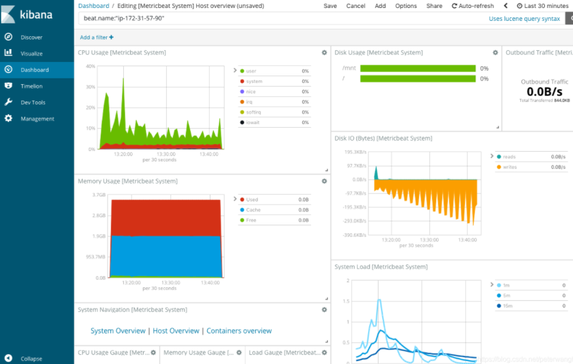
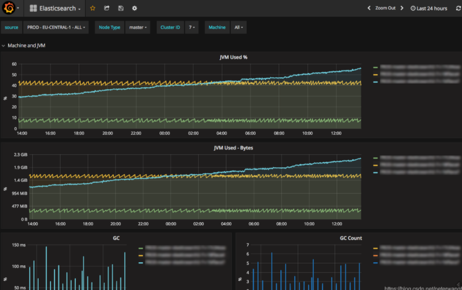
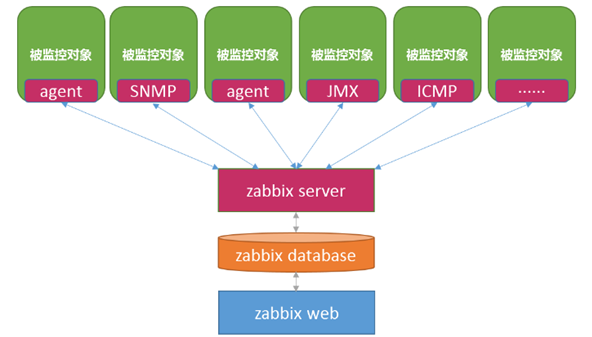

# 监控三方件产品简单对比

Grafana与时间序列数据库（如Graphite或InfluxDB）是用于度量分析的组合；

Kibana是流行的ELK Stack的一部分，用于探索日志数据。

## 1. Kibana

Kibana是世界上最受欢迎的开源日志分析平台ELK Stack中的“K” ，它为用户提供了一个工具，用于在存储于Elasticsearch集群中的日志数据进行检索，可视化和构建仪表板。

Kibana的核心功能是数据查询和分析。使用各种方法，用户可以搜索Elasticsearch中索引的数据，以查找其数据中的特定事件或字符串，以进行根本原因分析和诊断。基于这些查询，用户可以使用Kibana的可视化功能，允许用户使用图表，表格，地理图和其他类型的可视化以各种不同的方式可视化数据。

## 2. Grafana

Grafana是一个开源可视化工具，可以在各种不同的数据存储上使用，但最常用的是Graphite，InfluxDB，以及Elasticsearch等.

从本质上讲，它是Graphite-web的一个功能丰富的替代品，可帮助用户轻松创建和编辑仪表板。它包含一个独特的Graphite目标解析器，可以轻松进行度量和功能编辑。用户可以使用智能轴格式（例如线条和点）创建全面的图表，这是Grafana快速的客户端渲染（即使在很长的时间范围内） - 使用Flot作为默认选项。

## 3. Zabbix

官方演示视频： https://www.zabbix.com/cn/demo

