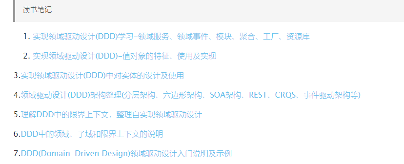

参考：《实现领域驱动设计》

https://blog.csdn.net/pushiqiang/article/details/115218721

https://www.deathearth.com/1255.html

页面底部

对象唯一标识

## 术语

### 领域事件

### Entity（实体）

### 值对象

### 聚合

聚合根

## CQRS

命令与查询分责

Command Query：

