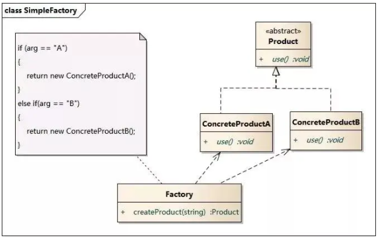
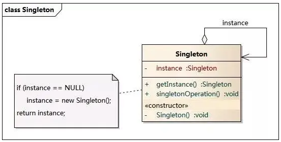
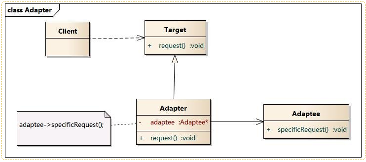
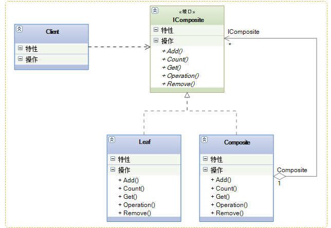
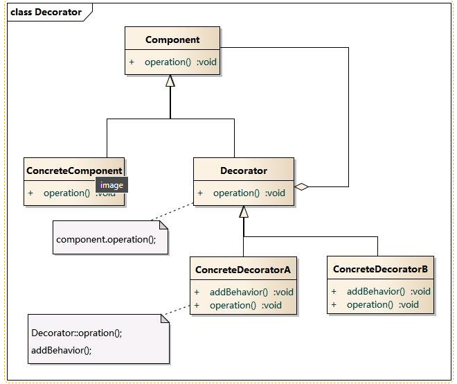
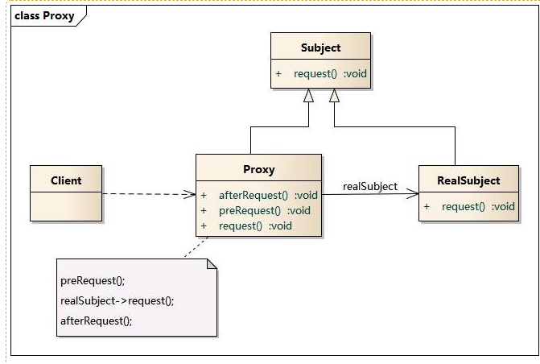
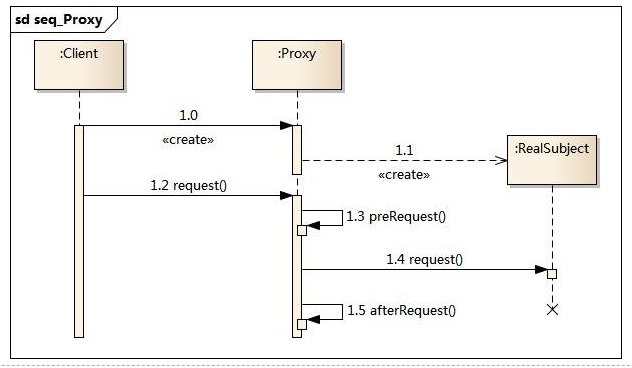
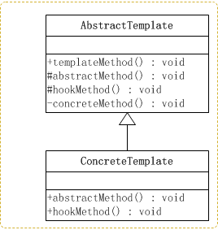
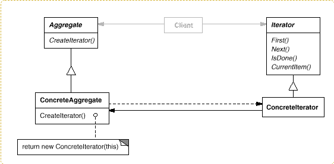
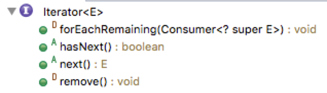

## 参考文档

1. 

# 一、设计模式概览

关键点：发现变更点

SOLID原则：

创建型：

结构型：

行为型：

# 二、创建型

## 1. 简单工厂

## 2. 工厂方法

## 3. 抽象工厂

产品族Family：

## 4. 单例（Singleton）

单例模式(Singleton Pattern)：单例模式确保某一个类只有一个实例，而且自行实例化并向整个系统提供这个实例，这个类称为单例类，它提供全局访问的方法。

单例模式的要点有三个：

- 某个类只能有一个实例；

- 它必须自行创建这个实例；

- 它必须自行向整个系统提供这个实例。

懒汉模式、饿汉模式

## 5. 建造者（Builder）

​	Builder模式的定义是“将一个复杂对象的构建与它的表示分离，使得同样的构建过程可以创建不同的表示。”，它属于创建类模式

​	一般来说，如果一个对象的构建比较复杂，超出了构造函数所能包含的范围，就可以使用工厂模式和Builder模式

==相对于工厂模式会产出一个完整的产品，Builder应用于更加复杂的对象的构建，甚至只会构建产品的一个部分。==

# 三、结构型

## 1. 适配器（Adapter）

适配器模式(Adapter Pattern) ：将一个接口转换成客户希望的另一个接口，适配器模式使接口不兼容的那些类可以一起工作，其别名为包装器(Wrapper)。适配器模式既可以作为类结构型模式，也可以作为对象结构型模式。

## 2.  桥接（Bridge）

## 3. 组合（Composite）

​	组合模式组合多个对象形成树形结构以表示“整体-部分”的结构层次。

​	组合模式对单个对象(叶子对象)和组合对象(组合对象)具有一致性，它将对象组织到树结构中，可以用来描述整体与部分的关系。同时它也模糊了简单元素(叶子对象)和复杂元素(容器对象)的概念，使得客户能够像处理简单元素一样来处理复杂元素，从而使客户程序能够与复杂元素的内部结构解耦。

​    在使用组合模式中需要注意一点也是组合模式最关键的地方：叶子对象和组合对象实现相同的接口。这就是组合模式能够将叶子节点和对象节点进行一致处理的原因。

## 4. 装饰模式（Decorate）

装饰模式(Decorator Pattern) ：动态地给一个对象增加一些额外的职责(Responsibility)，就增加对象功能来说，装饰模式比生成子类实现更为灵活。其别名也可以称为包装器(Wrapper)，与适配器模式的别名相同，但它们适用于不同的场合。根据翻译的不同，装饰模式也有人称之为“油漆工模式”，它是一种对象结构型模式。

## 5. 外观（Facade）

## 6. 享元（Flyweight）

## 7. 代理（Proxy）

​	代理模式(Proxy Pattern) ：给某一个对象提供一个代 理，并由代理对象控制对原对象的引用。代理模式的英 文叫做Proxy或Surrogate，它是一种对象结构型模式。

代理模式包含如下角色：

- Subject: 抽象主题角色
- Proxy: 代理主题角色
- RealSubject: 真实主题角色

​	这里有两个步骤，第一个是提前创建一个Proxy，第二个是使用的时候会自动请求Proxy，然后由Proxy来执行具体事务；

​	

# 四、行为型

## 1. 职责链（Chain Of Responsibility）

## 2. 命令（Command）

## 3. 解释器（Interpreter）

## 4. 中介者（Mediator)

## 5. 备忘录（Memento）

## 6. 观察者（Observer）

## 7. 状态（State）

### 高端应用参考

​		高德打车通用可编排订单状态机引擎设计 https://zhuanlan.zhihu.com/p/368197897

## 8. 策略（Strategy）

## 9. 模板方法（Template）

模板方法模式是所有模式中最为常见的几个模式之一，是基于继承的代码复用的基本技术。

模板方法模式需要开发抽象类和具体子类的设计师之间的协作。一个设计师负责给出一个算法的轮廓和骨架，另一些设计师则负责给出这个算法的各个逻辑步骤。代表这些具体逻辑步骤的方法称做基本方法(primitive method)；而将这些基本方法汇总起来的方法叫做模板方法(template method)，这个设计模式的名字就是从此而来。

模板类定义一个操作中的算法的骨架，而将一些步骤延迟到子类中。使得子类可以不改变一个算法的结构即可重定义该算法的某些特定步骤。

## 10. 访问者/迭代器

​	迭代器（Iterator）模式，又叫做游标（Cursor）模式。GOF给出的定义为：提供一种方法访问一个容器（container）对象中各个元素，而又不需暴露该对象的内部细节。

​	Java的Iterator就是迭代器模式的接口，只要实现了该接口，就相当于应用了迭代器模式：

# 五、云化模式

参考： https://docs.microsoft.com/zh-cn/azure/architecture/patterns/

## 1. 管道模式

​	参考：https://blog.csdn.net/jishulaozhuanjia/article/details/104975683

## 2. 过滤器模式

​	参考：https://blog.csdn.net/yangzhenping/article/details/40888683

# 六、不同设计模式对比

## 1. 状态模式 VS 策略模式

